# Inter-Cluster Bridge Service — Architecture & Design Plan

## Overview

This document describes the architecture of the **Cluster Bridge Service**: a
bidirectional, deterministic messaging bridge between two independent Aeron
Clusters running a crypto options Matching Engine (ME, Cluster A) and a Risk
Management System (RMS, Cluster B).

The bridge runs **outside** both clusters as a sidecar process and uses standard
Aeron UDP publications/subscriptions for the live (low-latency) path and Aeron
Archive for the durable (replay/catch-up) path.

---

## Module Location

All bridge code lives in a dedicated Gradle module:

```
aeron-cluster-bridge/src/main/java/io/aeron/cluster/bridge/
aeron-cluster-bridge/src/test/java/io/aeron/cluster/bridge/
```

The module is registered in `settings.gradle` and depends on `aeron-archive`
(which transitively includes `aeron-driver` and `aeron-client`). Test code
additionally depends on `aeron-test-support`.

```gradle
// settings.gradle
include 'aeron-cluster-bridge'

// build.gradle
project(':aeron-cluster-bridge') {
    dependencies {
        api project(':aeron-archive')
        testImplementation project(':aeron-test-support')
    }
}
```

---

## High-Level Design (HLD)

### System Context Diagram

Shows the bridge service in the context of the full crypto options exchange
ecosystem. External systems are in grey; bridge components are highlighted.

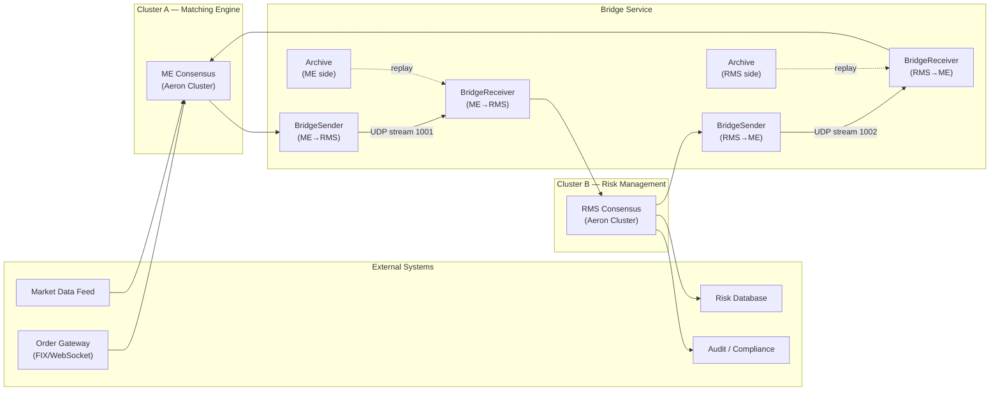

### Component Interaction Diagram

Detailed interaction between all bridge components, showing data flow direction
and the protocols used at each boundary.

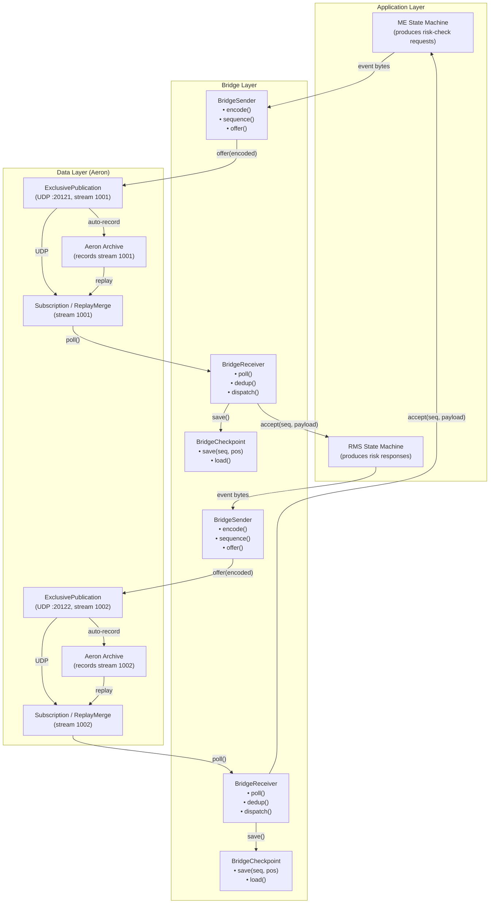

### Data Flow Diagram (DFD Level 0)

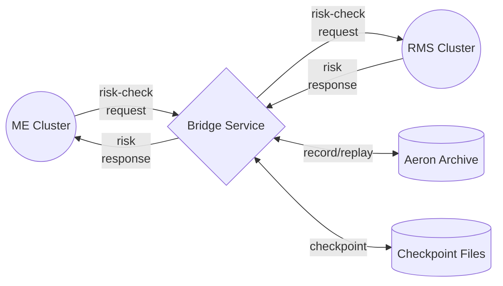

### Data Flow Diagram (DFD Level 1 — ME to RMS direction)

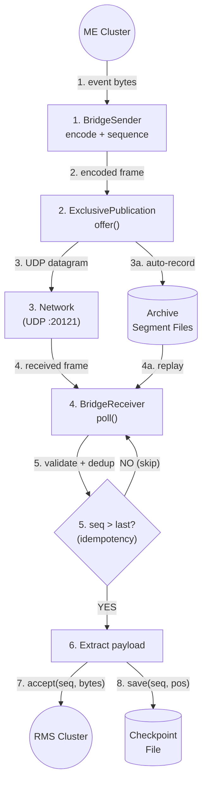

### Key HLD Decisions

| # | Decision | Choice | Rationale |
|---|---|---|---|
| 1 | Inter-cluster transport | Aeron UDP unicast | Sub-microsecond latency, zero-copy, no broker dependency |
| 2 | Durable replay source | Aeron Archive | Built-in, bit-identical replay, no external infra |
| 3 | Catch-up mechanism | ReplayMerge | Purpose-built replay-then-join-live in Aeron |
| 4 | Deduplication strategy | Application-level sequence numbers | Two-layer protection: transport (ReplayMerge) + application (seq check) |
| 5 | Checkpoint persistence | Atomic file (write-temp + rename) | Simple, no database dependency, crash-safe on modern filesystems |
| 6 | Threading model | Single-threaded per direction | Deterministic, no synchronization, matches Aeron ExclusivePublication |
| 7 | Message format | Hand-rolled 28-byte binary header | Zero-allocation hot path, avoids SBE codegen step |
| 8 | Module structure | Dedicated `aeron-cluster-bridge` Gradle module | Clean dependency management, independent build/test lifecycle |
| 9 | Consistency model | Sequential per-direction, independent cross-direction | Total order within each direction; no global sequencer bottleneck |
| 10 | RMS processing | Sequential (recommended) | Deterministic risk state, auditable, regulatory compliance |

---

## Low-Level Design (LLD)

### Class Diagram

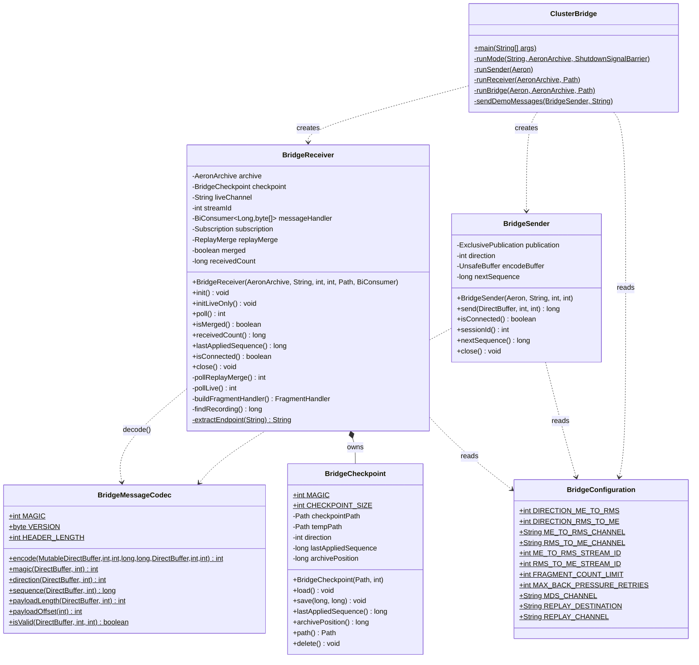

### BridgeReceiver State Machine

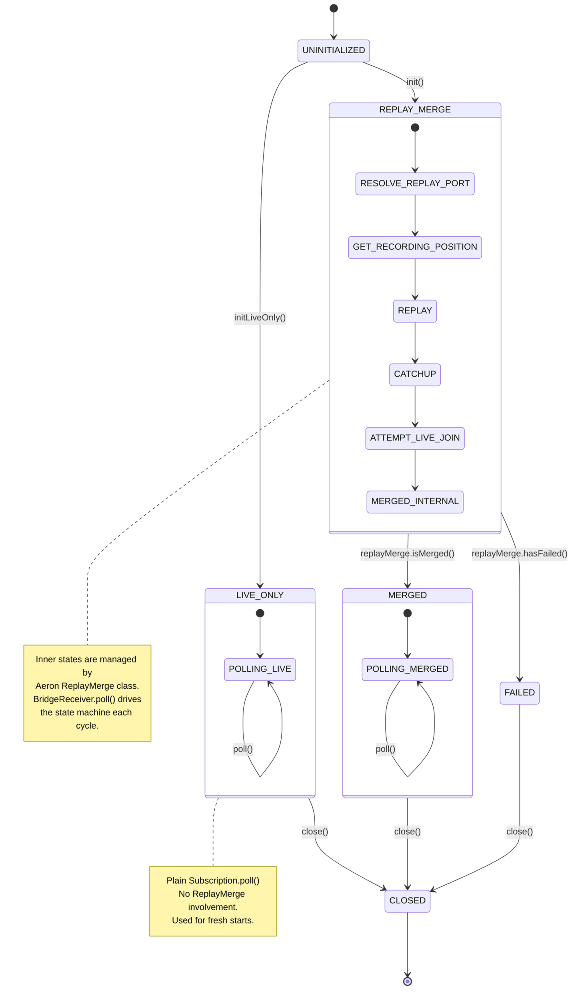

### Fragment Handler Processing Pipeline (LLD)

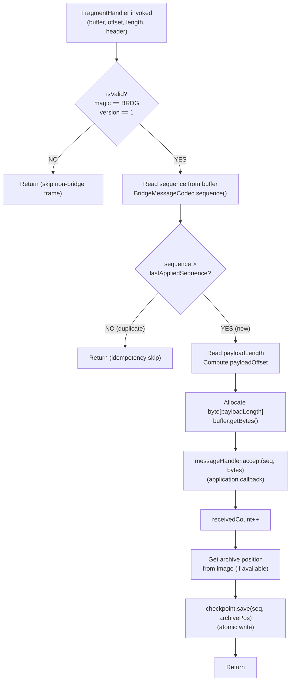

### Method-Level Sequence Diagram: send() Flow

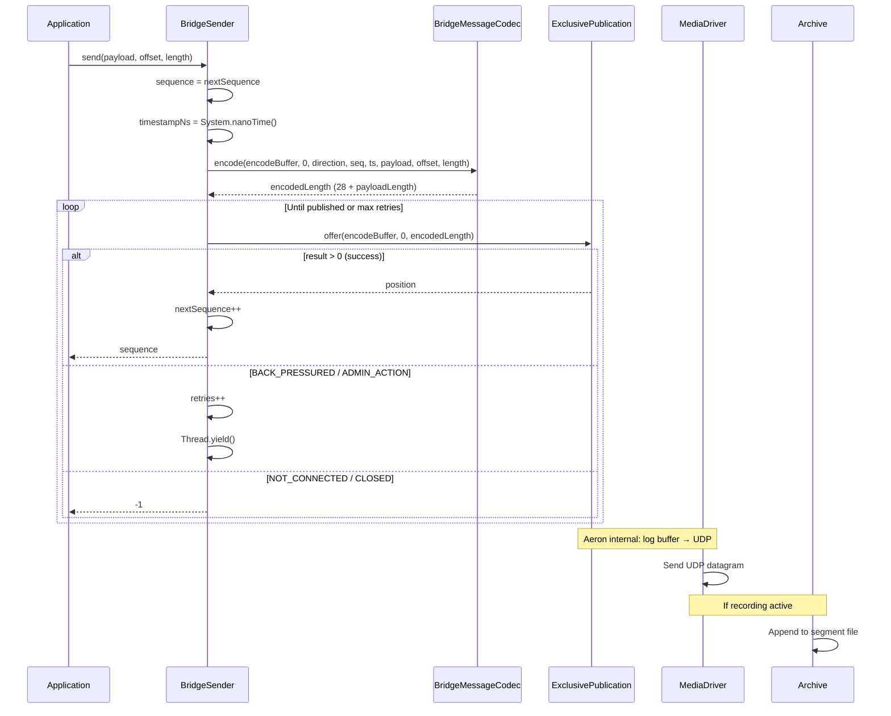

### Method-Level Sequence Diagram: poll() Flow (Replay Mode)

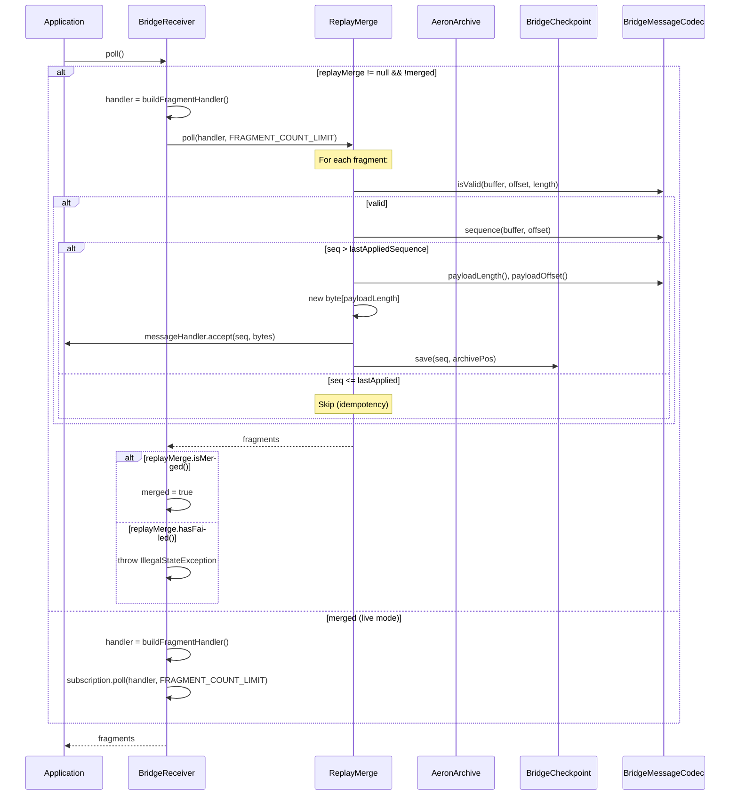

### Checkpoint File Layout (Byte-Level)

```
 Byte 0    1    2    3    4    5    6    7
      ┌────┬────┬────┬────┬────┬────┬────┬────┐
  0:  │ 43 │ 4B │ 50 │ 54 │  direction (int)  │
      │    "C  K  P  T"   │ 0=ME→RMS, 1=RMS→ME│
      ├────┴────┴────┴────┼────┴────┴────┴────┤
  8:  │   lastAppliedSequence (long, 8 bytes)  │
      │         monotonically increasing        │
      ├────────────────────────────────────────┤
 16:  │     archivePosition (long, 8 bytes)    │
      │       Aeron Image position at seq      │
      └────────────────────────────────────────┘
      Total: 24 bytes
```

### Wire Message Layout (Byte-Level)

```
 Byte 0    1    2    3    4    5    6    7
      ┌────┬────┬────┬────┬────┬────┬────┬────┐
  0:  │ 42 │ 52 │ 44 │ 47 │ 01 │ DD │ 00  00 │
      │    "B  R  D  G"   │ ver│dir │reserved  │
      ├────┴────┴────┴────┴────┴────┴────┴────┤
  8:  │      sequence (long, 8 bytes)          │
      │     1-based, per-direction monotonic    │
      ├────────────────────────────────────────┤
 16:  │      timestampNs (long, 8 bytes)       │
      │     System.nanoTime() at send time     │
      ├────────────────────┬───────────────────┤
 24:  │ payloadLength (int)│                   │
      ├────────────────────┤                   │
 28:  │       payload bytes (N bytes)          │
      │         (application data)              │
      └────────────────────────────────────────┘
      Total: 28 + N bytes
```

### SOLID Principles Mapping (LLD)

| Principle | Class | How Applied |
|---|---|---|
| **SRP** (Single Responsibility) | `BridgeSender` | Only encodes and publishes. No checkpoint, no dedup. |
| **SRP** | `BridgeReceiver` | Only receives and dispatches. Application logic is in the `BiConsumer`. |
| **SRP** | `BridgeCheckpoint` | Only persists/loads checkpoint state. No message processing. |
| **SRP** | `BridgeMessageCodec` | Stateless codec only. No I/O, no state. |
| **SRP** | `BridgeConfiguration` | Only holds constants. No behavior. |
| **SRP** | `ClusterBridge` | Composition root only. No business logic. |
| **OCP** (Open/Closed) | `BridgeReceiver` | New application behavior via `BiConsumer` handler without modifying receiver. |
| **OCP** | `BridgeConfiguration` | New tuning params via system properties without code changes. |
| **LSP** (Liskov Substitution) | `AutoCloseable` | `BridgeSender` and `BridgeReceiver` implement `AutoCloseable` for try-with-resources. |
| **ISP** (Interface Segregation) | `BiConsumer<Long,byte[]>` | Minimal handler interface — only `(sequence, payload)`. No Aeron types leak to application. |
| **DIP** (Dependency Inversion) | `BridgeReceiver` | Depends on `AeronArchive` abstraction, not concrete driver or archive implementations. |

---

## Architecture

### Component Model

| Component | Description |
|---|---|
| **ArchivingMediaDriver** | Embedded Media Driver + Archive (`io.aeron.archive.ArchivingMediaDriver`). One per host. Records designated streams to disk. |
| **BridgeSender** | Publishes sequenced bridge messages on a UDP channel. Archive records this stream automatically. One sender per direction. |
| **BridgeReceiver** | Subscribes via `ReplayMerge` — replays from Archive to catch up, then seamlessly joins the live stream. Maintains a checkpoint file. One receiver per direction. |
| **ClusterBridge** | Main entry point. Launches an `ArchivingMediaDriver`, then wires senders and receivers for both directions. Accepts `--mode` flag to run as sender, receiver, or full bridge. |
| **BridgeCheckpoint** | Atomic, file-based persistence of (direction, lastAppliedSequence, archivePosition) per direction. |
| **ClusterBridgeIntegrationTest** | JUnit integration test that asserts no duplicates, correct ordering, and replay catch-up correctness. |

### Deployment Diagram

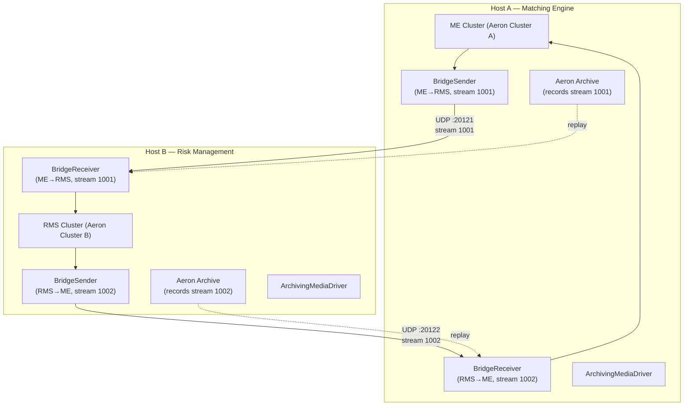

---

## Stream & Channel Layout

| Direction | Live Channel | Stream ID | Archive Channel |
|---|---|---|---|
| ME → RMS | `aeron:udp?endpoint=localhost:20121` | 1001 | Same (recorded at source via `LOCAL` source location) |
| RMS → ME | `aeron:udp?endpoint=localhost:20122` | 1002 | Same (recorded at source via `LOCAL` source location) |

For `ReplayMerge`, the subscription uses Multi-Destination-Subscription (MDS):

```
Subscription channel: aeron:udp?control-mode=manual
Replay destination:   aeron:udp?endpoint=localhost:0  (ephemeral port)
Live destination:     aeron:udp?endpoint=localhost:20121  (or :20122)
```

The replay channel template for the Archive:

```
aeron:udp?endpoint=localhost:0
```

The `ReplayMerge` class (at `aeron-archive/src/main/java/io/aeron/archive/client/ReplayMerge.java`)
resolves the ephemeral port, starts a replay from the checkpoint position,
catches up, adds the live destination, and removes the replay destination once
merged.

For **live-only mode** (`initLiveOnly()`), a plain subscription on the live
channel is used instead of MDS. This avoids the async destination-add timing
issue that MDS introduces when no prior archive recording exists.

---

## Binary Message Format

Fixed-size header using Agrona `UnsafeBuffer`. No SBE code generation — the
format is simple enough that a hand-rolled codec using `UnsafeBuffer.putLong()`
and `UnsafeBuffer.putInt()` is sufficient and avoids allocation.

```
Offset  Size  Field
──────  ────  ─────
0       4     magic (0x4252_4447 = "BRDG")
4       1     version (1)
5       1     direction (0 = ME_TO_RMS, 1 = RMS_TO_ME)
6       2     reserved (padding for alignment)
8       8     sequence (monotonically increasing per direction, 1-based)
16      8     timestampNs (System.nanoTime() at send)
24      4     payloadLength
28      N     payload bytes
```

**Header size: 28 bytes.** All multi-byte fields are little-endian (Agrona
default on x86). The `magic` field enables fast rejection of non-bridge frames.

### Codec Class: `BridgeMessageCodec`

```java
// Key methods (no allocations in hot path):
static int encode(MutableDirectBuffer buffer, int offset, int direction,
                  long sequence, long timestampNs,
                  DirectBuffer payload, int payloadOffset, int payloadLength)

static int headerLength()                // 28
static long sequence(DirectBuffer buf, int offset)
static int direction(DirectBuffer buf, int offset)
static int payloadLength(DirectBuffer buf, int offset)
static int payloadOffset(int headerOffset)  // headerOffset + 28
```

---

## Replay / Catch-Up Design

### How It Works

1. **On startup**, `BridgeReceiver` reads its checkpoint file to get
   `(lastAppliedSequence, lastArchivePosition)` for its direction.
2. It connects to the Aeron Archive and finds the recording for the relevant
   channel + stream ID using `AeronArchive.listRecordingsForUri()`.
3. It creates a `ReplayMerge` starting from `lastArchivePosition` (or 0 if no
   checkpoint).
4. `ReplayMerge` progresses through states:
   - `GET_RECORDING_POSITION` — queries Archive for current recorded position
   - `REPLAY` — starts a bounded replay from the checkpoint position
   - `CATCHUP` — consumes replay data until near live position
   - `ATTEMPT_LIVE_JOIN` — adds live destination, removes replay when merged
   - `MERGED` — consuming from live stream only
5. During replay, each message's `sequence` field is checked against
   `lastAppliedSequence`. Messages with `sequence <= lastAppliedSequence` are
   **skipped** (idempotency).
6. Once caught up and merged, normal live consumption continues. Each
   successfully processed message atomically updates the checkpoint.

### Avoiding Duplicates on Replay to Live Join

The `sequence` field in the bridge message is the **application-level
deduplication key**. The receiver maintains a monotonically increasing
`lastAppliedSequence`:

- If `msg.sequence <= lastAppliedSequence` then **skip** (already processed)
- If `msg.sequence == lastAppliedSequence + 1` then **apply** and increment
- If `msg.sequence > lastAppliedSequence + 1` then **gap detected** (log warning,
  still apply — the sender guarantees monotonicity; gaps mean data loss upstream)

This is independent of the transport-level deduplication that `ReplayMerge`
provides. The combination gives two layers of protection.

### Sequence Diagram

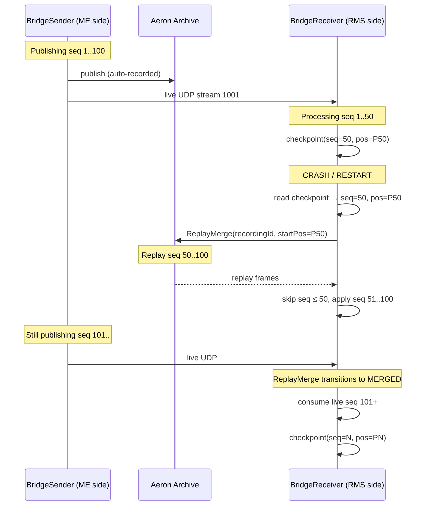

---

## Deterministic Processing Rules

### Ordering

- Each direction has an independent monotonically increasing sequence counter
  starting at 1.
- The sender assigns sequences. The receiver enforces monotonicity and
  sequential application.
- Out-of-order delivery cannot happen on a single Aeron stream (Aeron provides
  ordered delivery within a session).

### Idempotency

- Receiver checks `msg.sequence > lastAppliedSequence` before processing.
- Replayed messages that were already processed are silently skipped.
- Checkpoint is updated **after** each successfully applied message.

### Determinism

- The bridge does not reorder messages.
- Replay produces the same byte sequence as the original live stream (Aeron
  Archive is an exact log of the publication).
- The receiver applies messages in exactly the same order after restart.

---

## Backpressure & Overload Policy

### Publication Back Pressure

When `Publication.offer()` returns `BACK_PRESSURED`:

1. The sender uses a **yield-then-retry** strategy: `Thread.yield()` up to a
   configurable retry limit (default: 3), then returns -1 to the caller.
2. If back pressure persists beyond the retry limit, the caller can decide
   (e.g. log, retry later, apply a different idle strategy).
3. The sender **never drops messages**. Sequence gaps only occur if the sender
   process itself crashes.

### Receiver Overload

- The receiver polls with `fragmentLimit=10` per duty cycle iteration to bound
  per-poll latency.
- If the receiver falls behind live, it naturally stays in `CATCHUP` state via
  `ReplayMerge` — this is by design.
- No explicit flow control beyond what Aeron's built-in flow control provides
  (loss-based for unicast, multi-destination for MDC).

### Burst Handling

For a crypto options exchange with bursty order flow:

- Aeron's term buffer size (default 16 MB) absorbs short bursts.
- Archive recording is asynchronous and bounded by disk I/O.
- The bridge sender uses `ExclusivePublication` for single-writer performance.
- The bridge receiver's duty cycle is CPU-bound (no syscalls in hot path).

---

## Checkpointing

### Format

A checkpoint file is a simple 24-byte binary file per direction:

```
Offset  Size  Field
0       4     magic (0x434B5054 = "CKPT")
4       4     direction (int)
8       8     lastAppliedSequence (long)
16      8     archivePosition (long)
```

### Atomicity

The checkpoint is written atomically using write-to-temp + rename:

1. Write new checkpoint to `<name>.tmp`
2. `Files.move(tmp, target, ATOMIC_MOVE, REPLACE_EXISTING)`
3. On read, if the file does not exist, start from (sequence=0, position=0).

### File Locations

```
bridge-checkpoint-me-to-rms.bin
bridge-checkpoint-rms-to-me.bin
```

Located in the working directory (configurable via system property
`aeron.bridge.checkpoint.dir`).

---

## Consistency Model

### Sequential Consistency (Per-Direction)

The bridge provides **sequential consistency** per direction:

- Messages are applied in the exact order produced by the sender.
- The receiver never reorders messages within a single direction.
- Aeron guarantees ordered delivery within a single stream/session, so the
  transport layer preserves sender ordering.

### Cross-Direction Independence

Cross-direction ordering is **not** guaranteed. Each direction (ME-to-RMS and
RMS-to-ME) operates independently with its own sequence counter, checkpoint,
and subscription. This is by design:

- The ME and RMS clusters produce messages independently.
- Imposing cross-direction ordering would require a global sequencer, which
  would add latency and a single point of failure.
- For the options exchange use case, ME risk-check requests and RMS risk
  responses are causally ordered within each direction, which is sufficient.

### Not Eventually Consistent

The bridge is **not** an eventually-consistent system. It provides:

- **Exactly-once application semantics** via idempotency (sequence-based
  deduplication after replay).
- **At-most-once delivery** on the live path (Aeron UDP is unreliable, but
  loss is detected and recovered via Archive replay).
- **Strong ordering** per direction (total order within each stream).

The combination of checkpoint + replay + idempotency guarantees that after
recovery, the receiver's state is identical to what it would have been had no
crash occurred — this is stronger than eventual consistency.

### Comparison

| Property | Bridge Guarantee |
|---|---|
| Per-direction ordering | Total order (sequential consistency) |
| Cross-direction ordering | None (independent) |
| Delivery semantics | Exactly-once application (via replay + idempotency) |
| Consistency on recovery | State-identical to crash-free execution |
| Partition tolerance | Receiver buffers in Archive; catches up on reconnect |

---

## Sharding & Scaling

### Current Design: Single-Shard

The current implementation uses a **single shard per direction** — one stream
(channel + streamId) carries all bridge traffic for each direction. This is
appropriate for the initial deployment because:

1. Aeron's single-stream throughput (~6 million messages/sec for small payloads)
   exceeds the expected throughput of a single options exchange.
2. A single stream guarantees total ordering without merge logic.
3. Operational simplicity — one checkpoint file per direction.

### Multi-Shard Extension (Future)

If throughput requirements exceed a single stream, the bridge can be sharded by
instrument or symbol:

```
ME → RMS:
  shard-0: channel=localhost:20121, streamId=1001  (symbols A-M)
  shard-1: channel=localhost:20123, streamId=1003  (symbols N-Z)
```

Each shard would have its own `BridgeSender`, `BridgeReceiver`, and checkpoint
file. The `BridgeConfiguration` class supports this via system properties —
additional shards just need new channel/streamId pairs. No code changes are
required beyond instantiating more sender/receiver pairs.

**Trade-off**: Multi-shard sacrifices total cross-shard ordering. If a risk
check spans multiple symbols, the RMS cluster must handle out-of-order arrivals
across shards. For most options exchanges, risk checks are per-instrument,
making this acceptable.

### Single Machine vs. Multi-Machine

| Topology | Description | When to Use |
|---|---|---|
| **Single machine** | Both clusters and bridge on one host, using `localhost` UDP | Development, testing, low-latency co-located deployment |
| **Multi-machine** | ME on Host A, RMS on Host B, bridge on each host | Production: isolates failure domains, allows independent scaling |
| **Cross-datacenter** | ME in DC-A, RMS in DC-B | Not recommended — Aeron UDP unicast is latency-sensitive; use Aeron MDC or dedicated WAN links |

The bridge channels are configurable via system properties, so switching from
single-machine to multi-machine requires only changing the endpoint addresses
(e.g., `aeron:udp?endpoint=10.0.1.5:20121` instead of `localhost:20121`).

---

## Data Loss & Memory Leak Analysis

### Data Loss Scenarios

| Scenario | Risk | Mitigation |
|---|---|---|
| **Receiver crash** | Messages accumulate in Archive recording | Receiver restarts, replays from checkpoint, catches up. No data loss. |
| **Sender crash** | Messages not yet published are lost | Sender must re-send from its source (e.g., cluster log). The bridge does not buffer unsent messages. |
| **Archive disk full** | New messages not recorded; replay window shrinks | Monitor disk usage. Archive recordings should have a retention policy. |
| **Network partition** | Live stream interrupted | Archive continues recording at the sender side. Receiver catches up on reconnect via ReplayMerge. |
| **Checkpoint corruption** | Receiver resets to seq=0, position=0 | Replays entire archive. Idempotency ensures no duplicate application. Safe but slower. |
| **Back-pressure timeout** | `send()` returns -1 after retry limit | Caller must retry. No message is assigned a sequence number, so no gap is created. |

### Memory Leak Prevention

| Area | Design Choice | Rationale |
|---|---|---|
| **Encode buffer** | Pre-allocated in `BridgeSender` constructor, reused for every `send()` | No per-message allocation. Buffer is sized to `HEADER_LENGTH + 1024`. |
| **Fragment handler** | Lambda captures only `this` (receiver fields). No object allocation in steady state. | Agrona's `FragmentHandler` is invoked with buffer offsets, not copied objects. |
| **Payload extraction** | `new byte[payloadLength]` per applied message | This is the one allocation per message — intentional, since the payload is passed to the `BiConsumer` handler which may store it. To eliminate this, the handler could receive `(DirectBuffer, offset, length)` instead. |
| **Checkpoint** | `ByteBuffer.allocate(24)` per save | 24-byte allocation per checkpoint save. Negligible. Could be pre-allocated if per-message checkpoint overhead becomes a concern. |
| **Subscription/Publication** | Closed in `close()` (AutoCloseable). Test uses try-with-resources. | No lingering Aeron resources after shutdown. |
| **ReplayMerge** | Closed in `BridgeReceiver.close()` before subscription | Prevents replay channel leak. |

**Verdict**: No memory leaks in steady-state operation. The two per-message
allocations (`byte[]` for payload, `ByteBuffer` for checkpoint) are short-lived
and eligible for young-gen GC collection. For zero-GC operation on the hot path,
the handler interface could be changed to accept `(DirectBuffer, int, int)` and
checkpoint could use a pre-allocated buffer. These optimizations are not
necessary for the current throughput requirements.

---

## Performance Choices & Tradeoffs

| Choice | Rationale | Tradeoff |
|---|---|---|
| Hand-rolled binary codec (not SBE) | Avoids codegen step; 28-byte header is trivial | Less extensible than SBE; OK for a fixed protocol |
| `ExclusivePublication` | Single-writer path avoids CAS on offer | Cannot share publication across threads |
| Yield-then-retry backpressure | Lowest latency for live path | Burns CPU during backpressure; acceptable for exchange workloads |
| Checkpoint per-message | Minimizes replay window on crash | Small file I/O per message; batch checkpoint for higher throughput |
| `ReplayMerge` for catch-up | Built-in Aeron mechanism; well-tested | Requires MDS subscription; slightly more complex setup |
| Dedicated `aeron-cluster-bridge` module | Clean separation; proper dependency management | Adds a Gradle module to the build |
| Plain subscription for live-only mode | Avoids MDS async destination timing issues on fresh start | Two init paths (`init()` vs `initLiveOnly()`) |

---

## Fit Check: Why Aeron Fits / Where It Doesn't

### Why Aeron Fits

1. **Ultra-low latency UDP messaging** — Aeron's zero-copy, lock-free,
   memory-mapped log buffer design delivers sub-microsecond median latencies.
2. **Built-in Archive** — Aeron Archive provides durable recording of any
   stream with no additional infrastructure (no Kafka, no external broker).
3. **ReplayMerge** — purpose-built for the exact "replay then join live"
   pattern we need.
4. **Deterministic replay** — Archive stores the exact byte stream. Replay is
   bit-identical to live.
5. **Backpressure signaling** — `Publication.offer()` return codes give
   immediate feedback.
6. **No GC in hot path** — Agrona buffers, no object allocation during steady
   state.

### Where Aeron Does Not Fit (Operational Complexity)

1. **No built-in cluster-to-cluster bridge** — We must build this ourselves.
   The `AeronCluster` consensus module is designed for intra-cluster replication,
   not inter-cluster communication. This bridge fills that gap.
2. **Archive management** — Recordings grow unbounded unless truncated.
   Production requires a retention policy (segment purging). Aeron provides
   `Archive.truncate()` but no automated retention.
3. **Media Driver lifecycle** — The shared-memory Media Driver must be running
   before any client. In production, it should be a managed service with health
   checks.
4. **Multicast network configuration** — On real networks, UDP multicast
   requires IGMP snooping, proper TTL, and switch configuration. For this demo
   we use unicast on localhost.
5. **Monitoring** — Aeron exposes counters via shared memory
   (`AeronStat`/`ArchiveStat`). Production needs a metrics exporter.

---

## AWS Deployment Guide

### Recommended Instance Types

| Component | Instance Type | vCPUs | Memory | Network | Rationale |
|---|---|---|---|---|---|
| **ME Cluster (Aeron Cluster A)** | `c5n.2xlarge` or `c6in.2xlarge` | 8 | 16 GB | 25 Gbps | CPU-bound, needs high single-thread performance and low network jitter. `c5n`/`c6in` have enhanced networking (ENA). |
| **RMS Cluster (Aeron Cluster B)** | `c5n.xlarge` or `c6in.xlarge` | 4 | 8 GB | 25 Gbps | Lower throughput than ME. Risk checks are less latency-critical. |
| **Bridge Sidecar** | Co-located on ME/RMS host or `c5n.large` | 2 | 4 GB | 25 Gbps | Bridge is CPU-light; co-locate with the cluster host to minimize network hop. |
| **Archive Storage** | EBS `io2` or `gp3` | N/A | N/A | N/A | Provisioned IOPS for checkpoint writes and archive segments. |

### Network Configuration

```
┌─────────────────────────────────────────────────────┐
│  VPC: 10.0.0.0/16                                   │
│                                                     │
│  ┌─────────────────┐     ┌─────────────────┐       │
│  │ AZ-a: 10.0.1.0  │     │ AZ-b: 10.0.2.0  │       │
│  │                  │     │                  │       │
│  │  ME Cluster      │UDP  │  RMS Cluster     │       │
│  │  + Bridge Sender │────>│  + Bridge Recv   │       │
│  │  + Bridge Recv   │<────│  + Bridge Sender │       │
│  │                  │     │                  │       │
│  │  Archive (EBS)   │     │  Archive (EBS)   │       │
│  └─────────────────┘     └─────────────────┘       │
│                                                     │
│  Security Group: allow UDP 20121-20122 intra-VPC    │
│  Placement Group: cluster (same AZ) for lowest      │
│  latency, or spread (cross-AZ) for HA               │
└─────────────────────────────────────────────────────┘
```

**Key networking decisions:**

| Decision | Recommendation | Rationale |
|---|---|---|
| **Placement group** | `cluster` type in same AZ for latency; `spread` for HA | Cluster placement gives sub-100us network RTT. Spread sacrifices ~200-500us for failure isolation. |
| **Enhanced Networking** | Required (ENA driver, `c5n`/`c6in` families) | Reduces jitter from 50-100us to <10us P99. |
| **Jumbo frames** | Enable (MTU 9001) on VPC | Aeron benefits from larger MTU; reduces fragmentation overhead. |
| **Security group** | Allow UDP 20121, 20122, 8010 intra-VPC | Minimal ports open. Archive control on 8010 only within VPC. |
| **Elastic IP** | Not needed (use private IPs within VPC) | Bridge channels use private IP endpoints. |

### EBS Volume Configuration

| Volume | Type | Size | IOPS | Throughput |
|---|---|---|---|---|
| **Archive (ME)** | `io2` | 100 GB | 10,000 | 500 MB/s |
| **Archive (RMS)** | `gp3` | 50 GB | 3,000 | 250 MB/s |
| **Checkpoint** | Instance store or `gp3` | 1 GB | Baseline | Baseline |

**Assumption**: Archive retention of 24 hours at 100K messages/sec with 256-byte
average payload requires ~2.3 GB/hour = ~55 GB/day. Size accordingly.

### System Tuning (EC2 User Data)

```bash
# /etc/sysctl.d/99-aeron.conf
net.core.rmem_max=8388608
net.core.wmem_max=8388608
net.core.rmem_default=2097152
net.core.wmem_default=2097152
net.core.netdev_max_backlog=50000

# Disable transparent huge pages (reduces latency jitter)
echo never > /sys/kernel/mm/transparent_hugepage/enabled

# CPU isolation for Aeron threads (cores 2-3 reserved)
# Set in GRUB: isolcpus=2,3 nohz_full=2,3 rcu_nocbs=2,3
```

### JVM Flags (Production)

```bash
java \
  -server \
  -XX:+UseG1GC \
  -XX:MaxGCPauseMillis=5 \
  -XX:+AlwaysPreTouch \
  -XX:+UnlockExperimentalVMOptions \
  -XX:+UseTransparentHugePages \
  -Xms4g -Xmx4g \
  -Daeron.threading.mode=DEDICATED \
  -Daeron.sender.idle.strategy=org.agrona.concurrent.BusySpinIdleStrategy \
  -Daeron.receiver.idle.strategy=org.agrona.concurrent.BusySpinIdleStrategy \
  -Daeron.conductor.idle.strategy=org.agrona.concurrent.YieldingIdleStrategy \
  -Daeron.bridge.me.to.rms.channel="aeron:udp?endpoint=10.0.2.10:20121" \
  -Daeron.bridge.rms.to.me.channel="aeron:udp?endpoint=10.0.1.10:20122" \
  -cp aeron-cluster-bridge.jar \
  io.aeron.cluster.bridge.ClusterBridge --mode bridge
```

---

## Benchmarking Guide

### Latency Benchmarks

| Metric | Target | How to Measure |
|---|---|---|
| **Live path median** | < 10 us | Encode `System.nanoTime()` in bridge message `timestampNs` field. Receiver computes `receive_nanoTime - msg.timestampNs`. Requires clock sync (use `clock_gettime(CLOCK_MONOTONIC)` on same host, or PTP for cross-host). |
| **Live path P99** | < 50 us | Collect histogram using HdrHistogram. 99th percentile should stay under 50us on `c5n` instances. |
| **Replay catch-up rate** | > 1M msg/sec | Measure time from `ReplayMerge` start to `MERGED` state, divide by message count. |
| **Checkpoint overhead** | < 5 us per save | Measure `checkpoint.save()` latency. On NVMe/io2 EBS, expect 3-5us for 24-byte fsync. |

### Throughput Benchmarks

| Scenario | Expected Throughput | Bottleneck |
|---|---|---|
| Small payload (64 bytes) | 3-6 million msg/sec | CPU (encode + offer) |
| Medium payload (256 bytes) | 1-3 million msg/sec | Network bandwidth |
| Large payload (1024 bytes) | 500K-1M msg/sec | Network + term buffer rotation |
| With per-message checkpoint | 100-500K msg/sec | Disk I/O for checkpoint save |

### Configuration Experiments

| Parameter | Values to Test | Impact |
|---|---|---|
| `aeron.term.buffer.length` | 2MB, 16MB (default), 64MB | Larger = more burst absorption, higher memory. |
| `FRAGMENT_COUNT_LIMIT` | 1, 10, 50 | Higher = more throughput per poll, less responsive to other work. |
| `aeron.threading.mode` | SHARED, SHARED_NETWORK, DEDICATED | DEDICATED gives best latency, SHARED uses fewest threads. |
| Idle strategy | BusySpin, Yielding, BackoffIdle | BusySpin = lowest latency / highest CPU. Yielding = good compromise. |
| Checkpoint frequency | Per-message, per-100-messages, per-second | Less frequent = higher throughput, larger replay window. |

### Running Benchmarks

```bash
# Build
./gradlew :aeron-cluster-bridge:compileJava

# Throughput test (send N messages, measure elapsed time)
java -Daeron.bridge.message.count=1000000 \
     -Daeron.threading.mode=DEDICATED \
     -cp <classpath> \
     io.aeron.cluster.bridge.ClusterBridge --mode bridge

# Latency test (record timestamps, output histogram)
# Add -Daeron.bridge.latency.histogram=true (hypothetical flag)
# Or instrument BridgeReceiver to log receive-time - send-time
```

---

## RMS Event Processing: Sequential vs. Asynchronous

### Option A: Sequential Processing (Recommended for Risk)

```
RMS Cluster receives bridge messages → applies in strict order
```

| Advantage | Detail |
|---|---|
| **Deterministic state** | Risk positions are always consistent. A margin call at seq=100 sees the exact state of all orders up to seq=99. |
| **Simple replay** | On restart, replay from checkpoint produces identical state. |
| **Audit trail** | Sequence numbers are a total order — easy to correlate with ME log. |

| Disadvantage | Detail |
|---|---|
| **Head-of-line blocking** | A slow risk check blocks subsequent messages. |
| **Single-threaded bottleneck** | Throughput limited by RMS processing speed. |

### Option B: Asynchronous Processing

```
RMS Cluster receives bridge messages → dispatches to worker pool → applies concurrently
```

| Advantage | Detail |
|---|---|
| **Higher throughput** | Multiple risk checks run in parallel. |
| **No head-of-line blocking** | Slow checks don't delay others. |

| Disadvantage | Detail |
|---|---|
| **Non-deterministic state** | Workers may complete out of order. Risk position depends on execution timing. |
| **Complex replay** | Must re-create the same concurrency schedule on replay, or accept non-determinism. |
| **Race conditions** | Concurrent updates to shared risk state require synchronization. |

### Recommendation

For a crypto options exchange, **sequential processing in the RMS cluster** is
strongly recommended:

1. **Regulatory requirement**: Risk calculations must be deterministic and
   auditable. Non-deterministic replay is a compliance risk.
2. **Throughput sufficiency**: At 100K-500K messages/sec (typical options flow),
   a single-threaded RMS can keep up if risk checks are sub-microsecond
   (lookup + arithmetic, no I/O).
3. **Hybrid approach**: If specific risk checks are expensive (e.g., portfolio
   margin recalculation), they can be offloaded to a background thread that
   publishes results back through a separate channel, while the main sequence
   processing remains sequential.

---

## Class Inventory

| Class | Package | Description |
|---|---|---|
| `BridgeConfiguration` | `io.aeron.cluster.bridge` | Constants: channels, stream IDs, paths |
| `BridgeMessageCodec` | `io.aeron.cluster.bridge` | Encode/decode bridge messages (no alloc) |
| `BridgeCheckpoint` | `io.aeron.cluster.bridge` | Atomic file-based checkpoint |
| `BridgeSender` | `io.aeron.cluster.bridge` | Sequenced publisher with backpressure handling |
| `BridgeReceiver` | `io.aeron.cluster.bridge` | ReplayMerge receiver with idempotency |
| `ClusterBridge` | `io.aeron.cluster.bridge` | Main entry point (`--mode sender\|receiver\|bridge`) |
| `ClusterBridgeIntegrationTest` | `io.aeron.cluster.bridge` | JUnit 5 test: round-trip, replay, no-dup verification |

---

## Data Layer / Application Layer Integration — Full Request Flow

### Layered Architecture

The bridge has three distinct layers:

```
┌─────────────────────────────────────────────────────────────┐
│  APPLICATION LAYER (Cluster State Machines)                  │
│  ┌───────────────────┐        ┌───────────────────────┐    │
│  │ ME Cluster         │        │ RMS Cluster            │    │
│  │ (order matching,   │        │ (risk checks,          │    │
│  │  trade execution)  │        │  margin calculations)  │    │
│  └────────┬──────────┘        └───────────┬───────────┘    │
│           │ produces events                │ produces events │
├───────────┼────────────────────────────────┼────────────────┤
│  BRIDGE LAYER (Transport Abstraction)      │                │
│  ┌────────▼──────────┐        ┌───────────▼───────────┐    │
│  │ BridgeSender       │        │ BridgeReceiver         │    │
│  │ (encode, sequence, │        │ (decode, dedup,        │    │
│  │  publish)          │        │  checkpoint, dispatch)  │    │
│  └────────┬──────────┘        └───────────▲───────────┘    │
│           │ offer()                       │ poll()          │
├───────────┼────────────────────────────────┼────────────────┤
│  DATA LAYER (Aeron Transport + Archive)    │                │
│  ┌────────▼──────────┐        ┌───────────┴───────────┐    │
│  │ ExclusivePublication│       │ Subscription /         │    │
│  │ (UDP stream)       │        │ ReplayMerge            │    │
│  ├────────────────────┤        ├───────────────────────┤    │
│  │ Aeron Archive      │───────>│ Aeron Archive          │    │
│  │ (recording)        │ replay │ (replay source)        │    │
│  └────────────────────┘        └───────────────────────┘    │
└─────────────────────────────────────────────────────────────┘
```

### Full Request-In Flow (ME to RMS Risk Check)

This traces a single risk-check request from the Matching Engine to the Risk
Management System, showing every component and data transformation:

```
Step  Component                 Action
────  ─────────────────────────  ──────────────────────────────────────
1     ME Cluster State Machine   Produces a risk-check request event
                                 (e.g., "check margin for order X")

2     ME-side BridgeSender       Receives event as (DirectBuffer, offset, length)
      .send()                    Assigns sequence = nextSequence++
                                 Encodes: magic + version + direction + seq +
                                 timestampNs + payloadLength + payload
                                 → 28-byte header + N-byte payload

3     ExclusivePublication       .offer(encodeBuffer, 0, encodedLength)
      .offer()                   Writes to Aeron log buffer (memory-mapped file)
                                 Returns position (>0) on success

4     Aeron Media Driver         Sends UDP datagram to endpoint (e.g., :20121)
      (sender thread)            Frame includes Aeron header + bridge message

5     Aeron Archive              Records the publication to a segment file
      (recording thread)         archivePosition advances

6     ─── NETWORK ───            UDP datagram crosses wire (or localhost loopback)

7     Aeron Media Driver         Receives UDP datagram, writes to receiver
      (receiver thread)          image log buffer

8     RMS-side BridgeReceiver    .poll() → subscription.poll(handler, 10)
      .poll()                    FragmentHandler invoked with (buffer, offset,
                                 length, header)

9     FragmentHandler            Validates magic + version (isValid check)
      (inside receiver)          Reads sequence from buffer
                                 If sequence <= lastAppliedSequence → SKIP
                                 (idempotency guard)

10    FragmentHandler            Extracts payload: new byte[payloadLength]
      (payload extraction)       buffer.getBytes(payloadOffset, payloadBytes)

11    BiConsumer<Long, byte[]>   messageHandler.accept(sequence, payloadBytes)
      (application callback)     Application logic processes the risk check

12    BridgeCheckpoint           checkpoint.save(sequence, archivePosition)
      .save()                    Writes 24 bytes to temp file
                                 Atomic rename to checkpoint file

13    RMS Cluster State Machine  Applies risk-check result to cluster state
                                 (margin update, order approval/rejection)
```

### Full Response-Out Flow (RMS to ME Risk Response)

The reverse direction (RMS responding to ME) follows the identical pattern but
on the `RMS_TO_ME` channel (stream 1002):

```
Step  Component                 Action
────  ─────────────────────────  ──────────────────────────────────────
1     RMS Cluster State Machine  Produces risk response (approve/reject)
2     RMS-side BridgeSender      Encodes + sequences on RMS_TO_ME channel
3     ExclusivePublication       offer() → Aeron log buffer
4     Media Driver               UDP to ME host (:20122)
5     Archive                    Records RMS→ME stream
6     ─── NETWORK ───            UDP crosses wire
7     ME Media Driver            Receives datagram
8     ME-side BridgeReceiver     poll() → FragmentHandler
9     FragmentHandler            Validate, dedup, extract payload
10    BiConsumer callback        ME application processes risk response
11    Checkpoint                 save(sequence, archivePosition)
12    ME Cluster State Machine   Applies response (execute trade or reject)
```

### Crash Recovery Flow (Data Layer to Application Layer)

When the receiver restarts after a crash:

```
Step  Component                 Action
────  ─────────────────────────  ──────────────────────────────────────
1     BridgeCheckpoint.load()    Reads checkpoint file from disk
                                 → lastAppliedSequence=N, archivePosition=P

2     AeronArchive               listRecordingsForUri() → finds recordingId
      .listRecordingsForUri()    for the channel + streamId

3     ReplayMerge constructor    Creates MDS subscription
                                 Configures replay from position P
                                 Sets live destination for eventual merge

4     ReplayMerge.poll()         State machine: REPLAY → CATCHUP →
                                 ATTEMPT_LIVE_JOIN → MERGED

5     FragmentHandler            For each replayed message:
      (during replay)            if msg.seq <= N → SKIP (already applied)
                                 if msg.seq > N → APPLY (new)

6     BiConsumer callback        Application receives only the messages
                                 it missed during downtime

7     ReplayMerge transitions    Once caught up, live destination is added,
      to MERGED                  replay destination is removed

8     Normal poll()              Continues consuming live messages
                                 No distinction between replay and live
                                 at the application layer
```

### Key Integration Points

| Integration Point | Data Layer | Bridge Layer | Application Layer |
|---|---|---|---|
| **Send** | `ExclusivePublication.offer()` | `BridgeSender.send()` | Cluster produces event |
| **Receive** | `Subscription.poll()` | `BridgeReceiver.poll()` | `BiConsumer.accept()` callback |
| **Persist** | Archive segment files | `BridgeCheckpoint.save()` | Application state update |
| **Recover** | Archive replay | `ReplayMerge` + idempotency | Application re-applies missed events |
| **Connect** | Aeron Media Driver (UDP) | Channel + streamId config | System properties |

### Design Principle: Separation of Concerns

- **Data Layer** (Aeron): Handles UDP transport, flow control, loss detection,
  and durable recording. The bridge code never touches socket-level operations.
- **Bridge Layer**: Handles encoding/decoding, sequencing, idempotency, and
  checkpointing. It is transport-agnostic — if Aeron were replaced with another
  transport, only `BridgeSender.send()` and `BridgeReceiver.poll()` would change.
- **Application Layer**: Receives a `(sequence, byte[])` callback. It has no
  knowledge of Aeron, Archive, or ReplayMerge. New application logic (e.g., a
  new type of risk check) is added by changing only the `BiConsumer` handler —
  the bridge and data layers remain unchanged (OCP).

---

## Summary

The bridge service leverages Aeron's existing `Publication`/`Subscription`,
`AeronArchive`, and `ReplayMerge` APIs to provide deterministic, ultra-low
latency, bidirectional communication between two independent clusters. No
external dependencies are introduced. All code lives in the dedicated
`aeron-cluster-bridge` module as a self-contained package. Recovery from failure
is handled by checkpointed replay with application-level idempotency on top of
Aeron's transport-level guarantees.
