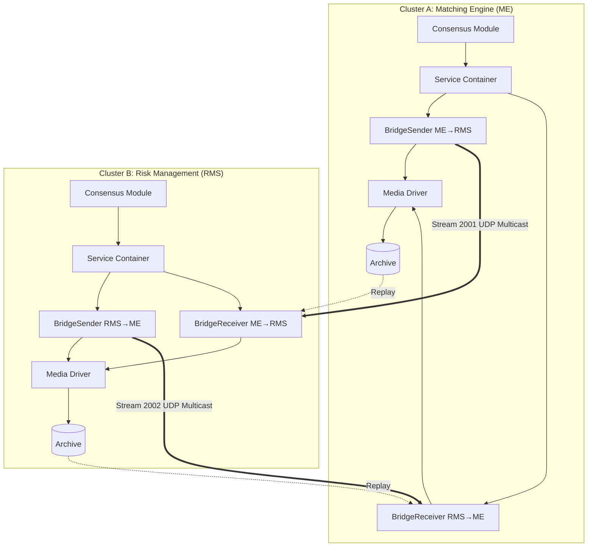
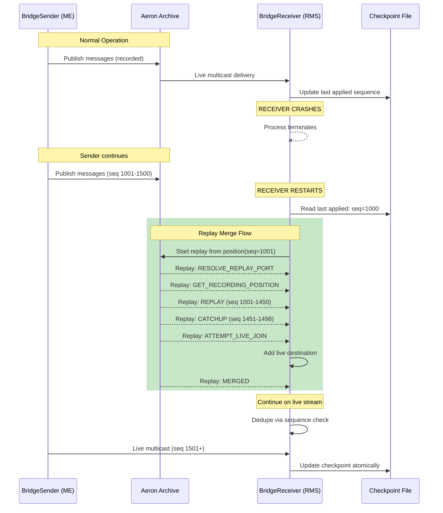
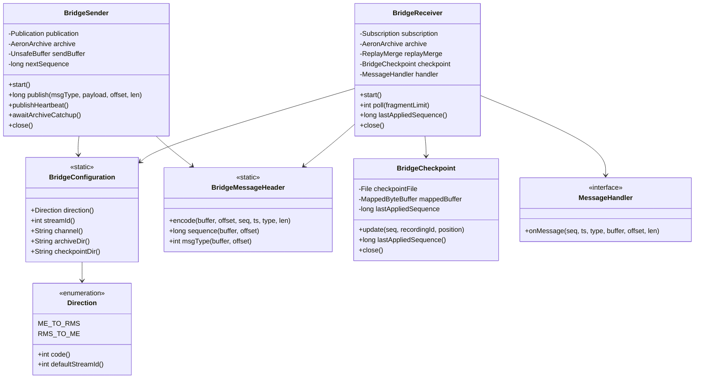
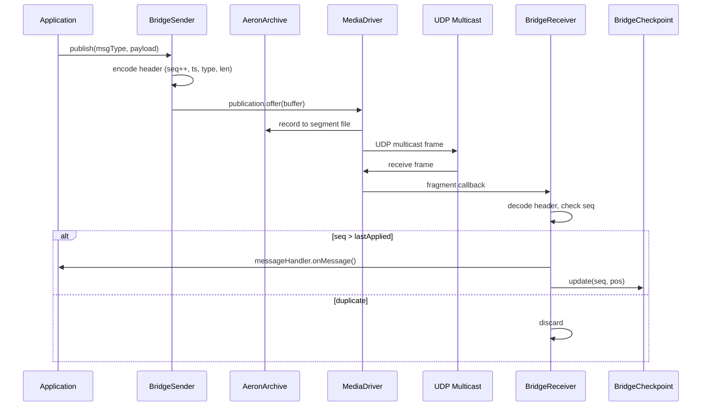
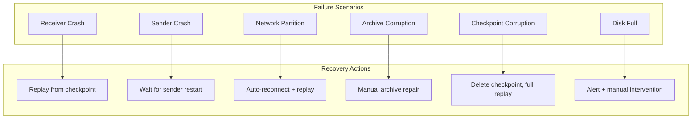
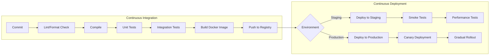
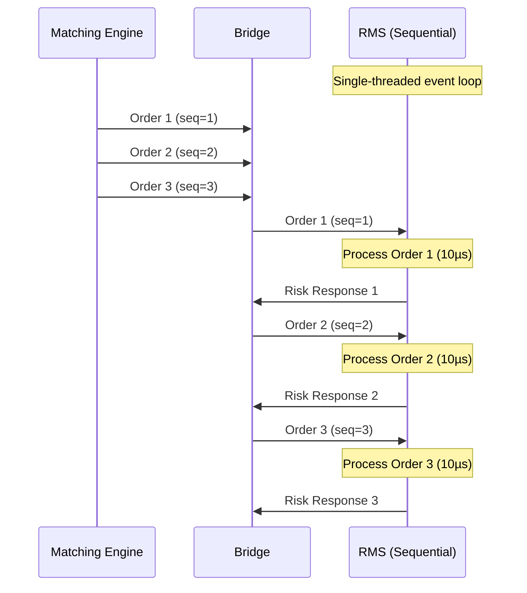
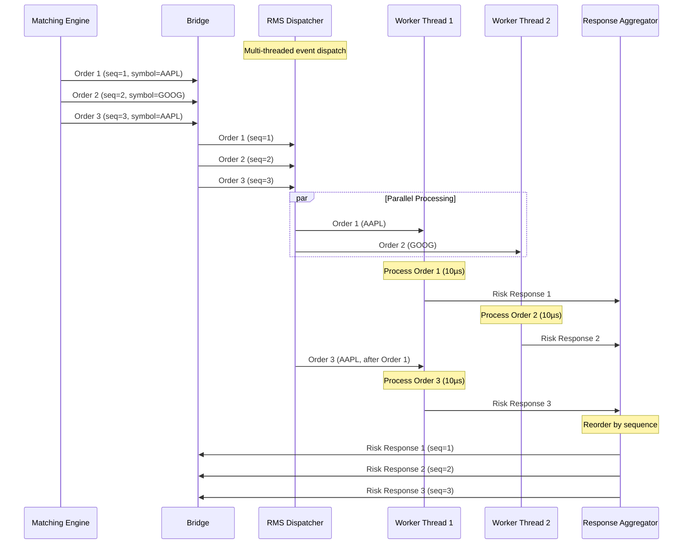

# Cluster Bridge Service - Architecture Plan

## Overview

This document describes the architecture for an inter-cluster Bridge Service enabling deterministic, bidirectional communication between two independent Aeron Clusters:

- **Cluster A (ME)**: Matching Engine
- **Cluster B (RMS)**: Risk Management System

The bridge provides:
1. Ultra-low latency live traffic via UDP multicast
2. Deterministic replay and catch-up via Aeron Archive
3. Fault tolerance with graceful degradation

## Architecture

### Component Overview

```
┌─────────────────────────────────────────────────────────────────────────────┐
│                           Deployment Architecture                            │
├─────────────────────────────────────────────────────────────────────────────┤
│                                                                             │
│   ┌─────────────────────────────────┐     ┌─────────────────────────────┐   │
│   │         Cluster A (ME)          │     │        Cluster B (RMS)      │   │
│   │  ┌───────────────────────────┐  │     │  ┌───────────────────────┐  │   │
│   │  │   Consensus Module        │  │     │  │   Consensus Module    │  │   │
│   │  │   (Leader/Follower)       │  │     │  │   (Leader/Follower)   │  │   │
│   │  └───────────────────────────┘  │     │  └───────────────────────┘  │   │
│   │  ┌───────────────────────────┐  │     │  ┌───────────────────────┐  │   │
│   │  │   Service Container       │  │     │  │   Service Container   │  │   │
│   │  │   + BridgeSender          │──┼─────┼─▶│   + BridgeReceiver    │  │   │
│   │  └───────────────────────────┘  │     │  └───────────────────────┘  │   │
│   │  ┌───────────────────────────┐  │     │  ┌───────────────────────┐  │   │
│   │  │   BridgeReceiver          │◀─┼─────┼──│   BridgeSender        │  │   │
│   │  │                           │  │     │  │                       │  │   │
│   │  └───────────────────────────┘  │     │  └───────────────────────┘  │   │
│   │  ┌───────────────────────────┐  │     │  ┌───────────────────────┐  │   │
│   │  │   Media Driver            │  │     │  │   Media Driver        │  │   │
│   │  │   + Archive               │  │     │  │   + Archive           │  │   │
│   │  └───────────────────────────┘  │     │  └───────────────────────┘  │   │
│   └─────────────────────────────────┘     └─────────────────────────────┘   │
│                                                                             │
│                         UDP Multicast (Live Path)                           │
│   ◄══════════════════════════════════════════════════════════════════════►  │
│        Stream 2001 (ME→RMS)              Stream 2002 (RMS→ME)               │
│                                                                             │
└─────────────────────────────────────────────────────────────────────────────┘
```

### Mermaid Deployment Diagram



## Stream and Channel Layout

### Channel Configuration

| Direction | Stream ID | Channel (Live Multicast) | Archive Channel |
|-----------|-----------|-------------------------|-----------------|
| ME → RMS  | 2001      | `aeron:udp?endpoint=239.1.1.1:40456\|interface=0.0.0.0` | `aeron:udp?endpoint=localhost:40456` |
| RMS → ME  | 2002      | `aeron:udp?endpoint=239.1.1.2:40457\|interface=0.0.0.0` | `aeron:udp?endpoint=localhost:40457` |

### Control Channels

| Purpose | Stream ID | Channel |
|---------|-----------|---------|
| Archive Control (Request) | 10001 | `aeron:udp?endpoint=localhost:8010` |
| Archive Control (Response) | 10002 | `aeron:udp?endpoint=localhost:8020` |
| Archive Recording Events | 10003 | `aeron:udp?endpoint=localhost:8030` |

### Rationale for Stream ID Selection
- Stream IDs 2001/2002 are chosen to avoid conflict with default samples (1001-1003)
- Separate stream IDs per direction enable independent replay and checkpointing
- Multicast addresses 239.1.1.x are in the organization-local scope

## Message Protocol

### Binary Message Format

Using Agrona's `UnsafeBuffer` for zero-allocation messaging:

```
┌──────────────────────────────────────────────────────────────────┐
│                     Bridge Message Header                         │
├──────────┬──────────┬──────────┬──────────┬──────────────────────┤
│ Offset   │ Size     │ Type     │ Field    │ Description          │
├──────────┼──────────┼──────────┼──────────┼──────────────────────┤
│ 0        │ 8 bytes  │ long     │ sequence │ Monotonic sequence # │
│ 8        │ 8 bytes  │ long     │ timestamp│ Epoch nanos          │
│ 16       │ 4 bytes  │ int      │ msgType  │ Message type enum    │
│ 20       │ 4 bytes  │ int      │ length   │ Payload length       │
│ 24       │ N bytes  │ byte[]   │ payload  │ Application data     │
└──────────┴──────────┴──────────┴──────────┴──────────────────────┘

Total Header Size: 24 bytes
Maximum Payload: (MTU - 24) bytes, typically ~1448 bytes for standard MTU
```

### Message Types

```java
public static final int MSG_TYPE_ORDER_NEW = 1;
public static final int MSG_TYPE_ORDER_CANCEL = 2;
public static final int MSG_TYPE_ORDER_MODIFY = 3;
public static final int MSG_TYPE_RISK_CHECK_REQUEST = 10;
public static final int MSG_TYPE_RISK_CHECK_RESPONSE = 11;
public static final int MSG_TYPE_POSITION_UPDATE = 20;
public static final int MSG_TYPE_HEARTBEAT = 99;
```

## Replay and Catch-up Design

### State Machine: Replay → Live Join

The bridge receiver uses Aeron's `ReplayMerge` class to seamlessly transition from archived data to live stream without duplicates.



### Duplicate Prevention Strategy

1. **Sequence-based Deduplication**: Each message carries a monotonically increasing sequence number. The receiver tracks the highest applied sequence and discards any message with `seq <= lastAppliedSequence`.

2. **Position-based Checkpoint**: The checkpoint stores both:
   - `lastAppliedSequence`: Application-level sequence for deduplication
   - `archivePosition`: Aeron log position for replay start point

3. **ReplayMerge Guarantees**: Aeron's `ReplayMerge` handles the transition from replay to live stream atomically by:
   - Adding live destination when within merge window
   - Verifying 2+ active transports before removing replay
   - Using position-based tracking internally

### Checkpoint File Format

```
┌────────────────────────────────────────────────────────┐
│              Checkpoint File (Binary)                  │
├──────────┬──────────┬──────────────────────────────────┤
│ Offset   │ Type     │ Field                            │
├──────────┼──────────┼──────────────────────────────────┤
│ 0        │ int      │ version (1)                      │
│ 4        │ int      │ direction (1=ME→RMS, 2=RMS→ME)   │
│ 8        │ long     │ lastAppliedSequence              │
│ 16       │ long     │ archiveRecordingId               │
│ 24       │ long     │ archivePosition                  │
│ 32       │ long     │ timestampNanos                   │
│ 40       │ long     │ checksum (CRC64)                 │
└──────────┴──────────┴──────────────────────────────────┘
Total Size: 48 bytes (fits in single sector for atomic write)
```

## Deterministic Processing Rules

### Ordering Guarantees

1. **Single-Source Ordering**: Messages from ME to RMS maintain strict FIFO order within a single stream
2. **Sequence Monotonicity**: Sequence numbers are strictly increasing per direction
3. **No Reordering on Replay**: Archive replay preserves original publication order

### Idempotency Rules

1. **At-Least-Once Delivery**: The system guarantees at-least-once delivery; duplicates are possible
2. **Receiver-Side Deduplication**: Receivers MUST track and discard duplicate sequences
3. **Checkpoint Atomicity**: Sequence advancement and checkpoint update are logically atomic

### Processing Contract

```java
// Receiver pseudocode
void onMessage(long sequence, long timestamp, int msgType, DirectBuffer payload) {
    if (sequence <= lastAppliedSequence) {
        // Duplicate - discard
        return;
    }

    if (sequence != lastAppliedSequence + 1) {
        // Gap detected - may need replay or alert
        handleSequenceGap(lastAppliedSequence, sequence);
    }

    // Process message
    processApplicationMessage(msgType, payload);

    // Update checkpoint (atomic)
    lastAppliedSequence = sequence;
    persistCheckpoint();
}
```

## Backpressure and Overload Policy

### Backpressure Strategy

| Condition | Action | Rationale |
|-----------|--------|-----------|
| `Publication.BACK_PRESSURED` | Yield and retry with exponential backoff | Subscriber cannot keep up; avoid overwhelming |
| `Publication.NOT_CONNECTED` | Buffer locally, retry connection | Temporary network partition |
| `Publication.ADMIN_ACTION` | Retry immediately | Transient internal action |
| `Publication.MAX_POSITION_EXCEEDED` | Rotate publication, alert | Term exhaustion (unlikely) |

### Overload Detection

```java
// Sender-side metrics
private long backpressureCount = 0;
private long lastBackpressureTimeNs = 0;
private static final long OVERLOAD_THRESHOLD_NS = TimeUnit.MILLISECONDS.toNanos(100);

boolean isOverloaded() {
    return backpressureCount > 0 &&
           (System.nanoTime() - lastBackpressureTimeNs) < OVERLOAD_THRESHOLD_NS;
}
```

### Burst Handling

For crypto exchange bursts:

1. **Ring Buffer Sizing**: Configure term buffer length to accommodate expected burst size (default: 16MB)
2. **Receiver Pacing**: Use `IdleStrategy` with `BackoffIdleStrategy` for power efficiency during idle periods
3. **Flow Control**: Rely on Aeron's built-in NAK-based loss recovery and flow control

### Graceful Degradation

| Failure Mode | Behavior | Recovery |
|--------------|----------|----------|
| Receiver crash | Sender continues publishing; Archive records | Receiver replays from checkpoint |
| Sender crash | Receiver detects via heartbeat timeout | Alert; wait for sender recovery |
| Network partition | Publications fail; local buffering | Automatic reconnection |
| Archive failure | Live traffic continues; replay unavailable | Alert; manual archive recovery |

## Performance Considerations

### Hot Path Optimizations

1. **Zero-Copy Messaging**: Use `DirectBuffer` exclusively; avoid byte[] allocations
2. **Object Pooling**: Pre-allocate message headers and reuse
3. **Busy-Spin Idle**: Use `BusySpinIdleStrategy` for lowest latency (at CPU cost)
4. **Pinned Threads**: Recommend pinning sender/receiver threads to dedicated cores

### Memory Layout

```java
// Pre-allocated buffer for message construction
private final UnsafeBuffer sendBuffer = new UnsafeBuffer(
    BufferUtil.allocateDirectAligned(MESSAGE_MAX_SIZE, 64)); // Cache-line aligned

// Avoid allocation in hot path
public long publish(int msgType, DirectBuffer payload, int offset, int length) {
    sendBuffer.putLong(OFFSET_SEQUENCE, nextSequence++);
    sendBuffer.putLong(OFFSET_TIMESTAMP, epochClock.nanoTime());
    sendBuffer.putInt(OFFSET_MSG_TYPE, msgType);
    sendBuffer.putInt(OFFSET_LENGTH, length);
    sendBuffer.putBytes(OFFSET_PAYLOAD, payload, offset, length);

    return publication.offer(sendBuffer, 0, HEADER_SIZE + length);
}
```

### Latency Budget

| Component | Target | Notes |
|-----------|--------|-------|
| Serialization | < 100ns | Header write is 8 field writes |
| Publication offer | < 500ns | Memory-mapped file write |
| Network transit | < 50µs | Local network multicast |
| Reception + deser | < 200ns | Read from Image |
| **Total one-way** | **< 51µs** | 99th percentile target |

## Fit Check: Why Aeron

### Strengths for This Use Case

| Requirement | Aeron Capability | Fit |
|-------------|------------------|-----|
| Ultra-low latency | Memory-mapped IPC, zero-copy | Excellent |
| UDP Multicast | Native multicast support | Excellent |
| Replay/Recovery | Archive with ReplayMerge | Excellent |
| Deterministic ordering | Single-publisher FIFO guarantee | Excellent |
| Backpressure | Publication status codes | Good |
| High throughput | 10M+ msg/sec possible | Excellent |

### Limitations and Trade-offs

| Concern | Aeron Behavior | Mitigation |
|---------|----------------|------------|
| No built-in exactly-once | At-least-once delivery | Application-level deduplication |
| Multicast requires careful tuning | MTU, flow control, buffer sizes | Operational expertise required |
| Archive adds complexity | Separate process/configuration | ArchivingMediaDriver simplifies |
| No cross-datacenter support | UDP multicast is LAN-only | Unicast or dedicated WAN link for DR |

### Operational Complexity

| Aspect | Complexity | Notes |
|--------|------------|-------|
| Media Driver management | Medium | Recommend embedded driver per JVM |
| Archive configuration | Medium | Segment size, retention policy |
| Monitoring | Medium | Counter-based; need external collection |
| Debugging | High | Requires understanding of Aeron internals |
| Upgrades | Low | Protocol backward-compatible |

### Alternative Considered

| Technology | Rejected Because |
|------------|------------------|
| Kafka | Too high latency (ms vs µs) |
| Chronicle Queue | No native multicast |
| ZeroMQ | No built-in persistence/replay |
| Custom UDP | No flow control, no archive |

## Module Structure

The bridge implementation is in a dedicated module `aeron-cluster-bridge`:

```
aeron-cluster-bridge/
├── src/main/java/io/aeron/cluster/bridge/
│   ├── BridgeConfiguration.java   # Configuration constants (SOLID - SRP)
│   ├── BridgeMessageHeader.java   # Message header codec (zero-alloc)
│   ├── BridgeSender.java          # Publication side with archive recording
│   ├── BridgeReceiver.java        # Subscription side with replay-merge
│   ├── BridgeCheckpoint.java      # Atomic checkpoint persistence
│   ├── ClusterBridgeMain.java     # Unified entry point (Command Pattern)
│   └── BridgeVerifier.java        # Deterministic verification utility
├── src/test/java/io/aeron/cluster/bridge/
│   └── BridgeIntegrationTest.java # JUnit 5 integration tests
├── Dockerfile                     # Container image for deployment
└── docker-compose.yml             # Multi-container local testing
```

### Design Rationale

- **Dedicated Module**: Separates bridge concerns from samples, following SOLID principles
- **Clean Dependencies**: Only depends on aeron-cluster and aeron-archive
- **Testable**: Isolated module enables focused unit and integration tests

## Low-Level Design (LLD)

### Class Diagram



### Component Interaction Sequence



## Architecture Considerations

### Single-Shard vs Multi-Shard

| Aspect | Current Implementation | Multi-Shard Extension |
|--------|----------------------|----------------------|
| **Design** | Single-shard per direction | Requires stream ID partitioning |
| **Throughput** | ~10M msg/sec single stream | Linear scaling with shard count |
| **Ordering** | Total ordering within stream | Per-shard ordering only |
| **Complexity** | Low | Medium (shard routing logic) |
| **Recovery** | Single checkpoint per direction | Checkpoint per shard |

**Current Choice**: Single-shard design for simplicity. For multi-shard:
- Partition by instrument/symbol hash
- Each shard has independent stream ID (e.g., 2001-2099 for ME→RMS)
- Cross-shard ordering requires vector clocks or global sequencer

### Single-Machine vs Multi-Machine

| Aspect | Single-Machine | Multi-Machine |
|--------|---------------|---------------|
| **Network** | IPC or loopback UDP | Multicast or unicast UDP |
| **Archive** | Shared filesystem | Distributed archive (replication) |
| **Latency** | < 10µs | 50-500µs (network dependent) |
| **Fault Isolation** | Process-level | Machine-level |
| **Configuration** | Embedded driver | Dedicated driver per node |

**Current Choice**: Supports both via channel configuration:
- Single-machine: `aeron:udp?endpoint=localhost:port`
- Multi-machine: `aeron:udp?endpoint=239.1.1.1:port|interface=eth0`

### Aeron Architecture Optimization

```
┌─────────────────────────────────────────────────────────────────┐
│                    Optimization Strategies                       │
├─────────────────────────────────────────────────────────────────┤
│                                                                 │
│  1. MEMORY LAYOUT                                               │
│     ├── Cache-line aligned buffers (64 bytes)                   │
│     ├── Pre-allocated send buffer (no GC in hot path)           │
│     └── Memory-mapped checkpoint (atomic sector writes)         │
│                                                                 │
│  2. THREADING MODEL                                             │
│     ├── Single-writer principle (one thread per publication)    │
│     ├── Busy-spin idle strategy for lowest latency              │
│     └── CPU pinning recommended for production                  │
│                                                                 │
│  3. NETWORK OPTIMIZATION                                        │
│     ├── MTU sizing (jumbo frames: 9000 bytes)                   │
│     ├── Socket buffer tuning (SO_SNDBUF/SO_RCVBUF)              │
│     └── Multicast TTL and interface binding                     │
│                                                                 │
│  4. ARCHIVE OPTIMIZATION                                        │
│     ├── Segment file size (default: 128MB)                      │
│     ├── Async recording (non-blocking publication)              │
│     └── Replay merge window (32MB max)                          │
│                                                                 │
└─────────────────────────────────────────────────────────────────┘
```

## Consistency Model

### Consistency Guarantees

| Property | Guarantee | Mechanism |
|----------|-----------|-----------|
| **Ordering** | Total order per stream | Single-writer, monotonic sequence |
| **Durability** | At-least-once | Archive recording + checkpoint |
| **Consistency** | **Eventual with ordering** | Replay catch-up on recovery |
| **Idempotency** | Receiver-enforced | Sequence-based deduplication |

### NOT Strong Consistency

This system provides **eventual consistency with ordering**, NOT strong consistency:

1. **No distributed transactions**: Sender doesn't wait for receiver ACK
2. **Asynchronous replication**: Archive recording is async to publication
3. **Recovery lag**: Receiver may be behind sender during replay

For strong consistency (e.g., Raft consensus), use Aeron Cluster's built-in replication within each cluster, not the bridge.

### CAP Theorem Position

```
         Consistency
            /\
           /  \
          /    \
         / THIS \
        /  SYSTEM \
       /    (AP)   \
      /____________\
   Availability   Partition
                  Tolerance
```

The bridge prioritizes **Availability** and **Partition Tolerance**:
- Sender continues publishing during network partitions
- Receiver catches up after partition heals
- No blocking on cross-cluster consensus

## Failure Handling

### Failure Scenarios and Recovery



### Network Throttling Handling

| Scenario | Detection | Response |
|----------|-----------|----------|
| **High latency** | Publication backpressure | Exponential backoff retry |
| **Packet loss** | NAK retransmission | Aeron handles automatically |
| **Bandwidth limit** | Sustained backpressure | Reduce send rate, alert |
| **Complete outage** | NOT_CONNECTED status | Local buffering (limited) |

### Machine Down Handling

| Failed Component | Impact | Recovery |
|------------------|--------|----------|
| **ME sender machine** | RMS stops receiving ME→RMS | ME cluster elects new leader, sender restarts |
| **RMS receiver machine** | Messages accumulate in archive | Receiver restarts, replays from checkpoint |
| **Archive storage** | Cannot replay, live continues | Restore from backup or accept data loss |
| **Both clusters** | Complete outage | Sequential restart: archive → sender → receiver |

## Benchmarking and Performance

### Expected Performance Metrics

| Metric | Target | Measurement Method |
|--------|--------|-------------------|
| **One-way latency (p50)** | < 10µs | Timestamp in message header |
| **One-way latency (p99)** | < 50µs | Histogram collection |
| **Throughput** | > 1M msg/sec | Rate counter |
| **Replay speed** | > 5M msg/sec | Archive playback benchmark |
| **Recovery time** | < 10 sec/1M messages | End-to-end recovery test |

### Latency Breakdown

```
Publication Path:
├── Header encoding:           ~50 ns
├── Buffer copy:               ~100 ns
├── Publication.offer():       ~300 ns
├── Media driver processing:   ~500 ns
├── Network transit (local):   ~5,000 ns
└── Total (sender side):       ~6,000 ns (6µs)

Reception Path:
├── Fragment callback:         ~100 ns
├── Header decoding:           ~50 ns
├── Sequence check:            ~10 ns
├── Handler invocation:        ~100 ns (app-dependent)
└── Total (receiver side):     ~300 ns

TOTAL ONE-WAY: ~6.3µs (local network)
```

### Reliability Metrics

| Metric | Target | Notes |
|--------|--------|-------|
| **Message loss rate** | 0% | Archive ensures durability |
| **Duplicate rate** | 0% (after dedup) | Sequence filtering |
| **Out-of-order rate** | 0% | Single-stream FIFO |
| **Recovery success rate** | 100% | Checkpoint + replay |

## Known Bottlenecks and Limitations

### Current Bottlenecks

| Bottleneck | Impact | Mitigation |
|------------|--------|------------|
| **Single-stream throughput** | ~10M msg/sec max | Shard by instrument |
| **Checkpoint I/O** | fsync latency (~100µs) | Batch checkpoint updates |
| **ReplayMerge timeout** | 5 sec default | Tune merge window |
| **Archive segment rotation** | Brief pause | Configure larger segments |

### Potential Loopholes

| Issue | Risk | Resolution |
|-------|------|------------|
| **Checkpoint clock skew** | Timestamp-based ordering issues | Use monotonic sequence only |
| **Archive corruption** | Silent data loss | Add CRC to messages |
| **Memory leak in long-running** | OOM after days | Monitor native memory |
| **Stream ID collision** | Message cross-talk | Strict ID allocation |
| **Unbounded replay** | Slow recovery | Checkpoint pruning policy |

### Risk Mitigation Matrix

```
┌─────────────────────────────────────────────────────────────────┐
│                      Risk Assessment                             │
├──────────────────┬──────────┬───────────────────────────────────┤
│ Risk             │ Severity │ Mitigation                        │
├──────────────────┼──────────┼───────────────────────────────────┤
│ Data loss        │ HIGH     │ Archive + checkpoint + monitoring │
│ High latency     │ MEDIUM   │ Busy-spin, CPU pinning, tuning    │
│ Ordering errors  │ HIGH     │ Single-writer, sequence checks    │
│ Recovery failure │ HIGH     │ Multiple checkpoint copies        │
│ Resource exhaust │ MEDIUM   │ Bounded buffers, retention policy │
└──────────────────┴──────────┴───────────────────────────────────┘
```

## Configuration Reference

### System Properties

| Property | Default | Description |
|----------|---------|-------------|
| `bridge.direction` | `ME_TO_RMS` | Message direction |
| `bridge.live.channel` | `aeron:udp?endpoint=239.1.1.1:40456` | Multicast channel |
| `bridge.stream.id` | `2001` | Stream ID |
| `bridge.archive.dir` | `./aeron-archive` | Archive storage |
| `bridge.checkpoint.dir` | `./checkpoints` | Checkpoint storage |
| `bridge.embedded.driver` | `true` | Use embedded media driver |

## Summary

This design leverages Aeron's strengths:
- **ReplayMerge** for seamless archive-to-live transition
- **UDP Multicast** for lowest-latency fan-out
- **Archive** for durability and recovery

The trade-off is operational complexity, mitigated by:
- Embedded drivers reducing process management
- Atomic checkpointing for deterministic recovery
- Comprehensive logging for debugging

The bridge provides deterministic, ordered, deduplicated message delivery with sub-100µs latency targets suitable for high-frequency trading workloads.

## CI/CD Guidelines

### Build Pipeline



### GitHub Actions Workflow

```yaml
# .github/workflows/bridge-ci.yml
name: Bridge CI/CD

on:
  push:
    branches: [master, develop]
    paths:
      - 'aeron-cluster-bridge/**'
  pull_request:
    branches: [master]

jobs:
  build:
    runs-on: ubuntu-latest
    steps:
      - uses: actions/checkout@v4

      - name: Set up JDK 17
        uses: actions/setup-java@v4
        with:
          java-version: '17'
          distribution: 'temurin'

      - name: Cache Gradle packages
        uses: actions/cache@v4
        with:
          path: ~/.gradle/caches
          key: gradle-${{ hashFiles('**/*.gradle*') }}

      - name: Build
        run: ./gradlew :aeron-cluster-bridge:build

      - name: Unit Tests
        run: ./gradlew :aeron-cluster-bridge:test

      - name: Integration Tests
        run: ./gradlew :aeron-cluster-bridge:integrationTest

  docker:
    needs: build
    runs-on: ubuntu-latest
    steps:
      - uses: actions/checkout@v4

      - name: Build Docker Image
        run: |
          docker build -t aeron-cluster-bridge:${{ github.sha }} \
            -f aeron-cluster-bridge/Dockerfile .

      - name: Push to Registry
        if: github.ref == 'refs/heads/master'
        run: |
          docker tag aeron-cluster-bridge:${{ github.sha }} \
            ghcr.io/${{ github.repository }}/bridge:latest
          docker push ghcr.io/${{ github.repository }}/bridge:latest

  staging:
    needs: docker
    if: github.ref == 'refs/heads/master'
    runs-on: ubuntu-latest
    environment: staging
    steps:
      - name: Deploy to Staging
        run: |
          # Deploy using kubectl, docker-compose, or cloud-specific CLI
          echo "Deploying to staging..."

      - name: Run Smoke Tests
        run: |
          # Run basic verification
          ./gradlew :aeron-cluster-bridge:runBridgeVerifier
```

### Production Deployment Checklist

- [ ] All unit and integration tests pass
- [ ] Performance benchmarks meet SLA
- [ ] Docker image built and scanned for vulnerabilities
- [ ] Configuration reviewed (channels, stream IDs, buffer sizes)
- [ ] Monitoring dashboards configured
- [ ] Alerting rules set up
- [ ] Rollback plan documented
- [ ] On-call rotation scheduled

### Monitoring and Observability

```
Metrics to Monitor:
├── bridge.sender.messages.sent       (counter)
├── bridge.sender.position            (gauge)
├── bridge.sender.backpressure.count  (counter)
├── bridge.receiver.messages.received (counter)
├── bridge.receiver.duplicates        (counter)
├── bridge.receiver.last.sequence     (gauge)
├── bridge.checkpoint.updates         (counter)
└── bridge.replay.merge.state         (gauge)

Alerts:
├── Backpressure rate > 1% sustained for 1 min
├── Sequence gap detected
├── Replay merge failed
├── Checkpoint write failure
└── Archive disk > 80% full
```

## Local Verification Guide

### Quick Start - Verify Bidirectional Flow

```bash
# Terminal 1: Start ME sender
./gradlew :aeron-cluster-bridge:runBridgeSender \
    -Dbridge.direction=ME_TO_RMS \
    -Dbridge.message.count=100

# Terminal 2: Start RMS receiver
./gradlew :aeron-cluster-bridge:runBridgeReceiver \
    -Dbridge.direction=ME_TO_RMS

# Expected: Receiver shows 100 messages received
```

### Verify Replay Scenario

```bash
# Step 1: Start sender (keep running)
./gradlew :aeron-cluster-bridge:runBridgeSender \
    -Dbridge.message.count=1000 \
    -Dbridge.message.interval.ms=100

# Step 2: Start receiver, wait for ~200 messages, then Ctrl+C
./gradlew :aeron-cluster-bridge:runBridgeReceiver

# Step 3: Restart receiver - should replay missed messages
./gradlew :aeron-cluster-bridge:runBridgeReceiver

# Expected: Receiver shows "Replay merge" in logs, catches up
```

### Docker-Based Testing

```bash
# Build images
docker-compose -f aeron-cluster-bridge/docker-compose.yml build

# Run full bidirectional test
docker-compose -f aeron-cluster-bridge/docker-compose.yml up

# Run verifier
docker-compose -f aeron-cluster-bridge/docker-compose.yml \
    --profile test run verifier
```

## Testing Strategy

### Test Pyramid

```
                    ╱╲
                   ╱  ╲
                  ╱ E2E╲        ← Docker/TestContainers (few)
                 ╱______╲
                ╱        ╲
               ╱Integration╲    ← Component tests (medium)
              ╱____________╲
             ╱              ╲
            ╱   Unit Tests   ╲  ← Fast, isolated (many)
           ╱__________________╲
```

### Test Categories

| Category | Location | Purpose |
|----------|----------|---------|
| Unit | `src/test/java/.../bridge/` | Header encoding, config |
| Integration | `src/test/java/.../bridge/` | Sender/Receiver lifecycle |
| E2E | `docker-compose.yml` | Full bidirectional flow |
| Scenario | `OptionsExchangeScenarioTest` | Trading scenarios |

---

## AWS Infrastructure Deployment Guide

### Overview

This section provides detailed guidance for deploying the Aeron Cluster Bridge on AWS infrastructure, including machine provisioning, network configuration, and performance optimization strategies.

### AWS Network Topology

```
┌─────────────────────────────────────────────────────────────────────────────────┐
│                        AWS VPC (10.0.0.0/16)                                    │
├─────────────────────────────────────────────────────────────────────────────────┤
│                                                                                 │
│  ┌──────────────────────────────┐    ┌──────────────────────────────┐          │
│  │   Availability Zone A         │    │   Availability Zone B         │          │
│  │   (us-east-1a)                │    │   (us-east-1b)                │          │
│  │                               │    │                               │          │
│  │  ┌─────────────────────────┐  │    │  ┌─────────────────────────┐  │          │
│  │  │  Private Subnet A       │  │    │  │  Private Subnet B       │  │          │
│  │  │  (10.0.1.0/24)          │  │    │  │  (10.0.2.0/24)          │  │          │
│  │  │                         │  │    │  │                         │  │          │
│  │  │  ┌───────────────────┐  │  │    │  │  ┌───────────────────┐  │  │          │
│  │  │  │ ME Cluster Node 1 │  │  │    │  │  │ ME Cluster Node 2 │  │  │          │
│  │  │  │ (c6i.4xlarge)     │  │  │    │  │  │ (c6i.4xlarge)     │  │  │          │
│  │  │  └───────────────────┘  │  │    │  │  └───────────────────┘  │  │          │
│  │  │           │             │  │    │  │           │             │  │          │
│  │  │           ▼             │  │    │  │           ▼             │  │          │
│  │  │  ┌───────────────────┐  │  │    │  │  ┌───────────────────┐  │  │          │
│  │  │  │ RMS Cluster Node 1│  │  │    │  │  │ RMS Cluster Node 2│  │  │          │
│  │  │  │ (c6i.2xlarge)     │  │  │    │  │  │ (c6i.2xlarge)     │  │  │          │
│  │  │  └───────────────────┘  │  │    │  │  └───────────────────┘  │  │          │
│  │  │                         │  │    │  │                         │  │          │
│  │  └─────────────────────────┘  │    │  └─────────────────────────┘  │          │
│  │                               │    │                               │          │
│  │  ┌─────────────────────────┐  │    │  ┌─────────────────────────┐  │          │
│  │  │  EBS gp3 Volume         │  │    │  │  EBS gp3 Volume         │  │          │
│  │  │  (Archive Storage)      │  │    │  │  (Archive Storage)      │  │          │
│  │  │  500GB, 16K IOPS        │  │    │  │  500GB, 16K IOPS        │  │          │
│  │  └─────────────────────────┘  │    │  └─────────────────────────┘  │          │
│  └──────────────────────────────┘    └──────────────────────────────┘          │
│                                                                                 │
│  ┌─────────────────────────────────────────────────────────────────────────┐   │
│  │                    Placement Group (cluster)                             │   │
│  │                    Low-latency inter-node communication                  │   │
│  └─────────────────────────────────────────────────────────────────────────┘   │
│                                                                                 │
└─────────────────────────────────────────────────────────────────────────────────┘
```

### Machine Provisioning Recommendations

#### Matching Engine (ME) Cluster

The ME requires the highest performance for order matching and requires strict determinism.

| Configuration | Instance Type | vCPU | Memory | Network | Use Case |
|--------------|---------------|------|--------|---------|----------|
| **Production (Recommended)** | c6i.8xlarge | 32 | 64 GB | 12.5 Gbps | High-volume production |
| **Production (Budget)** | c6i.4xlarge | 16 | 32 GB | Up to 12.5 Gbps | Medium-volume production |
| **Staging** | c6i.2xlarge | 8 | 16 GB | Up to 12.5 Gbps | Performance testing |
| **Development** | c6i.xlarge | 4 | 8 GB | Up to 12.5 Gbps | Development/debugging |

**Instance Selection Rationale (ME):**
- **c6i series**: Intel Ice Lake processors with consistent clock speeds, ideal for latency-sensitive workloads
- **Compute-optimized**: ME is CPU-bound during order matching
- **High network bandwidth**: Essential for multicast traffic
- **No burstable instances**: T-series inappropriate due to CPU credit variability

#### Risk Management System (RMS) Cluster

The RMS handles risk calculations and can tolerate slightly higher latency than ME.

| Configuration | Instance Type | vCPU | Memory | Network | Use Case |
|--------------|---------------|------|--------|---------|----------|
| **Production (Recommended)** | c6i.4xlarge | 16 | 32 GB | Up to 12.5 Gbps | High-volume production |
| **Production (Budget)** | c6i.2xlarge | 8 | 16 GB | Up to 12.5 Gbps | Medium-volume production |
| **Staging** | c6i.xlarge | 4 | 8 GB | Up to 12.5 Gbps | Performance testing |
| **Development** | c5.large | 2 | 4 GB | Up to 10 Gbps | Development/debugging |

**Instance Selection Rationale (RMS):**
- **Smaller than ME**: Risk checks are less computationally intensive than order matching
- **Memory considerations**: Risk calculations may need more memory for position tracking
- **Same instance family**: Ensures consistent network performance

### Configuration Profiles for Experimentation

#### Profile 1: Ultra-Low Latency (Aggressive)

```properties
# Ultra-low latency configuration - highest cost, lowest latency
# Target: Sub-10µs one-way latency

# Instance: c6i.8xlarge or c6i.metal for both ME and RMS

# JVM Settings
JAVA_OPTS=-XX:+UseZGC \
         -XX:+UseLargePages \
         -XX:+AlwaysPreTouch \
         -XX:MaxGCPauseMillis=1 \
         -Xms16g -Xmx16g \
         -XX:+UnlockExperimentalVMOptions \
         -XX:+UseNUMA

# Aeron Settings
aeron.term.buffer.length=16777216           # 16MB term buffer
aeron.socket.so_sndbuf=4194304              # 4MB send buffer
aeron.socket.so_rcvbuf=4194304              # 4MB receive buffer
aeron.rcv.initial.window.length=4194304     # 4MB window
aeron.mtu.length=1408                       # Standard MTU
aeron.threading.mode=DEDICATED              # Dedicated conductor thread
aeron.sender.idle.strategy=noop             # Busy spin
aeron.receiver.idle.strategy=noop           # Busy spin
aeron.conductor.idle.strategy=noop          # Busy spin

# Archive Settings
aeron.archive.segment.file.length=268435456 # 256MB segments
aeron.archive.file.sync.level=0             # Async writes (for speed)

# OS Tuning Required
# - CPU isolation via isolcpus kernel parameter
# - IRQ affinity to non-application CPUs
# - Disable hyperthreading
# - Enable huge pages (2MB or 1GB)
```

**Cost Estimate**: ~$2,500/month per node (c6i.8xlarge)

#### Profile 2: Balanced Performance (Recommended for Production)

```properties
# Balanced configuration - good latency with reasonable cost
# Target: Sub-50µs one-way latency

# Instance: c6i.4xlarge for ME, c6i.2xlarge for RMS

# JVM Settings
JAVA_OPTS=-XX:+UseG1GC \
         -XX:MaxGCPauseMillis=5 \
         -XX:+AlwaysPreTouch \
         -Xms8g -Xmx8g

# Aeron Settings
aeron.term.buffer.length=8388608            # 8MB term buffer
aeron.socket.so_sndbuf=2097152              # 2MB send buffer
aeron.socket.so_rcvbuf=2097152              # 2MB receive buffer
aeron.rcv.initial.window.length=2097152     # 2MB window
aeron.mtu.length=1408
aeron.threading.mode=SHARED                 # Shared conductor
aeron.sender.idle.strategy=backoff          # Backoff when idle
aeron.receiver.idle.strategy=backoff
aeron.conductor.idle.strategy=backoff

# Archive Settings
aeron.archive.segment.file.length=134217728 # 128MB segments
aeron.archive.file.sync.level=1             # Sync on segment close

# OS Tuning Recommended
# - Process pinning via taskset
# - Increase socket buffer limits
```

**Cost Estimate**: ~$800/month per ME node, ~$400/month per RMS node

#### Profile 3: Cost-Optimized (Development/Staging)

```properties
# Cost-optimized configuration - acceptable latency, lowest cost
# Target: Sub-200µs one-way latency

# Instance: c6i.xlarge for ME, c5.large for RMS

# JVM Settings
JAVA_OPTS=-XX:+UseG1GC \
         -XX:MaxGCPauseMillis=20 \
         -Xms2g -Xmx2g

# Aeron Settings
aeron.term.buffer.length=4194304            # 4MB term buffer
aeron.socket.so_sndbuf=1048576              # 1MB send buffer
aeron.socket.so_rcvbuf=1048576              # 1MB receive buffer
aeron.rcv.initial.window.length=1048576     # 1MB window
aeron.mtu.length=1408
aeron.threading.mode=SHARED
aeron.sender.idle.strategy=yield            # Yield when idle
aeron.receiver.idle.strategy=yield
aeron.conductor.idle.strategy=sleep-1ms

# Archive Settings
aeron.archive.segment.file.length=67108864  # 64MB segments
aeron.archive.file.sync.level=2             # Sync every write
```

**Cost Estimate**: ~$200/month per ME node, ~$100/month per RMS node

### Storage Configuration

#### Archive Storage (EBS Volumes)

| Tier | Volume Type | Size | IOPS | Throughput | Use Case |
|------|-------------|------|------|------------|----------|
| **Production** | gp3 | 500 GB | 16,000 | 1,000 MB/s | High-volume archive |
| **Staging** | gp3 | 200 GB | 6,000 | 500 MB/s | Testing |
| **Development** | gp3 | 100 GB | 3,000 | 125 MB/s | Development |

**Storage Rationale:**
- **gp3 over io2**: gp3 provides configurable IOPS at lower cost
- **No EFS**: Shared filesystem adds latency; each node has dedicated storage
- **Size calculation**: 24-hour retention × message rate × avg message size × 2 (safety margin)

### Network Configuration

#### VPC and Subnet Design

```hcl
# Terraform excerpt for network configuration

resource "aws_vpc" "aeron_vpc" {
  cidr_block           = "10.0.0.0/16"
  enable_dns_hostnames = true
  enable_dns_support   = true

  tags = {
    Name = "aeron-cluster-vpc"
  }
}

resource "aws_subnet" "private_a" {
  vpc_id            = aws_vpc.aeron_vpc.id
  cidr_block        = "10.0.1.0/24"
  availability_zone = "us-east-1a"
}

resource "aws_subnet" "private_b" {
  vpc_id            = aws_vpc.aeron_vpc.id
  cidr_block        = "10.0.2.0/24"
  availability_zone = "us-east-1b"
}

# Placement group for low-latency communication
resource "aws_placement_group" "cluster" {
  name     = "aeron-cluster-placement"
  strategy = "cluster"
}
```

#### Security Group Rules

```hcl
resource "aws_security_group" "aeron_cluster" {
  name        = "aeron-cluster-sg"
  description = "Security group for Aeron Cluster communication"
  vpc_id      = aws_vpc.aeron_vpc.id

  # ME <-> RMS Bridge Traffic (UDP)
  ingress {
    from_port   = 40456
    to_port     = 40457
    protocol    = "udp"
    self        = true
    description = "Bridge multicast traffic"
  }

  # Archive Control Traffic
  ingress {
    from_port   = 8010
    to_port     = 8030
    protocol    = "udp"
    self        = true
    description = "Archive control channels"
  }

  # Cluster Consensus Traffic
  ingress {
    from_port   = 9000
    to_port     = 9100
    protocol    = "udp"
    self        = true
    description = "Cluster consensus"
  }

  # JMX Monitoring (from bastion only)
  ingress {
    from_port       = 9999
    to_port         = 9999
    protocol        = "tcp"
    security_groups = [aws_security_group.bastion.id]
    description     = "JMX monitoring"
  }

  egress {
    from_port   = 0
    to_port     = 0
    protocol    = "-1"
    cidr_blocks = ["0.0.0.0/0"]
  }
}
```

### Benchmarking Strategy

#### Benchmark Metrics

```
┌─────────────────────────────────────────────────────────────────────────────┐
│                          Benchmark Metrics Matrix                           │
├─────────────────────────────────────────────────────────────────────────────┤
│                                                                             │
│  LATENCY METRICS                                                            │
│  ├── one_way_latency_p50          Target: < 10µs (ultra), < 50µs (balanced)│
│  ├── one_way_latency_p99          Target: < 50µs (ultra), < 200µs (balanced)│
│  ├── one_way_latency_p999         Target: < 200µs (ultra), < 1ms (balanced) │
│  ├── round_trip_latency_p50       Target: < 20µs (ultra), < 100µs (balanced)│
│  └── replay_merge_latency         Target: < 5 seconds for 1M messages      │
│                                                                             │
│  THROUGHPUT METRICS                                                         │
│  ├── messages_per_second          Target: > 1M msg/sec (single stream)     │
│  ├── bytes_per_second             Target: > 500 MB/sec                      │
│  ├── sustained_throughput_1hr     Target: > 90% of peak for 1 hour         │
│  └── burst_capacity               Target: 10x average for 1 second         │
│                                                                             │
│  RELIABILITY METRICS                                                        │
│  ├── message_loss_rate            Target: 0% (with archive)                │
│  ├── duplicate_rate_after_dedup   Target: 0%                               │
│  ├── checkpoint_write_latency     Target: < 1ms p99                        │
│  └── recovery_time_per_1m_msgs    Target: < 10 seconds                     │
│                                                                             │
│  RESOURCE METRICS                                                           │
│  ├── cpu_utilization_sender       Target: < 70% sustained                  │
│  ├── cpu_utilization_receiver     Target: < 50% sustained                  │
│  ├── memory_usage_heap            Target: < 80% of Xmx                     │
│  ├── gc_pause_max                 Target: < 10ms                           │
│  └── network_bandwidth_utilization Target: < 60% of capacity               │
│                                                                             │
└─────────────────────────────────────────────────────────────────────────────┘
```

#### Benchmark Test Suite

```bash
#!/bin/bash
# benchmark_suite.sh - Comprehensive benchmark for Aeron Bridge

set -e

RESULTS_DIR="./benchmark-results/$(date +%Y%m%d_%H%M%S)"
mkdir -p "$RESULTS_DIR"

echo "=== Aeron Bridge Benchmark Suite ==="
echo "Results directory: $RESULTS_DIR"

# Test 1: Latency Baseline (1000 msg/sec for 60 seconds)
echo "Running latency baseline test..."
java -jar aeron-cluster-bridge.jar benchmark \
    --mode latency \
    --rate 1000 \
    --duration 60 \
    --warmup 10 \
    --output "$RESULTS_DIR/latency_baseline.hdr"

# Test 2: Throughput Maximum (saturate for 60 seconds)
echo "Running throughput test..."
java -jar aeron-cluster-bridge.jar benchmark \
    --mode throughput \
    --duration 60 \
    --warmup 10 \
    --output "$RESULTS_DIR/throughput_max.csv"

# Test 3: Burst Handling (10x burst for 1 second, every 10 seconds)
echo "Running burst test..."
java -jar aeron-cluster-bridge.jar benchmark \
    --mode burst \
    --base-rate 100000 \
    --burst-rate 1000000 \
    --burst-duration 1 \
    --burst-interval 10 \
    --duration 120 \
    --output "$RESULTS_DIR/burst_test.csv"

# Test 4: Recovery Benchmark
echo "Running recovery test..."
java -jar aeron-cluster-bridge.jar benchmark \
    --mode recovery \
    --messages 1000000 \
    --output "$RESULTS_DIR/recovery_test.csv"

# Test 5: Sustained Load (1 hour)
echo "Running sustained load test..."
java -jar aeron-cluster-bridge.jar benchmark \
    --mode sustained \
    --rate 500000 \
    --duration 3600 \
    --output "$RESULTS_DIR/sustained_1hr.csv"

echo "=== Benchmark Complete ==="
echo "Generating report..."

# Generate HTML report
java -jar aeron-cluster-bridge.jar report \
    --input "$RESULTS_DIR" \
    --output "$RESULTS_DIR/report.html"

echo "Report: $RESULTS_DIR/report.html"
```

#### CI/CD Benchmark Integration

```yaml
# .github/workflows/benchmark.yml
name: Performance Benchmark

on:
  schedule:
    - cron: '0 2 * * 0'  # Weekly on Sunday at 2 AM
  workflow_dispatch:
    inputs:
      profile:
        description: 'Configuration profile'
        required: true
        default: 'balanced'
        type: choice
        options:
          - ultra-low-latency
          - balanced
          - cost-optimized

jobs:
  benchmark:
    runs-on: self-hosted  # Use dedicated benchmark runners
    timeout-minutes: 180

    steps:
      - uses: actions/checkout@v4

      - name: Setup Environment
        run: |
          # Configure kernel parameters
          sudo sysctl -w net.core.rmem_max=8388608
          sudo sysctl -w net.core.wmem_max=8388608
          sudo sysctl -w net.core.rmem_default=2097152
          sudo sysctl -w net.core.wmem_default=2097152

      - name: Build
        run: ./gradlew :aeron-cluster-bridge:shadowJar

      - name: Run Latency Benchmark
        run: |
          java -jar aeron-cluster-bridge/build/libs/aeron-cluster-bridge-all.jar \
            benchmark --mode latency --duration 300 \
            --output benchmark-latency.hdr

      - name: Run Throughput Benchmark
        run: |
          java -jar aeron-cluster-bridge/build/libs/aeron-cluster-bridge-all.jar \
            benchmark --mode throughput --duration 300 \
            --output benchmark-throughput.csv

      - name: Analyze Results
        run: |
          # Parse HDR histogram and check thresholds
          P99_LATENCY=$(java -jar hdrhistogram.jar --input benchmark-latency.hdr --p99)

          if [ "$P99_LATENCY" -gt 200000 ]; then
            echo "::error::P99 latency ${P99_LATENCY}ns exceeds 200µs threshold"
            exit 1
          fi

          echo "P99 Latency: ${P99_LATENCY}ns - PASS"

      - name: Upload Results
        uses: actions/upload-artifact@v4
        with:
          name: benchmark-results
          path: |
            benchmark-latency.hdr
            benchmark-throughput.csv

      - name: Publish to Dashboard
        if: github.ref == 'refs/heads/master'
        run: |
          # Push metrics to Prometheus/Grafana
          curl -X POST "https://metrics.example.com/api/v1/write" \
            -H "Authorization: Bearer ${{ secrets.METRICS_TOKEN }}" \
            -d @benchmark-throughput.csv
```

---

## Event Flow Analysis: RMS Sequential vs Asynchronous

### Overview

A critical architectural decision is whether the Risk Management System (RMS) should process events **sequentially** (like the Matching Engine) or **asynchronously**. This section analyzes both approaches.

### Sequential Event Processing (Current Design)



#### Sequential Processing Characteristics

| Aspect | Description |
|--------|-------------|
| **Processing Model** | Single-threaded event loop, one message at a time |
| **Ordering** | Total ordering preserved, deterministic |
| **Latency** | Predictable, but cumulative backlog during bursts |
| **Throughput** | Limited by single-core speed |
| **State Management** | Simple, no concurrency concerns |
| **Recovery** | Straightforward replay from checkpoint |

#### Advantages of Sequential Processing

```
┌─────────────────────────────────────────────────────────────────────────────┐
│                    Sequential Processing Advantages                          │
├─────────────────────────────────────────────────────────────────────────────┤
│                                                                             │
│  1. DETERMINISM                                                             │
│     ├── Same input always produces same output                              │
│     ├── Easier debugging and audit trails                                   │
│     ├── Time-travel debugging possible                                      │
│     └── Regulatory compliance (reconstructable state)                       │
│                                                                             │
│  2. SIMPLICITY                                                              │
│     ├── No thread synchronization needed                                    │
│     ├── No race conditions or deadlocks                                     │
│     ├── Single-threaded state management                                    │
│     └── Easier to reason about correctness                                  │
│                                                                             │
│  3. CONSISTENCY                                                             │
│     ├── Risk calculations based on consistent position view                 │
│     ├── No stale reads during concurrent updates                            │
│     ├── Order of risk responses matches order of requests                   │
│     └── Portfolio risk always reflects latest state                         │
│                                                                             │
│  4. RECOVERY                                                                │
│     ├── Simple checkpoint: single sequence number                           │
│     ├── Replay is deterministic - same result every time                    │
│     ├── No need to handle partial transaction rollback                      │
│     └── Audit log is straightforward                                        │
│                                                                             │
└─────────────────────────────────────────────────────────────────────────────┘
```

#### Drawbacks of Sequential Processing

```
┌─────────────────────────────────────────────────────────────────────────────┐
│                    Sequential Processing Drawbacks                           │
├─────────────────────────────────────────────────────────────────────────────┤
│                                                                             │
│  1. THROUGHPUT CEILING                                                      │
│     ├── Single-threaded: ~1-5M msg/sec max on modern hardware              │
│     ├── Cannot scale horizontally within single node                        │
│     ├── Burst traffic creates processing backlog                            │
│     └── Latency spikes during high-volume periods                           │
│                                                                             │
│  2. HEAD-OF-LINE BLOCKING                                                   │
│     ├── Slow risk calculation blocks all subsequent messages                │
│     ├── One complex order can delay simple orders                           │
│     ├── External dependency latency affects entire pipeline                 │
│     └── Cannot prioritize urgent risk checks                                │
│                                                                             │
│  3. RESOURCE UNDERUTILIZATION                                               │
│     ├── Only 1 CPU core active during processing                            │
│     ├── Multiple cores sit idle                                             │
│     ├── Network bandwidth underutilized                                     │
│     └── Memory bandwidth not saturated                                      │
│                                                                             │
│  4. INFLEXIBILITY                                                           │
│     ├── Cannot parallelize independent risk checks                          │
│     ├── Different instruments cannot be processed concurrently              │
│     ├── No overlap between compute and I/O                                  │
│     └── Scaling requires sharding (adds complexity)                         │
│                                                                             │
└─────────────────────────────────────────────────────────────────────────────┘
```

### Asynchronous Event Processing (Alternative)



#### Asynchronous Processing Characteristics

| Aspect | Description |
|--------|-------------|
| **Processing Model** | Multi-threaded with partitioned state |
| **Ordering** | Per-partition ordering, global reordering required |
| **Latency** | Lower average latency, but variable |
| **Throughput** | Scales with thread count |
| **State Management** | Complex, requires thread-safe data structures |
| **Recovery** | Complex, requires per-partition checkpoints |

#### Advantages of Asynchronous Processing

```
┌─────────────────────────────────────────────────────────────────────────────┐
│                    Asynchronous Processing Advantages                        │
├─────────────────────────────────────────────────────────────────────────────┤
│                                                                             │
│  1. HIGHER THROUGHPUT                                                       │
│     ├── Utilizes multiple CPU cores (e.g., 8-16 workers)                   │
│     ├── Throughput scales linearly with core count (up to contention)       │
│     ├── Can process 10M+ msg/sec with proper partitioning                  │
│     └── Better handles burst traffic                                        │
│                                                                             │
│  2. LOWER AVERAGE LATENCY                                                   │
│     ├── Independent messages processed in parallel                          │
│     ├── No head-of-line blocking across partitions                          │
│     ├── I/O and compute can overlap                                         │
│     └── Slow calculations don't block fast ones (different partitions)     │
│                                                                             │
│  3. RESOURCE EFFICIENCY                                                     │
│     ├── Full CPU utilization during high load                              │
│     ├── Better memory bandwidth utilization                                 │
│     ├── Network processing parallelized                                     │
│     └── Cost-effective: smaller instances with more cores                  │
│                                                                             │
│  4. FAULT ISOLATION                                                         │
│     ├── Worker failure doesn't crash entire system                          │
│     ├── Partitions can be rebalanced on failure                            │
│     ├── Graceful degradation under partial failure                          │
│     └── Hot standby workers can take over quickly                          │
│                                                                             │
└─────────────────────────────────────────────────────────────────────────────┘
```

#### Drawbacks of Asynchronous Processing

```
┌─────────────────────────────────────────────────────────────────────────────┐
│                    Asynchronous Processing Drawbacks                         │
├─────────────────────────────────────────────────────────────────────────────┤
│                                                                             │
│  1. COMPLEXITY                                                              │
│     ├── Thread synchronization for shared state                             │
│     ├── Partition assignment and rebalancing logic                          │
│     ├── Global ordering requires sequencer or vector clocks                 │
│     └── More complex testing and debugging                                  │
│                                                                             │
│  2. NON-DETERMINISM RISK                                                    │
│     ├── Race conditions can cause different outcomes                        │
│     ├── Replay may produce different results                                │
│     ├── Thread scheduling affects execution order                           │
│     └── Harder to reproduce bugs                                            │
│                                                                             │
│  3. STATE MANAGEMENT CHALLENGES                                             │
│     ├── Cross-partition state (e.g., portfolio risk) requires locking      │
│     ├── Lock contention limits scalability                                  │
│     ├── Potential for deadlocks                                             │
│     └── Cache coherency overhead between cores                              │
│                                                                             │
│  4. RECOVERY COMPLEXITY                                                     │
│     ├── Per-partition checkpoints required                                  │
│     ├── Global consistent snapshot is expensive                             │
│     ├── Partial replay may miss cross-partition dependencies               │
│     └── More complex audit trail                                            │
│                                                                             │
│  5. ORDERING CONSTRAINTS                                                    │
│     ├── Same-symbol orders MUST be in same partition                        │
│     ├── Portfolio-level risk requires cross-partition coordination          │
│     ├── Response reordering adds latency                                    │
│     └── Causal ordering harder to guarantee                                 │
│                                                                             │
└─────────────────────────────────────────────────────────────────────────────┘
```

### Comparison Matrix

| Criteria | Sequential | Asynchronous | Winner |
|----------|------------|--------------|--------|
| **Throughput** | ~1-5M msg/sec | ~10-50M msg/sec | Async |
| **Latency (average)** | Medium | Low | Async |
| **Latency (worst case)** | Predictable | Variable | Sequential |
| **Determinism** | Guaranteed | Requires care | Sequential |
| **Simplicity** | Simple | Complex | Sequential |
| **Debugging** | Easy | Hard | Sequential |
| **Recovery** | Simple | Complex | Sequential |
| **Regulatory compliance** | Easy | Hard | Sequential |
| **Resource utilization** | Low | High | Async |
| **Cost efficiency** | Lower | Higher | Async |
| **Scalability** | Limited | Good | Async |

### Recommendation: Hybrid Approach

For a crypto options exchange, we recommend a **hybrid approach**:

```
┌─────────────────────────────────────────────────────────────────────────────┐
│                      Recommended Hybrid Architecture                         │
├─────────────────────────────────────────────────────────────────────────────┤
│                                                                             │
│  MATCHING ENGINE (ME): SEQUENTIAL                                           │
│  ├── Reason: Order matching MUST be deterministic                           │
│  ├── Reason: Price-time priority requires strict ordering                   │
│  ├── Reason: Regulatory requirement for reproducible audit                  │
│  └── Implementation: Single-threaded Aeron Cluster                          │
│                                                                             │
│  RISK MANAGEMENT (RMS): PARTITIONED SEQUENTIAL                              │
│  ├── Reason: Risk checks CAN be parallelized by symbol/account              │
│  ├── Reason: Same-symbol orders must be sequential (position tracking)      │
│  ├── Reason: Cross-account checks are independent                           │
│  └── Implementation: Symbol-partitioned workers, each sequential            │
│                                                                             │
│  BRIDGE: ORDERED DELIVERY                                                   │
│  ├── ME→RMS: Total ordering preserved                                       │
│  ├── RMS→ME: Partitioned responses, reordered if needed                     │
│  └── Implementation: Current design with optional response aggregator       │
│                                                                             │
└─────────────────────────────────────────────────────────────────────────────┘
```

### Implementation Strategy for Partitioned RMS

```java
/**
 * Partitioned RMS event processing.
 * Each partition handles a subset of symbols sequentially.
 */
public class PartitionedRmsProcessor implements MessageHandler
{
    private final int partitionCount;
    private final RmsWorker[] workers;
    private final AtomicLong[] partitionSequences;

    public PartitionedRmsProcessor(final int partitionCount)
    {
        this.partitionCount = partitionCount;
        this.workers = new RmsWorker[partitionCount];
        this.partitionSequences = new AtomicLong[partitionCount];

        for (int i = 0; i < partitionCount; i++)
        {
            workers[i] = new RmsWorker(i);
            partitionSequences[i] = new AtomicLong(0);
            workers[i].start();
        }
    }

    @Override
    public void onMessage(
        final long sequence,
        final long timestamp,
        final int msgType,
        final DirectBuffer buffer,
        final int offset,
        final int length)
    {
        // Extract symbol for partitioning
        final long symbolId = buffer.getLong(offset + SYMBOL_OFFSET);

        // Partition by symbol - ensures same-symbol orders go to same worker
        final int partition = (int)(symbolId % partitionCount);

        // Enqueue to partition's worker (wait-free queue)
        workers[partition].enqueue(sequence, timestamp, msgType, buffer, offset, length);
    }

    /**
     * Worker thread for a single partition.
     * Processes messages sequentially within partition.
     */
    private static class RmsWorker extends Thread
    {
        private final int partitionId;
        private final ManyToOneConcurrentArrayQueue<RiskCheckEvent> queue;
        private volatile boolean running = true;

        RmsWorker(final int partitionId)
        {
            this.partitionId = partitionId;
            this.queue = new ManyToOneConcurrentArrayQueue<>(65536);
            setName("rms-worker-" + partitionId);
        }

        void enqueue(/* params */)
        {
            // Add to queue
        }

        @Override
        public void run()
        {
            final IdleStrategy idleStrategy = new BackoffIdleStrategy();

            while (running)
            {
                final RiskCheckEvent event = queue.poll();
                if (event != null)
                {
                    processEvent(event);
                    idleStrategy.reset();
                }
                else
                {
                    idleStrategy.idle();
                }
            }
        }

        private void processEvent(final RiskCheckEvent event)
        {
            // Sequential processing within partition
            // Same symbol always processed by same thread = deterministic
        }
    }
}
```

### Decision Matrix for Your Use Case

Answer these questions to determine the right approach:

| Question | If Yes → | If No → |
|----------|----------|---------|
| Do you need fully reproducible audit trails? | Sequential | Either |
| Is regulatory compliance paramount? | Sequential | Either |
| Do you need >5M msg/sec throughput? | Async/Partitioned | Sequential |
| Is same-symbol ordering critical? | Sequential or Partitioned | Async |
| Do you have complex cross-account risk? | Sequential | Partitioned |
| Is development time constrained? | Sequential | Either |
| Do you have operational expertise for concurrent systems? | Either | Sequential |

### Final Recommendation

For a **crypto options exchange**:

1. **Matching Engine**: **Sequential** (mandatory for determinism)
2. **Risk Management System**: **Partitioned Sequential** (balance of throughput and determinism)
3. **Bridge**: **Current design** (supports both patterns)

This provides:
- Deterministic order matching
- Scalable risk processing (add partitions as needed)
- Same-symbol risk consistency
- Reasonable throughput (~10M msg/sec with 8 partitions)
- Simplified recovery (per-partition checkpoints)
