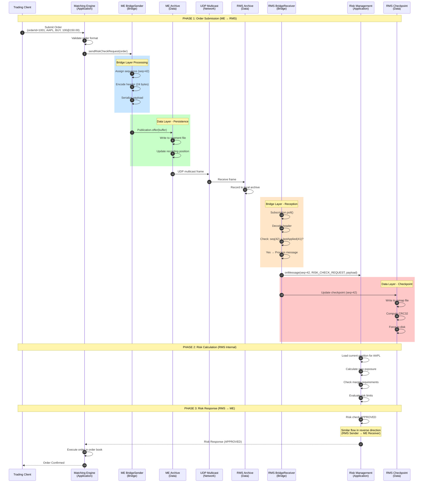
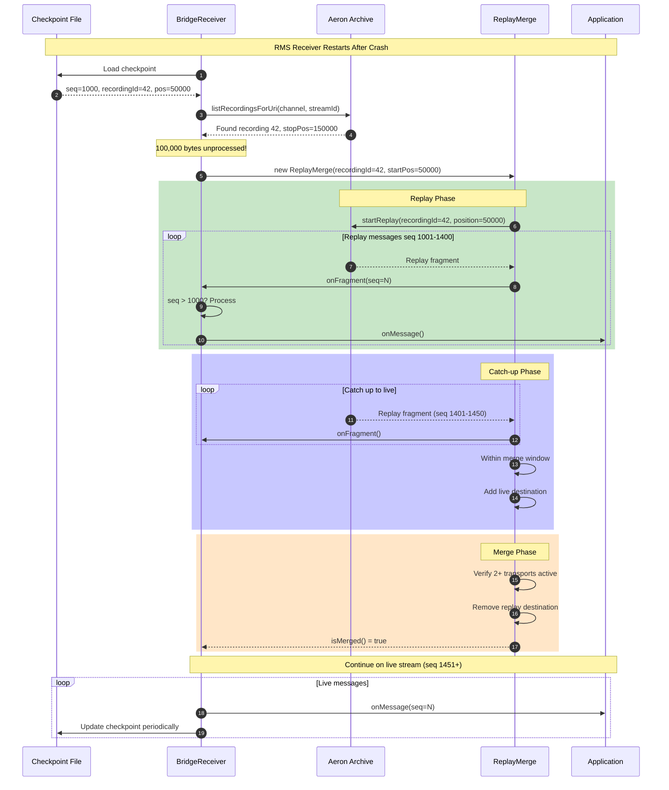

# Data Layer and Application Layer Integration Design

## Overview

This document describes the integration between the Data Layer (Aeron Archive, Checkpoints) and Application Layer (Matching Engine, Risk Management System) in the Cluster Bridge architecture.

---

## Layer Architecture

```
┌─────────────────────────────────────────────────────────────────────────────────────┐
│                              LAYER ARCHITECTURE                                      │
├─────────────────────────────────────────────────────────────────────────────────────┤
│                                                                                     │
│  ┌─────────────────────────────────────────────────────────────────────────────┐   │
│  │                        APPLICATION LAYER                                     │   │
│  │  ┌─────────────────────────┐         ┌─────────────────────────┐            │   │
│  │  │   Matching Engine (ME)  │         │  Risk Management (RMS)  │            │   │
│  │  │  ┌───────────────────┐  │         │  ┌───────────────────┐  │            │   │
│  │  │  │ Order Book        │  │         │  │ Risk Calculator   │  │            │   │
│  │  │  │ Trade Execution   │  │         │  │ Position Manager  │  │            │   │
│  │  │  │ Price Discovery   │  │         │  │ Margin Calculator │  │            │   │
│  │  │  └───────────────────┘  │         │  └───────────────────┘  │            │   │
│  │  └────────────┬────────────┘         └────────────┬────────────┘            │   │
│  └───────────────┼──────────────────────────────────┼──────────────────────────┘   │
│                  │                                  │                               │
│  ┌───────────────┼──────────────────────────────────┼──────────────────────────┐   │
│  │               │      BRIDGE LAYER (Transport)    │                          │   │
│  │  ┌────────────▼────────────┐         ┌───────────▼───────────┐              │   │
│  │  │     BridgeSender        │         │    BridgeReceiver     │              │   │
│  │  │  ┌───────────────────┐  │         │  ┌───────────────────┐│              │   │
│  │  │  │ Message Encoding  │  │         │  │ Message Decoding  ││              │   │
│  │  │  │ Sequence Numbers  │  │         │  │ Deduplication     ││              │   │
│  │  │  │ Backpressure      │  │         │  │ Gap Detection     ││              │   │
│  │  │  └───────────────────┘  │         │  └───────────────────┘│              │   │
│  │  └────────────┬────────────┘         └───────────┬───────────┘              │   │
│  └───────────────┼──────────────────────────────────┼──────────────────────────┘   │
│                  │                                  │                               │
│  ┌───────────────┼──────────────────────────────────┼──────────────────────────┐   │
│  │               │         DATA LAYER               │                          │   │
│  │  ┌────────────▼────────────┐         ┌───────────▼───────────┐              │   │
│  │  │     Aeron Archive       │         │    BridgeCheckpoint   │              │   │
│  │  │  ┌───────────────────┐  │         │  ┌───────────────────┐│              │   │
│  │  │  │ Segment Files     │  │         │  │ Sequence Watermark││              │   │
│  │  │  │ Recording Index   │  │         │  │ Archive Position  ││              │   │
│  │  │  │ Catalog           │  │         │  │ CRC32 Checksum    ││              │   │
│  │  │  └───────────────────┘  │         │  └───────────────────┘│              │   │
│  │  └─────────────────────────┘         └───────────────────────┘              │   │
│  │                                                                              │   │
│  │  ┌─────────────────────────────────────────────────────────────────────┐    │   │
│  │  │                     Aeron Media Driver                               │    │   │
│  │  │  ┌─────────────┐  ┌─────────────┐  ┌─────────────┐                  │    │   │
│  │  │  │ Conductor   │  │ Sender      │  │ Receiver    │                  │    │   │
│  │  │  │ Thread      │  │ Thread      │  │ Thread      │                  │    │   │
│  │  │  └─────────────┘  └─────────────┘  └─────────────┘                  │    │   │
│  │  └─────────────────────────────────────────────────────────────────────┘    │   │
│  └──────────────────────────────────────────────────────────────────────────────┘   │
│                                                                                     │
└─────────────────────────────────────────────────────────────────────────────────────┘
```

---

## Component Responsibilities

### Application Layer

| Component | Responsibility | Data Produced | Data Consumed |
|-----------|---------------|---------------|---------------|
| **Matching Engine** | Order matching, trade execution | Orders, Trades, Executions | Risk responses, Position limits |
| **Risk Management** | Risk calculation, position tracking | Risk approvals/rejections | Orders, Position updates |

### Bridge Layer

| Component | Responsibility | Interface Up | Interface Down |
|-----------|---------------|--------------|----------------|
| **BridgeSender** | Message publication, sequencing | `publish(msgType, payload)` | `Publication.offer()` |
| **BridgeReceiver** | Message subscription, deduplication | `MessageHandler.onMessage()` | `Subscription.poll()` |
| **BridgeMessageHeader** | Binary encoding/decoding | Java objects | Raw bytes |

### Data Layer

| Component | Responsibility | Storage | Recovery |
|-----------|---------------|---------|----------|
| **Aeron Archive** | Message persistence | Segment files (128MB each) | Replay from position |
| **BridgeCheckpoint** | Progress tracking | 48-byte memory-mapped file | Load on startup |
| **Media Driver** | Network I/O, IPC | Shared memory (log buffers) | Reconnection |

---

## Full Request/Response Flow

### Scenario: New Order Submission with Risk Check



---

## Detailed Data Flow Diagrams

### 1. Publication Flow (Application → Data Layer)

```
┌─────────────────────────────────────────────────────────────────────────────────┐
│                    PUBLICATION FLOW (ME → Data Layer)                           │
├─────────────────────────────────────────────────────────────────────────────────┤
│                                                                                 │
│  APPLICATION LAYER                                                              │
│  ┌─────────────────────────────────────────────────────────────────────────┐   │
│  │  MatchingEngine.processOrder(Order order)                                │   │
│  │  {                                                                       │   │
│  │      // 1. Create risk check request                                     │   │
│  │      RiskCheckRequest request = new RiskCheckRequest(order);             │   │
│  │                                                                          │   │
│  │      // 2. Serialize to buffer (zero-copy)                               │   │
│  │      request.encode(payloadBuffer, 0);                                   │   │
│  │                                                                          │   │
│  │      // 3. Hand off to bridge                                            │   │
│  │      bridgeSender.publish(MSG_TYPE_RISK_CHECK_REQUEST,                   │   │
│  │                          payloadBuffer, 0, request.encodedLength());     │   │
│  │  }                                                                       │   │
│  └────────────────────────────────────────┬────────────────────────────────┘   │
│                                           │                                     │
│                                           ▼                                     │
│  BRIDGE LAYER                                                                   │
│  ┌─────────────────────────────────────────────────────────────────────────┐   │
│  │  BridgeSender.publish(msgType, payload, offset, length)                  │   │
│  │  {                                                                       │   │
│  │      // 1. Assign monotonic sequence number                              │   │
│  │      long sequence = nextSequence++;  // Thread-safe via single writer   │   │
│  │                                                                          │   │
│  │      // 2. Get timestamp for latency tracking                            │   │
│  │      long timestamp = System.nanoTime();                                 │   │
│  │                                                                          │   │
│  │      // 3. Encode header into pre-allocated buffer                       │   │
│  │      BridgeMessageHeader.encode(sendBuffer, 0,                           │   │
│  │          sequence, timestamp, msgType, length);                          │   │
│  │                                                                          │   │
│  │      // 4. Copy payload (or use gather I/O in production)                │   │
│  │      sendBuffer.putBytes(HEADER_SIZE, payload, offset, length);          │   │
│  │                                                                          │   │
│  │      // 5. Offer to publication with backpressure handling               │   │
│  │      while (true) {                                                      │   │
│  │          long result = publication.offer(sendBuffer, 0, totalLen);       │   │
│  │          if (result > 0) break;        // Success                        │   │
│  │          if (result == BACK_PRESSURED) idleStrategy.idle();              │   │
│  │          if (result == CLOSED) throw new IllegalStateException();        │   │
│  │      }                                                                   │   │
│  │  }                                                                       │   │
│  └────────────────────────────────────────┬────────────────────────────────┘   │
│                                           │                                     │
│                                           ▼                                     │
│  DATA LAYER                                                                     │
│  ┌─────────────────────────────────────────────────────────────────────────┐   │
│  │  Aeron Publication (inside Media Driver)                                 │   │
│  │  ┌───────────────────────────────────────────────────────────────────┐  │   │
│  │  │  1. TERM BUFFER WRITE                                              │  │   │
│  │  │     ┌─────────────────────────────────────────────────────────┐   │  │   │
│  │  │     │ Memory-mapped file (shared memory)                       │   │  │   │
│  │  │     │ Position: 0x1000 → 0x1100 (256 bytes written)            │   │  │   │
│  │  │     └─────────────────────────────────────────────────────────┘   │  │   │
│  │  └───────────────────────────────────────────────────────────────────┘  │   │
│  │                                                                          │   │
│  │  ┌───────────────────────────────────────────────────────────────────┐  │   │
│  │  │  2. ARCHIVE RECORDING (Async)                                      │  │   │
│  │  │     ┌─────────────────────────────────────────────────────────┐   │  │   │
│  │  │     │ Archive Agent polls term buffer                          │   │  │   │
│  │  │     │ Writes to segment file: archive/42-0.rec                 │   │  │   │
│  │  │     │ Updates catalog with new stop position                   │   │  │   │
│  │  │     └─────────────────────────────────────────────────────────┘   │  │   │
│  │  └───────────────────────────────────────────────────────────────────┘  │   │
│  │                                                                          │   │
│  │  ┌───────────────────────────────────────────────────────────────────┐  │   │
│  │  │  3. NETWORK TRANSMISSION                                           │  │   │
│  │  │     ┌─────────────────────────────────────────────────────────┐   │  │   │
│  │  │     │ Sender thread reads term buffer                          │   │  │   │
│  │  │     │ UDP sendmsg() to multicast address 239.1.1.1:40456       │   │  │   │
│  │  │     └─────────────────────────────────────────────────────────┘   │  │   │
│  │  └───────────────────────────────────────────────────────────────────┘  │   │
│  └──────────────────────────────────────────────────────────────────────────┘   │
│                                                                                 │
└─────────────────────────────────────────────────────────────────────────────────┘
```

### 2. Reception Flow (Data Layer → Application)

```
┌─────────────────────────────────────────────────────────────────────────────────┐
│                    RECEPTION FLOW (Data Layer → RMS)                            │
├─────────────────────────────────────────────────────────────────────────────────┤
│                                                                                 │
│  DATA LAYER                                                                     │
│  ┌─────────────────────────────────────────────────────────────────────────┐   │
│  │  Aeron Subscription (inside Media Driver)                                │   │
│  │  ┌───────────────────────────────────────────────────────────────────┐  │   │
│  │  │  1. NETWORK RECEPTION                                              │  │   │
│  │  │     ┌─────────────────────────────────────────────────────────┐   │  │   │
│  │  │     │ Receiver thread: recvmsg() from 239.1.1.1:40456          │   │  │   │
│  │  │     │ Writes to term buffer (shared memory)                    │   │  │   │
│  │  │     │ Updates subscriber position                              │   │  │   │
│  │  │     └─────────────────────────────────────────────────────────┘   │  │   │
│  │  └───────────────────────────────────────────────────────────────────┘  │   │
│  │                                                                          │   │
│  │  ┌───────────────────────────────────────────────────────────────────┐  │   │
│  │  │  2. LOCAL ARCHIVE RECORDING (for receiver's own replay)            │  │   │
│  │  │     ┌─────────────────────────────────────────────────────────┐   │  │   │
│  │  │     │ If configured: Records received messages locally         │   │  │   │
│  │  │     │ Enables receiver-side replay without sender              │   │  │   │
│  │  │     └─────────────────────────────────────────────────────────┘   │  │   │
│  │  └───────────────────────────────────────────────────────────────────┘  │   │
│  └────────────────────────────────────────┬────────────────────────────────┘   │
│                                           │                                     │
│                                           ▼                                     │
│  BRIDGE LAYER                                                                   │
│  ┌─────────────────────────────────────────────────────────────────────────┐   │
│  │  BridgeReceiver.poll(fragmentLimit)                                      │   │
│  │  {                                                                       │   │
│  │      // Poll subscription (or ReplayMerge during recovery)               │   │
│  │      return subscription.poll(this::onFragment, fragmentLimit);          │   │
│  │  }                                                                       │   │
│  │                                                                          │   │
│  │  BridgeReceiver.onFragment(buffer, offset, length, header)               │   │
│  │  {                                                                       │   │
│  │      // 1. Decode header                                                 │   │
│  │      long sequence = BridgeMessageHeader.sequence(buffer, offset);       │   │
│  │      long timestamp = BridgeMessageHeader.timestamp(buffer, offset);     │   │
│  │      int msgType = BridgeMessageHeader.msgType(buffer, offset);          │   │
│  │      int payloadLen = BridgeMessageHeader.payloadLength(buffer, offset); │   │
│  │                                                                          │   │
│  │      // 2. DEDUPLICATION CHECK (Critical!)                               │   │
│  │      if (sequence <= lastAppliedSequence) {                              │   │
│  │          duplicatesDiscarded++;                                          │   │
│  │          return;  // Already processed - discard                         │   │
│  │      }                                                                   │   │
│  │                                                                          │   │
│  │      // 3. Gap detection (optional alerting)                             │   │
│  │      if (sequence != lastAppliedSequence + 1) {                          │   │
│  │          log.warn("Gap detected: {} to {}", lastAppliedSequence, seq);   │   │
│  │      }                                                                   │   │
│  │                                                                          │   │
│  │      // 4. Invoke application handler                                    │   │
│  │      messageHandler.onMessage(sequence, timestamp, msgType,              │   │
│  │          buffer, offset + HEADER_SIZE, payloadLen);                      │   │
│  │                                                                          │   │
│  │      // 5. Update state                                                  │   │
│  │      lastAppliedSequence = sequence;                                     │   │
│  │                                                                          │   │
│  │      // 6. Periodic checkpoint                                           │   │
│  │      if (messagesReceived++ % 100 == 0) {                                │   │
│  │          checkpoint.update(sequence, recordingId, position);             │   │
│  │      }                                                                   │   │
│  │  }                                                                       │   │
│  └────────────────────────────────────────┬────────────────────────────────┘   │
│                                           │                                     │
│                                           ▼                                     │
│  CHECKPOINT (Data Layer)                                                        │
│  ┌─────────────────────────────────────────────────────────────────────────┐   │
│  │  BridgeCheckpoint.update(sequence, recordingId, position)                │   │
│  │  {                                                                       │   │
│  │      // Memory-mapped I/O for atomicity                                  │   │
│  │      buffer.putLong(OFFSET_LAST_SEQUENCE, sequence);     // 8 bytes     │   │
│  │      buffer.putLong(OFFSET_RECORDING_ID, recordingId);   // 8 bytes     │   │
│  │      buffer.putLong(OFFSET_ARCHIVE_POSITION, position);  // 8 bytes     │   │
│  │      buffer.putLong(OFFSET_TIMESTAMP, System.nanoTime());// 8 bytes     │   │
│  │                                                                          │   │
│  │      // Compute checksum for integrity verification                      │   │
│  │      long checksum = computeCRC32();                                     │   │
│  │      buffer.putLong(OFFSET_CHECKSUM, checksum);          // 8 bytes     │   │
│  │                                                                          │   │
│  │      // Force to disk (fsync)                                            │   │
│  │      mappedBuffer.force();  // ~100µs                                    │   │
│  │  }                                                                       │   │
│  └──────────────────────────────────────────────────────────────────────────┘   │
│                                           │                                     │
│                                           ▼                                     │
│  APPLICATION LAYER                                                              │
│  ┌─────────────────────────────────────────────────────────────────────────┐   │
│  │  RiskManagementSystem implements MessageHandler                          │   │
│  │  {                                                                       │   │
│  │      void onMessage(seq, ts, msgType, buffer, offset, length)            │   │
│  │      {                                                                   │   │
│  │          switch (msgType) {                                              │   │
│  │              case MSG_TYPE_RISK_CHECK_REQUEST:                           │   │
│  │                  RiskCheckRequest req = decodeRequest(buffer, offset);   │   │
│  │                  RiskCheckResult result = evaluateRisk(req);             │   │
│  │                  sendResponse(req.orderId(), result);                    │   │
│  │                  break;                                                  │   │
│  │                                                                          │   │
│  │              case MSG_TYPE_POSITION_UPDATE:                              │   │
│  │                  PositionUpdate update = decodeUpdate(buffer, offset);   │   │
│  │                  positionManager.apply(update);                          │   │
│  │                  break;                                                  │   │
│  │          }                                                               │   │
│  │      }                                                                   │   │
│  │  }                                                                       │   │
│  └──────────────────────────────────────────────────────────────────────────┘   │
│                                                                                 │
└─────────────────────────────────────────────────────────────────────────────────┘
```

---

## Recovery Flow (Crash Recovery)



---

## Data Structures

### Message Header (24 bytes)

```
┌────────────────────────────────────────────────────────────────────────┐
│                    Bridge Message Header Layout                         │
├────────┬────────┬──────────────────────────────────────────────────────┤
│ Offset │ Size   │ Field                                                │
├────────┼────────┼──────────────────────────────────────────────────────┤
│ 0      │ 8      │ sequence    : uint64  (monotonic, never reused)      │
│ 8      │ 8      │ timestamp   : uint64  (System.nanoTime())            │
│ 16     │ 4      │ msgType     : uint32  (see message types below)      │
│ 20     │ 4      │ payloadLen  : uint32  (0 for header-only messages)   │
│ 24     │ N      │ payload     : byte[]  (application-specific)         │
└────────┴────────┴──────────────────────────────────────────────────────┘

Message Types:
  1  = ORDER_NEW              (ME → RMS)
  2  = ORDER_CANCEL           (ME → RMS)
  3  = ORDER_MODIFY           (ME → RMS)
  10 = RISK_CHECK_REQUEST     (ME → RMS)
  11 = RISK_CHECK_RESPONSE    (RMS → ME)
  20 = POSITION_UPDATE        (RMS → ME)
  99 = HEARTBEAT              (bidirectional)
```

### Checkpoint File (48 bytes)

```
┌────────────────────────────────────────────────────────────────────────┐
│                    Checkpoint File Layout                               │
├────────┬────────┬──────────────────────────────────────────────────────┤
│ Offset │ Size   │ Field                                                │
├────────┼────────┼──────────────────────────────────────────────────────┤
│ 0      │ 4      │ version           : uint32  (currently 1)            │
│ 4      │ 4      │ direction         : uint32  (1=ME→RMS, 2=RMS→ME)     │
│ 8      │ 8      │ lastAppliedSeq    : uint64  (high watermark)         │
│ 16     │ 8      │ archiveRecordingId: uint64  (for replay)             │
│ 24     │ 8      │ archivePosition   : uint64  (byte offset)            │
│ 32     │ 8      │ timestampNanos    : uint64  (last update time)       │
│ 40     │ 8      │ checksum          : uint64  (CRC32 of bytes 0-39)    │
└────────┴────────┴──────────────────────────────────────────────────────┘

File locations:
  ME→RMS: {checkpoint_dir}/me_to_rms.checkpoint
  RMS→ME: {checkpoint_dir}/rms_to_me.checkpoint
```

### Archive Segment File

```
┌────────────────────────────────────────────────────────────────────────┐
│                    Archive Segment Layout                               │
├────────────────────────────────────────────────────────────────────────┤
│                                                                        │
│  Directory: {archive_dir}/                                             │
│  ├── archive.catalog        (recording metadata)                       │
│  ├── archive.mark           (archive position marker)                  │
│  ├── {recordingId}-{segmentId}.rec                                     │
│  │   ├── 42-0.rec           (first 128MB segment)                      │
│  │   ├── 42-1.rec           (second 128MB segment)                     │
│  │   └── ...                                                           │
│  └── {recordingId}.rec.idx  (term offset index)                        │
│                                                                        │
│  Segment File Internal Layout:                                         │
│  ┌──────────────────────────────────────────────────────────────────┐  │
│  │ Term Buffer 0 (16MB default)                                      │  │
│  │ ┌────────────────────────────────────────────────────────────┐   │  │
│  │ │ Frame Header │ Message │ Frame Header │ Message │ ...      │   │  │
│  │ └────────────────────────────────────────────────────────────┘   │  │
│  ├──────────────────────────────────────────────────────────────────┤  │
│  │ Term Buffer 1 (16MB)                                              │  │
│  ├──────────────────────────────────────────────────────────────────┤  │
│  │ ... (8 terms per segment = 128MB)                                 │  │
│  └──────────────────────────────────────────────────────────────────┘  │
│                                                                        │
└────────────────────────────────────────────────────────────────────────┘
```

---

## Integration Patterns

### Pattern 1: Synchronous Risk Check (Request-Response)

```java
// Application Layer: Matching Engine
public class MatchingEngine implements MessageHandler {
    private final BridgeSender riskSender;
    private final Map<Long, CompletableFuture<RiskResponse>> pendingChecks;

    public CompletableFuture<TradeResult> submitOrder(Order order) {
        // 1. Send risk check request
        long correlationId = order.orderId();
        CompletableFuture<RiskResponse> future = new CompletableFuture<>();
        pendingChecks.put(correlationId, future);

        riskSender.publish(MSG_TYPE_RISK_CHECK_REQUEST,
            order.encode(), 0, order.encodedLength());

        // 2. Wait for response (with timeout)
        return future
            .orTimeout(100, TimeUnit.MILLISECONDS)
            .thenCompose(response -> {
                if (response.approved()) {
                    return executeTrade(order);
                } else {
                    return CompletableFuture.completedFuture(
                        TradeResult.rejected(response.reason()));
                }
            });
    }

    // Called by BridgeReceiver when RMS responds
    @Override
    public void onMessage(long seq, long ts, int type, DirectBuffer buf, int off, int len) {
        if (type == MSG_TYPE_RISK_CHECK_RESPONSE) {
            RiskResponse response = RiskResponse.decode(buf, off);
            CompletableFuture<RiskResponse> future =
                pendingChecks.remove(response.correlationId());
            if (future != null) {
                future.complete(response);
            }
        }
    }
}
```

### Pattern 2: Fire-and-Forget Position Updates

```java
// Application Layer: Risk Management System
public class RiskManagementSystem implements MessageHandler {
    private final BridgeSender positionSender;
    private final PositionManager positions;

    @Override
    public void onMessage(long seq, long ts, int type, DirectBuffer buf, int off, int len) {
        if (type == MSG_TYPE_ORDER_NEW) {
            Order order = Order.decode(buf, off);

            // Update internal position
            positions.reserve(order.symbol(), order.quantity());

            // Fire-and-forget position update to ME
            PositionUpdate update = new PositionUpdate(
                order.accountId(),
                order.symbol(),
                positions.getPosition(order.accountId(), order.symbol())
            );

            positionSender.publish(MSG_TYPE_POSITION_UPDATE,
                update.encode(), 0, update.encodedLength());
        }
    }
}
```

### Pattern 3: Batch Processing with Checkpoint

```java
// Optimized batch processing for high throughput
public class BatchingReceiver implements MessageHandler {
    private final List<Message> batch = new ArrayList<>(1000);
    private final BridgeCheckpoint checkpoint;
    private long lastCheckpointSeq = 0;

    @Override
    public void onMessage(long seq, long ts, int type, DirectBuffer buf, int off, int len) {
        // Accumulate in batch
        batch.add(new Message(seq, type, copyBuffer(buf, off, len)));

        // Process batch when full or time elapsed
        if (batch.size() >= 1000) {
            processBatch();
        }
    }

    private void processBatch() {
        // Process all messages in batch
        for (Message msg : batch) {
            processMessage(msg);
        }

        // Single checkpoint for entire batch
        long lastSeq = batch.get(batch.size() - 1).sequence();
        checkpoint.update(lastSeq, recordingId, position);

        batch.clear();
    }
}
```

---

## Error Handling

### Data Layer Errors

| Error | Detection | Recovery |
|-------|-----------|----------|
| Archive disk full | `Publication.MAX_POSITION_EXCEEDED` | Alert, rotate archive, manual cleanup |
| Checkpoint write failure | `IOException` on `force()` | Retry with backoff, alert if persistent |
| Segment corruption | CRC mismatch during replay | Skip segment, alert, manual repair |
| Network partition | `Publication.NOT_CONNECTED` | Buffer locally, retry with exponential backoff |

### Application Layer Errors

| Error | Detection | Recovery |
|-------|-----------|----------|
| Message decode failure | Exception in `decode()` | Log, skip message, continue |
| Risk check timeout | `CompletableFuture.orTimeout()` | Reject order, alert |
| Position mismatch | Reconciliation check | Full position sync from RMS |

---

## Performance Characteristics

### Latency Breakdown by Layer

```
┌─────────────────────────────────────────────────────────────────────────┐
│                    LATENCY BREAKDOWN (ME → RMS)                         │
├─────────────────────────────────────────────────────────────────────────┤
│                                                                         │
│  APPLICATION LAYER                                                      │
│  ├── Order validation         : ~100 ns                                 │
│  ├── Payload serialization    : ~200 ns                                 │
│  └── Subtotal                 : ~300 ns                                 │
│                                                                         │
│  BRIDGE LAYER (Sender)                                                  │
│  ├── Sequence assignment      : ~10 ns                                  │
│  ├── Header encoding          : ~50 ns                                  │
│  ├── Buffer copy              : ~100 ns                                 │
│  └── Subtotal                 : ~160 ns                                 │
│                                                                         │
│  DATA LAYER (Publication)                                               │
│  ├── Publication.offer()      : ~300 ns  (memory-mapped write)         │
│  ├── Archive recording        : ~0 ns    (async, doesn't add latency)  │
│  └── Subtotal                 : ~300 ns                                 │
│                                                                         │
│  NETWORK                                                                │
│  ├── UDP sendmsg()            : ~1,000 ns                               │
│  ├── Network transit          : ~5,000 ns (same rack)                   │
│  ├── UDP recvmsg()            : ~1,000 ns                               │
│  └── Subtotal                 : ~7,000 ns                               │
│                                                                         │
│  DATA LAYER (Reception)                                                 │
│  ├── Term buffer write        : ~200 ns                                 │
│  └── Subtotal                 : ~200 ns                                 │
│                                                                         │
│  BRIDGE LAYER (Receiver)                                                │
│  ├── Header decoding          : ~50 ns                                  │
│  ├── Deduplication check      : ~10 ns                                  │
│  ├── Handler invocation       : ~50 ns                                  │
│  └── Subtotal                 : ~110 ns                                 │
│                                                                         │
│  APPLICATION LAYER                                                      │
│  ├── Payload deserialization  : ~200 ns                                 │
│  ├── Business logic           : variable                                │
│  └── Subtotal                 : ~200 ns + business logic                │
│                                                                         │
│  ════════════════════════════════════════════════════════════════════  │
│  TOTAL ONE-WAY LATENCY        : ~8.3 µs (excluding business logic)     │
│  ════════════════════════════════════════════════════════════════════  │
│                                                                         │
└─────────────────────────────────────────────────────────────────────────┘
```

### Throughput by Layer

| Layer | Component | Max Throughput | Bottleneck |
|-------|-----------|---------------|------------|
| Application | Serialization | 10M msg/sec | CPU |
| Bridge | Header encoding | 20M msg/sec | Memory bandwidth |
| Data | Publication | 10M msg/sec | Term buffer size |
| Network | UDP multicast | 1M msg/sec | NIC, MTU |
| Data | Reception | 10M msg/sec | Term buffer size |
| Data | Archive | 5M msg/sec | Disk I/O |
| Data | Checkpoint | 10K updates/sec | fsync latency |

---

## Summary

The Cluster Bridge architecture cleanly separates concerns across three layers:

1. **Application Layer**: Business logic (ME order matching, RMS risk calculation)
2. **Bridge Layer**: Message transport (encoding, sequencing, deduplication)
3. **Data Layer**: Persistence and recovery (archive, checkpoints, media driver)

Key integration points:
- Application → Bridge: `BridgeSender.publish()` and `MessageHandler.onMessage()`
- Bridge → Data: `Publication.offer()` and `Subscription.poll()`
- Data → Recovery: `BridgeCheckpoint` + `ReplayMerge`

This design ensures:
- **Durability**: All messages archived before delivery confirmation
- **Exactly-once semantics**: Sequence-based deduplication
- **Low latency**: Zero-copy, pre-allocated buffers, memory-mapped I/O
- **Recovery**: Checkpoint + replay merge for crash recovery
