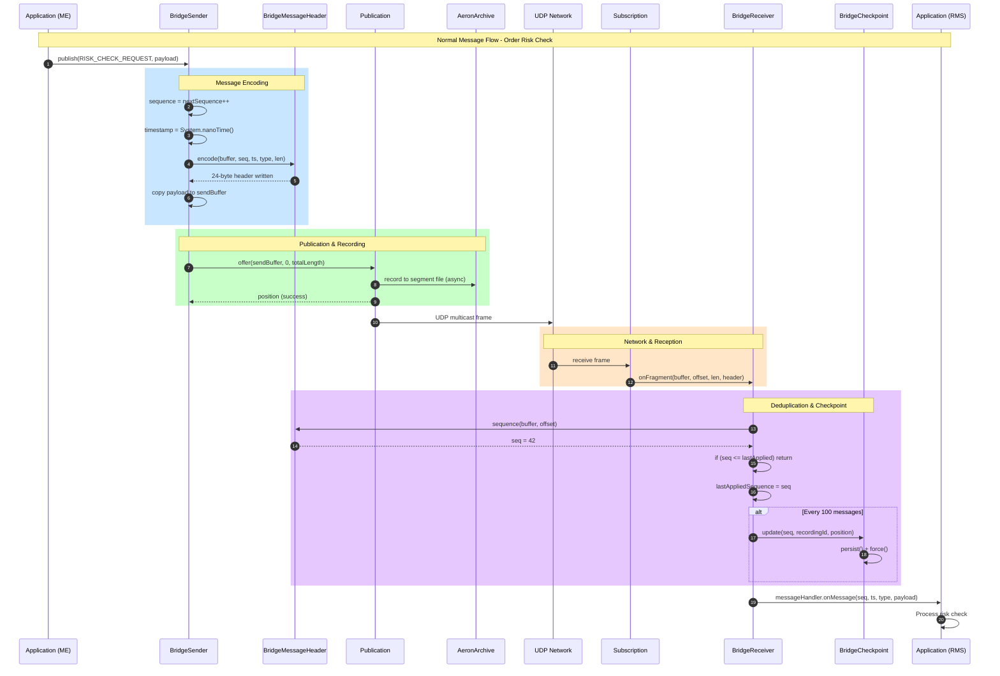
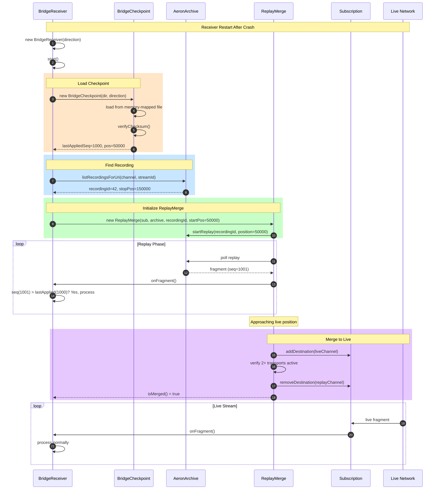

# Cluster Bridge Service - HLD & LLD Design Document

## Table of Contents

1. [High-Level Design (HLD)](#high-level-design-hld)
   - System Context Diagram
   - Component Architecture
   - Deployment Architecture
   - Data Flow Overview
   - Technology Stack
2. [Low-Level Design (LLD)](#low-level-design-lld)
   - Class Diagrams
   - Sequence Diagrams
   - State Machine Diagrams
   - Data Models
   - API Specifications
   - Algorithm Details

---

# High-Level Design (HLD)

## 1. System Context Diagram

```
┌─────────────────────────────────────────────────────────────────────────────────────┐
│                              SYSTEM CONTEXT DIAGRAM                                  │
├─────────────────────────────────────────────────────────────────────────────────────┤
│                                                                                     │
│                           ┌─────────────────────┐                                   │
│                           │   Trading Clients   │                                   │
│                           │  (FIX, REST, WS)    │                                   │
│                           └──────────┬──────────┘                                   │
│                                      │                                              │
│                                      │ Orders, Queries                              │
│                                      ▼                                              │
│  ┌───────────────────────────────────────────────────────────────────────────────┐ │
│  │                                                                               │ │
│  │                        CRYPTO OPTIONS EXCHANGE                                │ │
│  │                                                                               │ │
│  │   ┌─────────────────────────────────────────────────────────────────────┐    │ │
│  │   │                     MATCHING ENGINE CLUSTER                          │    │ │
│  │   │                                                                      │    │ │
│  │   │  ┌──────────┐  ┌──────────┐  ┌──────────┐                           │    │ │
│  │   │  │ Leader   │  │ Follower │  │ Follower │  (Raft Consensus)         │    │ │
│  │   │  └──────────┘  └──────────┘  └──────────┘                           │    │ │
│  │   │                                                                      │    │ │
│  │   └──────────────────────────┬───────────────────────────────────────────┘    │ │
│  │                              │                                                │ │
│  │                              │  ◄══════════════════════════════════════►      │ │
│  │                              │         CLUSTER BRIDGE SERVICE                 │ │
│  │                              │     (Bidirectional UDP Multicast)              │ │
│  │                              │         + Aeron Archive                        │ │
│  │                              │                                                │ │
│  │   ┌──────────────────────────┴───────────────────────────────────────────┐    │ │
│  │   │                     RISK MANAGEMENT CLUSTER                          │    │ │
│  │   │                                                                      │    │ │
│  │   │  ┌──────────┐  ┌──────────┐  ┌──────────┐                           │    │ │
│  │   │  │ Leader   │  │ Follower │  │ Follower │  (Raft Consensus)         │    │ │
│  │   │  └──────────┘  └──────────┘  └──────────┘                           │    │ │
│  │   │                                                                      │    │ │
│  │   └──────────────────────────────────────────────────────────────────────┘    │ │
│  │                                                                               │ │
│  └───────────────────────────────────────────────────────────────────────────────┘ │
│                                      │                                              │
│                                      │ Market Data, Settlements                     │
│                                      ▼                                              │
│                           ┌─────────────────────┐                                   │
│                           │  External Systems   │                                   │
│                           │ (Clearing, Custody) │                                   │
│                           └─────────────────────┘                                   │
│                                                                                     │
└─────────────────────────────────────────────────────────────────────────────────────┘
```

## 2. Component Architecture Diagram

```
┌─────────────────────────────────────────────────────────────────────────────────────┐
│                           COMPONENT ARCHITECTURE                                     │
├─────────────────────────────────────────────────────────────────────────────────────┤
│                                                                                     │
│  ┌─────────────────────────────────┐       ┌─────────────────────────────────┐     │
│  │      MATCHING ENGINE (ME)       │       │    RISK MANAGEMENT (RMS)        │     │
│  │                                 │       │                                 │     │
│  │  ┌───────────────────────────┐  │       │  ┌───────────────────────────┐  │     │
│  │  │    Application Services   │  │       │  │    Application Services   │  │     │
│  │  │  ┌─────────┐ ┌─────────┐  │  │       │  │  ┌─────────┐ ┌─────────┐  │  │     │
│  │  │  │ Order   │ │ Trade   │  │  │       │  │  │ Risk    │ │Position │  │  │     │
│  │  │  │ Book    │ │ Engine  │  │  │       │  │  │ Engine  │ │ Manager │  │  │     │
│  │  │  └─────────┘ └─────────┘  │  │       │  │  └─────────┘ └─────────┘  │  │     │
│  │  └───────────┬───────────────┘  │       │  └───────────┬───────────────┘  │     │
│  │              │                  │       │              │                  │     │
│  │  ┌───────────▼───────────────┐  │       │  ┌───────────▼───────────────┐  │     │
│  │  │     Bridge Adapter        │  │       │  │     Bridge Adapter        │  │     │
│  │  │  ┌─────────┐ ┌─────────┐  │  │       │  │  ┌─────────┐ ┌─────────┐  │  │     │
│  │  │  │ Bridge  │ │ Bridge  │  │  │       │  │  │ Bridge  │ │ Bridge  │  │  │     │
│  │  │  │ Sender  │ │Receiver │  │  │       │  │  │ Sender  │ │Receiver │  │  │     │
│  │  │  │(ME→RMS) │ │(RMS→ME) │  │  │       │  │  │(RMS→ME) │ │(ME→RMS) │  │  │     │
│  │  │  └────┬────┘ └────┬────┘  │  │       │  │  └────┬────┘ └────┬────┘  │  │     │
│  │  └───────┼───────────┼───────┘  │       │  └───────┼───────────┼───────┘  │     │
│  │          │           │          │       │          │           │          │     │
│  │  ┌───────▼───────────▼───────┐  │       │  ┌───────▼───────────▼───────┐  │     │
│  │  │    Aeron Infrastructure   │  │       │  │    Aeron Infrastructure   │  │     │
│  │  │  ┌─────────┐ ┌─────────┐  │  │       │  │  ┌─────────┐ ┌─────────┐  │  │     │
│  │  │  │ Media   │ │ Archive │  │  │       │  │  │ Media   │ │ Archive │  │  │     │
│  │  │  │ Driver  │ │         │  │  │       │  │  │ Driver  │ │         │  │  │     │
│  │  │  └─────────┘ └─────────┘  │  │       │  │  └─────────┘ └─────────┘  │  │     │
│  │  └───────────────────────────┘  │       │  └───────────────────────────┘  │     │
│  │                                 │       │                                 │     │
│  │  ┌───────────────────────────┐  │       │  ┌───────────────────────────┐  │     │
│  │  │    Persistence Layer      │  │       │  │    Persistence Layer      │  │     │
│  │  │  ┌─────────┐ ┌─────────┐  │  │       │  │  ┌─────────┐ ┌─────────┐  │  │     │
│  │  │  │Checkpoint│ │ Archive │  │  │       │  │  │Checkpoint│ │ Archive │  │  │     │
│  │  │  │  File   │ │ Segments│  │  │       │  │  │  File   │ │ Segments│  │  │     │
│  │  │  └─────────┘ └─────────┘  │  │       │  │  └─────────┘ └─────────┘  │  │     │
│  │  └───────────────────────────┘  │       │  └───────────────────────────┘  │     │
│  └─────────────────────────────────┘       └─────────────────────────────────┘     │
│                    │                                         │                      │
│                    │         UDP Multicast Network           │                      │
│                    │  ┌───────────────────────────────────┐  │                      │
│                    └──┤  Stream 2001: ME → RMS            ├──┘                      │
│                       │  Stream 2002: RMS → ME            │                         │
│                       │  (239.1.1.1:40456, 239.1.1.2:40457)│                         │
│                       └───────────────────────────────────┘                         │
│                                                                                     │
└─────────────────────────────────────────────────────────────────────────────────────┘
```

## 3. Deployment Architecture Diagram

```
┌─────────────────────────────────────────────────────────────────────────────────────┐
│                           AWS DEPLOYMENT ARCHITECTURE                                │
├─────────────────────────────────────────────────────────────────────────────────────┤
│                                                                                     │
│  ┌─────────────────────────────────────────────────────────────────────────────┐   │
│  │                              AWS VPC (10.0.0.0/16)                           │   │
│  │                                                                              │   │
│  │  ┌────────────────────────────┐    ┌────────────────────────────┐           │   │
│  │  │   Availability Zone A      │    │   Availability Zone B      │           │   │
│  │  │   (us-east-1a)             │    │   (us-east-1b)             │           │   │
│  │  │                            │    │                            │           │   │
│  │  │  ┌──────────────────────┐  │    │  ┌──────────────────────┐  │           │   │
│  │  │  │  EC2: c6i.8xlarge    │  │    │  │  EC2: c6i.8xlarge    │  │           │   │
│  │  │  │  ME Node 1 (Leader)  │  │    │  │  ME Node 2 (Follower)│  │           │   │
│  │  │  │  ┌────────────────┐  │  │    │  │  ┌────────────────┐  │  │           │   │
│  │  │  │  │ ME Application │  │  │    │  │  │ ME Application │  │  │           │   │
│  │  │  │  │ Bridge Sender  │  │  │    │  │  │ Bridge Sender  │  │  │           │   │
│  │  │  │  │ Bridge Receiver│  │  │    │  │  │ Bridge Receiver│  │  │           │   │
│  │  │  │  │ Media Driver   │  │  │    │  │  │ Media Driver   │  │  │           │   │
│  │  │  │  │ Archive        │  │  │    │  │  │ Archive        │  │  │           │   │
│  │  │  │  └────────────────┘  │  │    │  │  └────────────────┘  │  │           │   │
│  │  │  │  ┌────────────────┐  │  │    │  │  ┌────────────────┐  │  │           │   │
│  │  │  │  │ EBS gp3 500GB  │  │  │    │  │  │ EBS gp3 500GB  │  │  │           │   │
│  │  │  │  │ 16K IOPS       │  │  │    │  │  │ 16K IOPS       │  │  │           │   │
│  │  │  │  └────────────────┘  │  │    │  │  └────────────────┘  │  │           │   │
│  │  │  └──────────────────────┘  │    │  └──────────────────────┘  │           │   │
│  │  │                            │    │                            │           │   │
│  │  │  ┌──────────────────────┐  │    │  ┌──────────────────────┐  │           │   │
│  │  │  │  EC2: c6i.4xlarge    │  │    │  │  EC2: c6i.4xlarge    │  │           │   │
│  │  │  │  RMS Node 1 (Leader) │  │    │  │  RMS Node 2(Follower)│  │           │   │
│  │  │  │  ┌────────────────┐  │  │    │  │  ┌────────────────┐  │  │           │   │
│  │  │  │  │ RMS Application│  │  │    │  │  │ RMS Application│  │  │           │   │
│  │  │  │  │ Bridge Sender  │  │  │    │  │  │ Bridge Sender  │  │  │           │   │
│  │  │  │  │ Bridge Receiver│  │  │    │  │  │ Bridge Receiver│  │  │           │   │
│  │  │  │  │ Media Driver   │  │  │    │  │  │ Media Driver   │  │  │           │   │
│  │  │  │  │ Archive        │  │  │    │  │  │ Archive        │  │  │           │   │
│  │  │  │  └────────────────┘  │  │    │  │  └────────────────┘  │  │           │   │
│  │  │  │  ┌────────────────┐  │  │    │  │  ┌────────────────┐  │  │           │   │
│  │  │  │  │ EBS gp3 200GB  │  │  │    │  │  │ EBS gp3 200GB  │  │  │           │   │
│  │  │  │  └────────────────┘  │  │    │  │  └────────────────┘  │  │           │   │
│  │  │  └──────────────────────┘  │    │  └──────────────────────┘  │           │   │
│  │  │                            │    │                            │           │   │
│  │  └────────────────────────────┘    └────────────────────────────┘           │   │
│  │                                                                              │   │
│  │  ┌──────────────────────────────────────────────────────────────────────┐   │   │
│  │  │                      Placement Group (cluster)                        │   │   │
│  │  │                  Low-latency inter-node communication                 │   │   │
│  │  └──────────────────────────────────────────────────────────────────────┘   │   │
│  │                                                                              │   │
│  └──────────────────────────────────────────────────────────────────────────────┘   │
│                                                                                     │
│  ┌──────────────────────────────────────────────────────────────────────────────┐  │
│  │                           Monitoring & Observability                          │  │
│  │  ┌─────────────┐  ┌─────────────┐  ┌─────────────┐  ┌─────────────┐          │  │
│  │  │ CloudWatch  │  │ Prometheus  │  │  Grafana    │  │ PagerDuty   │          │  │
│  │  │   Logs      │  │   Metrics   │  │ Dashboards  │  │   Alerts    │          │  │
│  │  └─────────────┘  └─────────────┘  └─────────────┘  └─────────────┘          │  │
│  └──────────────────────────────────────────────────────────────────────────────┘  │
│                                                                                     │
└─────────────────────────────────────────────────────────────────────────────────────┘
```

## 4. Data Flow Overview Diagram

```
┌─────────────────────────────────────────────────────────────────────────────────────┐
│                              DATA FLOW OVERVIEW                                      │
├─────────────────────────────────────────────────────────────────────────────────────┤
│                                                                                     │
│  ════════════════════════════════════════════════════════════════════════════════  │
│                          ORDER SUBMISSION FLOW (ME → RMS)                           │
│  ════════════════════════════════════════════════════════════════════════════════  │
│                                                                                     │
│   ┌──────┐    ┌──────────┐    ┌────────────┐    ┌─────────┐    ┌──────────────┐   │
│   │Client│───▶│    ME    │───▶│  Bridge    │───▶│ Archive │───▶│   Network    │   │
│   │      │    │Order Book│    │  Sender    │    │(Record) │    │(UDP Multicast)│   │
│   └──────┘    └──────────┘    └────────────┘    └─────────┘    └──────┬───────┘   │
│                                                                        │           │
│                                                                        ▼           │
│   ┌──────┐    ┌──────────┐    ┌────────────┐    ┌─────────┐    ┌──────────────┐   │
│   │ RMS  │◀───│   Risk   │◀───│  Bridge    │◀───│Checkpoint│◀───│   Network    │   │
│   │Result│    │Calculator│    │  Receiver  │    │ (Dedup) │    │  (Receive)   │   │
│   └──────┘    └──────────┘    └────────────┘    └─────────┘    └──────────────┘   │
│                                                                                     │
│  ════════════════════════════════════════════════════════════════════════════════  │
│                          RISK RESPONSE FLOW (RMS → ME)                              │
│  ════════════════════════════════════════════════════════════════════════════════  │
│                                                                                     │
│   ┌──────┐    ┌──────────┐    ┌────────────┐    ┌─────────┐    ┌──────────────┐   │
│   │ RMS  │───▶│   Risk   │───▶│  Bridge    │───▶│ Archive │───▶│   Network    │   │
│   │      │    │ Response │    │  Sender    │    │(Record) │    │(UDP Multicast)│   │
│   └──────┘    └──────────┘    └────────────┘    └─────────┘    └──────┬───────┘   │
│                                                                        │           │
│                                                                        ▼           │
│   ┌──────┐    ┌──────────┐    ┌────────────┐    ┌─────────┐    ┌──────────────┐   │
│   │Client│◀───│    ME    │◀───│  Bridge    │◀───│Checkpoint│◀───│   Network    │   │
│   │      │    │ Execute  │    │  Receiver  │    │ (Dedup) │    │  (Receive)   │   │
│   └──────┘    └──────────┘    └────────────┘    └─────────┘    └──────────────┘   │
│                                                                                     │
│  ════════════════════════════════════════════════════════════════════════════════  │
│                               RECOVERY FLOW                                         │
│  ════════════════════════════════════════════════════════════════════════════════  │
│                                                                                     │
│   ┌──────────┐    ┌────────────┐    ┌─────────────┐    ┌──────────────────┐        │
│   │Checkpoint│───▶│   Load     │───▶│ ReplayMerge │───▶│ Dedup & Process  │        │
│   │  File    │    │Last Seq=N  │    │ from Archive│    │ seq > N only     │        │
│   └──────────┘    └────────────┘    └─────────────┘    └──────────────────┘        │
│                                                                                     │
└─────────────────────────────────────────────────────────────────────────────────────┘
```

## 5. Technology Stack

```
┌─────────────────────────────────────────────────────────────────────────────────────┐
│                              TECHNOLOGY STACK                                        │
├─────────────────────────────────────────────────────────────────────────────────────┤
│                                                                                     │
│  LAYER              │  TECHNOLOGY                │  PURPOSE                         │
│  ───────────────────┼────────────────────────────┼─────────────────────────────────│
│                     │                            │                                  │
│  Application        │  Java 17 (Temurin)         │  Business logic, type safety    │
│                     │  Agrona                    │  High-perf collections, buffers │
│                     │                            │                                  │
│  ───────────────────┼────────────────────────────┼─────────────────────────────────│
│                     │                            │                                  │
│  Messaging          │  Aeron                     │  Ultra-low latency transport    │
│                     │  Aeron Archive             │  Message persistence & replay   │
│                     │  Aeron Cluster             │  Raft consensus (per cluster)   │
│                     │                            │                                  │
│  ───────────────────┼────────────────────────────┼─────────────────────────────────│
│                     │                            │                                  │
│  Persistence        │  Memory-mapped files       │  Atomic checkpoints             │
│                     │  Aeron Archive segments    │  Message storage                │
│                     │  CRC32 checksums           │  Data integrity                 │
│                     │                            │                                  │
│  ───────────────────┼────────────────────────────┼─────────────────────────────────│
│                     │                            │                                  │
│  Network            │  UDP Multicast             │  Low-latency fan-out            │
│                     │  IPv4 (239.1.1.x)          │  Organization-local scope       │
│                     │                            │                                  │
│  ───────────────────┼────────────────────────────┼─────────────────────────────────│
│                     │                            │                                  │
│  Infrastructure     │  AWS EC2 (c6i series)      │  Compute-optimized instances    │
│                     │  AWS EBS (gp3)             │  High-IOPS storage              │
│                     │  AWS VPC                   │  Network isolation              │
│                     │                            │                                  │
│  ───────────────────┼────────────────────────────┼─────────────────────────────────│
│                     │                            │                                  │
│  Build & Deploy     │  Gradle 9.x                │  Build automation               │
│                     │  Docker                    │  Containerization               │
│                     │  GitHub Actions            │  CI/CD pipeline                 │
│                     │                            │                                  │
│  ───────────────────┼────────────────────────────┼─────────────────────────────────│
│                     │                            │                                  │
│  Monitoring         │  Prometheus                │  Metrics collection             │
│                     │  Grafana                   │  Visualization                  │
│                     │  CloudWatch                │  AWS-native logging             │
│                     │                            │                                  │
└─────────────────────────────────────────────────────────────────────────────────────┘
```

---

# Low-Level Design (LLD)

## 1. Class Diagrams

### 1.1 Core Bridge Classes

```
┌─────────────────────────────────────────────────────────────────────────────────────┐
│                              CLASS DIAGRAM - CORE                                    │
├─────────────────────────────────────────────────────────────────────────────────────┤
│                                                                                     │
│  ┌───────────────────────────────────────────────────────────────────────────────┐ │
│  │                         <<enumeration>>                                        │ │
│  │                     BridgeConfiguration.Direction                              │ │
│  ├───────────────────────────────────────────────────────────────────────────────┤ │
│  │  ME_TO_RMS(1, 2001)                                                           │ │
│  │  RMS_TO_ME(2, 2002)                                                           │ │
│  ├───────────────────────────────────────────────────────────────────────────────┤ │
│  │  + code() : int                                                               │ │
│  │  + defaultStreamId() : int                                                    │ │
│  │  + fromCode(code: int) : Direction                                            │ │
│  └───────────────────────────────────────────────────────────────────────────────┘ │
│                                           │                                         │
│                                           │ uses                                    │
│                                           ▼                                         │
│  ┌───────────────────────────────────────────────────────────────────────────────┐ │
│  │                           BridgeConfiguration                                  │ │
│  │                              <<static>>                                        │ │
│  ├───────────────────────────────────────────────────────────────────────────────┤ │
│  │  + HEADER_SIZE : int = 24                                                     │ │
│  │  + MAX_MESSAGE_SIZE : int = 4096                                              │ │
│  │  + MSG_TYPE_ORDER_NEW : int = 1                                               │ │
│  │  + MSG_TYPE_ORDER_CANCEL : int = 2                                            │ │
│  │  + MSG_TYPE_ORDER_MODIFY : int = 3                                            │ │
│  │  + MSG_TYPE_RISK_CHECK_REQUEST : int = 10                                     │ │
│  │  + MSG_TYPE_RISK_CHECK_RESPONSE : int = 11                                    │ │
│  │  + MSG_TYPE_POSITION_UPDATE : int = 20                                        │ │
│  │  + MSG_TYPE_HEARTBEAT : int = 99                                              │ │
│  ├───────────────────────────────────────────────────────────────────────────────┤ │
│  │  + direction() : Direction                                                    │ │
│  │  + streamId() : int                                                           │ │
│  │  + channel() : String                                                         │ │
│  │  + archiveDir() : String                                                      │ │
│  │  + checkpointDir() : String                                                   │ │
│  │  + messageCount() : int                                                       │ │
│  │  + messageIntervalMs() : int                                                  │ │
│  │  + replayMerge() : boolean                                                    │ │
│  │  + mergeTimeoutMs() : long                                                    │ │
│  └───────────────────────────────────────────────────────────────────────────────┘ │
│                                                                                     │
│  ┌───────────────────────────────────────────────────────────────────────────────┐ │
│  │                          BridgeMessageHeader                                   │ │
│  │                              <<static>>                                        │ │
│  ├───────────────────────────────────────────────────────────────────────────────┤ │
│  │  + HEADER_SIZE : int = 24                                                     │ │
│  │  + OFFSET_SEQUENCE : int = 0                                                  │ │
│  │  + OFFSET_TIMESTAMP : int = 8                                                 │ │
│  │  + OFFSET_MSG_TYPE : int = 16                                                 │ │
│  │  + OFFSET_LENGTH : int = 20                                                   │ │
│  │  + OFFSET_PAYLOAD : int = 24                                                  │ │
│  ├───────────────────────────────────────────────────────────────────────────────┤ │
│  │  + encode(buffer, offset, seq, ts, type, len) : void                          │ │
│  │  + sequence(buffer, offset) : long                                            │ │
│  │  + timestamp(buffer, offset) : long                                           │ │
│  │  + msgType(buffer, offset) : int                                              │ │
│  │  + payloadLength(buffer, offset) : int                                        │ │
│  │  + totalLength(buffer, offset) : int                                          │ │
│  │  + format(buffer, offset) : String                                            │ │
│  └───────────────────────────────────────────────────────────────────────────────┘ │
│                                                                                     │
└─────────────────────────────────────────────────────────────────────────────────────┘
```

### 1.2 Sender and Receiver Classes

```
┌─────────────────────────────────────────────────────────────────────────────────────┐
│                         CLASS DIAGRAM - SENDER/RECEIVER                              │
├─────────────────────────────────────────────────────────────────────────────────────┤
│                                                                                     │
│  ┌───────────────────────────────────────────────────────────────────────────────┐ │
│  │                              BridgeSender                                      │ │
│  │                         <<AutoCloseable>>                                      │ │
│  ├───────────────────────────────────────────────────────────────────────────────┤ │
│  │  - direction : Direction                                                      │ │
│  │  - channel : String                                                           │ │
│  │  - streamId : int                                                             │ │
│  │  - running : AtomicBoolean                                                    │ │
│  │  - sendBuffer : UnsafeBuffer                                                  │ │
│  │  - heartbeatPayload : UnsafeBuffer                                            │ │
│  │  - idleStrategy : IdleStrategy                                                │ │
│  │  - archivingMediaDriver : ArchivingMediaDriver                                │ │
│  │  - aeronArchive : AeronArchive                                                │ │
│  │  - publication : Publication                                                  │ │
│  │  - recordingId : long                                                         │ │
│  │  - nextSequence : long                                                        │ │
│  │  - recordingCounterId : int                                                   │ │
│  ├───────────────────────────────────────────────────────────────────────────────┤ │
│  │  + BridgeSender(direction: Direction)                                         │ │
│  │  + start() : void                                                             │ │
│  │  + publish(msgType, payload, offset, length) : long                           │ │
│  │  + publishHeartbeat() : long                                                  │ │
│  │  + awaitArchiveCatchup() : void                                               │ │
│  │  + recordingId() : long                                                       │ │
│  │  + position() : long                                                          │ │
│  │  + nextSequence() : long                                                      │ │
│  │  + shutdown() : void                                                          │ │
│  │  + isRunning() : boolean                                                      │ │
│  │  + close() : void                                                             │ │
│  └───────────────────────────────────────────────────────────────────────────────┘ │
│                                                                                     │
│  ┌───────────────────────────────────────────────────────────────────────────────┐ │
│  │                            <<interface>>                                       │ │
│  │                     BridgeReceiver.MessageHandler                              │ │
│  ├───────────────────────────────────────────────────────────────────────────────┤ │
│  │  + onMessage(seq, ts, type, buffer, offset, length) : void                    │ │
│  └───────────────────────────────────────────────────────────────────────────────┘ │
│                                           △                                         │
│                                           │ implements                              │
│                                           │                                         │
│  ┌───────────────────────────────────────────────────────────────────────────────┐ │
│  │                             BridgeReceiver                                     │ │
│  │                         <<AutoCloseable>>                                      │ │
│  ├───────────────────────────────────────────────────────────────────────────────┤ │
│  │  - direction : Direction                                                      │ │
│  │  - channel : String                                                           │ │
│  │  - streamId : int                                                             │ │
│  │  - running : AtomicBoolean                                                    │ │
│  │  - idleStrategy : IdleStrategy                                                │ │
│  │  - archivingMediaDriver : ArchivingMediaDriver                                │ │
│  │  - aeronArchive : AeronArchive                                                │ │
│  │  - subscription : Subscription                                                │ │
│  │  - checkpoint : BridgeCheckpoint                                              │ │
│  │  - replayMerge : ReplayMerge                                                  │ │
│  │  - lastAppliedSequence : long                                                 │ │
│  │  - messagesReceived : long                                                    │ │
│  │  - duplicatesDiscarded : long                                                 │ │
│  │  - merged : boolean                                                           │ │
│  │  - messageHandler : MessageHandler                                            │ │
│  ├───────────────────────────────────────────────────────────────────────────────┤ │
│  │  + BridgeReceiver(direction: Direction)                                       │ │
│  │  + messageHandler(handler: MessageHandler) : BridgeReceiver                   │ │
│  │  + start() : void                                                             │ │
│  │  + poll(fragmentLimit: int) : int                                             │ │
│  │  - onFragment(buffer, offset, length, header) : void                          │ │
│  │  - startDirectSubscription() : void                                           │ │
│  │  - startReplayMerge(recordingId: long) : void                                 │ │
│  │  - findLatestRecording() : long                                               │ │
│  │  - updateCheckpoint() : void                                                  │ │
│  │  - getImagePosition() : long                                                  │ │
│  │  + run() : void                                                               │ │
│  │  + shutdown() : void                                                          │ │
│  │  + isRunning() : boolean                                                      │ │
│  │  + lastAppliedSequence() : long                                               │ │
│  │  + messagesReceived() : long                                                  │ │
│  │  + duplicatesDiscarded() : long                                               │ │
│  │  + isMerged() : boolean                                                       │ │
│  │  + close() : void                                                             │ │
│  └───────────────────────────────────────────────────────────────────────────────┘ │
│                                                                                     │
└─────────────────────────────────────────────────────────────────────────────────────┘
```

### 1.3 Checkpoint Class

```
┌─────────────────────────────────────────────────────────────────────────────────────┐
│                          CLASS DIAGRAM - CHECKPOINT                                  │
├─────────────────────────────────────────────────────────────────────────────────────┤
│                                                                                     │
│  ┌───────────────────────────────────────────────────────────────────────────────┐ │
│  │                            BridgeCheckpoint                                    │ │
│  │                          <<AutoCloseable>>                                     │ │
│  ├───────────────────────────────────────────────────────────────────────────────┤ │
│  │  + VERSION : int = 1                                                          │ │
│  │  + CHECKPOINT_SIZE : int = 48                                                 │ │
│  │  - OFFSET_VERSION : int = 0                                                   │ │
│  │  - OFFSET_DIRECTION : int = 4                                                 │ │
│  │  - OFFSET_LAST_SEQUENCE : int = 8                                             │ │
│  │  - OFFSET_RECORDING_ID : int = 16                                             │ │
│  │  - OFFSET_ARCHIVE_POSITION : int = 24                                         │ │
│  │  - OFFSET_TIMESTAMP : int = 32                                                │ │
│  │  - OFFSET_CHECKSUM : int = 40                                                 │ │
│  ├───────────────────────────────────────────────────────────────────────────────┤ │
│  │  - checkpointFile : File                                                      │ │
│  │  - direction : Direction                                                      │ │
│  │  - buffer : UnsafeBuffer                                                      │ │
│  │  - mappedBuffer : MappedByteBuffer                                            │ │
│  │  - crc32 : CRC32                                                              │ │
│  │  - checksumData : byte[]                                                      │ │
│  │  - lastAppliedSequence : long                                                 │ │
│  │  - archiveRecordingId : long                                                  │ │
│  │  - archivePosition : long                                                     │ │
│  ├───────────────────────────────────────────────────────────────────────────────┤ │
│  │  + BridgeCheckpoint(checkpointDir, direction)                                 │ │
│  │  + lastAppliedSequence() : long                                               │ │
│  │  + archiveRecordingId() : long                                                │ │
│  │  + archivePosition() : long                                                   │ │
│  │  + update(sequence, recordingId, position) : void                             │ │
│  │  + updateSequence(sequence) : void                                            │ │
│  │  - persist() : void                                                           │ │
│  │  - computeChecksum() : long                                                   │ │
│  │  - verifyChecksum() : boolean                                                 │ │
│  │  + close() : void                                                             │ │
│  │  + delete(checkpointDir, direction) : void [static]                           │ │
│  │  + toString() : String                                                        │ │
│  └───────────────────────────────────────────────────────────────────────────────┘ │
│                                                                                     │
└─────────────────────────────────────────────────────────────────────────────────────┘
```

## 2. Sequence Diagrams

### 2.1 Normal Message Flow



### 2.2 Crash Recovery Flow



## 3. State Machine Diagrams

### 3.1 BridgeReceiver States

```
┌─────────────────────────────────────────────────────────────────────────────────────┐
│                       BRIDGERECEIVER STATE MACHINE                                   │
├─────────────────────────────────────────────────────────────────────────────────────┤
│                                                                                     │
│                              ┌─────────────┐                                        │
│                              │  CREATED    │                                        │
│                              └──────┬──────┘                                        │
│                                     │ start()                                       │
│                                     ▼                                               │
│                              ┌─────────────┐                                        │
│                              │ INITIALIZING│                                        │
│                              └──────┬──────┘                                        │
│                                     │                                               │
│                          ┌──────────┴──────────┐                                    │
│                          │                     │                                    │
│               checkpoint exists?          no checkpoint                             │
│                    AND                         │                                    │
│              archive available?                │                                    │
│                          │                     │                                    │
│                          ▼                     ▼                                    │
│                  ┌─────────────┐       ┌─────────────┐                              │
│                  │  REPLAYING  │       │   DIRECT    │                              │
│                  └──────┬──────┘       └──────┬──────┘                              │
│                         │                     │                                     │
│                         │ catchup             │ poll()                              │
│                         │ complete            │                                     │
│                         ▼                     │                                     │
│                  ┌─────────────┐              │                                     │
│                  │  MERGING    │              │                                     │
│                  └──────┬──────┘              │                                     │
│                         │ merged              │                                     │
│                         ▼                     │                                     │
│                  ┌─────────────┐              │                                     │
│                  │    LIVE     │◀─────────────┘                                     │
│                  └──────┬──────┘                                                    │
│                         │                                                           │
│            ┌────────────┼────────────┐                                              │
│            │            │            │                                              │
│      shutdown()    error()      close()                                             │
│            │            │            │                                              │
│            ▼            ▼            ▼                                              │
│     ┌─────────────┐  ┌─────────────┐                                                │
│     │  STOPPING   │  │   FAILED    │                                                │
│     └──────┬──────┘  └─────────────┘                                                │
│            │                                                                        │
│            ▼                                                                        │
│     ┌─────────────┐                                                                 │
│     │   CLOSED    │                                                                 │
│     └─────────────┘                                                                 │
│                                                                                     │
│  ═══════════════════════════════════════════════════════════════════════════════   │
│                                                                                     │
│  STATE DESCRIPTIONS:                                                                │
│  ─────────────────────────────────────────────────────────────────────────────────  │
│  CREATED      : Instance created, not yet started                                   │
│  INITIALIZING : Loading checkpoint, connecting to archive                           │
│  REPLAYING    : Replaying messages from archive                                     │
│  MERGING      : Transitioning from replay to live stream                            │
│  DIRECT       : Receiving live stream directly (no replay needed)                   │
│  LIVE         : Processing live messages normally                                   │
│  STOPPING     : Graceful shutdown in progress                                       │
│  FAILED       : Error state, requires intervention                                  │
│  CLOSED       : Fully closed, resources released                                    │
│                                                                                     │
└─────────────────────────────────────────────────────────────────────────────────────┘
```

### 3.2 ReplayMerge States (Internal)

```
┌─────────────────────────────────────────────────────────────────────────────────────┐
│                         REPLAYMERGE STATE MACHINE                                    │
├─────────────────────────────────────────────────────────────────────────────────────┤
│                                                                                     │
│    ┌──────────────────┐                                                             │
│    │ RESOLVE_REPLAY   │  Determine replay endpoint                                  │
│    │     _PORT        │                                                             │
│    └────────┬─────────┘                                                             │
│             │ endpoint resolved                                                     │
│             ▼                                                                       │
│    ┌──────────────────┐                                                             │
│    │ GET_RECORDING    │  Query recording position                                   │
│    │   _POSITION      │                                                             │
│    └────────┬─────────┘                                                             │
│             │ position retrieved                                                    │
│             ▼                                                                       │
│    ┌──────────────────┐                                                             │
│    │     REPLAY       │  Replaying archived messages                                │
│    └────────┬─────────┘                                                             │
│             │ within merge window                                                   │
│             ▼                                                                       │
│    ┌──────────────────┐                                                             │
│    │    CATCHUP       │  Catching up to live position                               │
│    └────────┬─────────┘                                                             │
│             │ close to live                                                         │
│             ▼                                                                       │
│    ┌──────────────────┐                                                             │
│    │ ATTEMPT_LIVE     │  Adding live destination                                    │
│    │     _JOIN        │                                                             │
│    └────────┬─────────┘                                                             │
│             │ live destination added                                                │
│             ▼                                                                       │
│    ┌──────────────────┐                                                             │
│    │    MERGED        │  Successfully merged to live                                │
│    └──────────────────┘                                                             │
│                                                                                     │
│    ┌──────────────────┐                                                             │
│    │     FAILED       │  Error during merge (timeout, etc.)                         │
│    └──────────────────┘                                                             │
│                                                                                     │
└─────────────────────────────────────────────────────────────────────────────────────┘
```

## 4. Data Models

### 4.1 Message Header Layout

```
┌─────────────────────────────────────────────────────────────────────────────────────┐
│                           MESSAGE HEADER LAYOUT (24 bytes)                           │
├─────────────────────────────────────────────────────────────────────────────────────┤
│                                                                                     │
│  Byte Offset:  0       8       16      20      24                                   │
│                │       │       │       │       │                                    │
│                ▼       ▼       ▼       ▼       ▼                                    │
│  ┌────────────┬────────────┬──────┬──────┬─────────────────────────┐               │
│  │  sequence  │ timestamp  │ type │ len  │       payload           │               │
│  │   (long)   │   (long)   │(int) │(int) │       (byte[])          │               │
│  │   8 bytes  │  8 bytes   │4 byte│4 byte│      variable           │               │
│  └────────────┴────────────┴──────┴──────┴─────────────────────────┘               │
│                                                                                     │
│  FIELD DETAILS:                                                                     │
│  ─────────────────────────────────────────────────────────────────────────────────  │
│                                                                                     │
│  sequence (offset 0, 8 bytes):                                                      │
│    - Monotonically increasing per direction                                         │
│    - Never reused, never wraps (long range sufficient)                              │
│    - Used for deduplication: if seq <= lastApplied, discard                         │
│                                                                                     │
│  timestamp (offset 8, 8 bytes):                                                     │
│    - System.nanoTime() at publication                                               │
│    - Used for latency measurement                                                   │
│    - Not used for ordering (sequence is authoritative)                              │
│                                                                                     │
│  type (offset 16, 4 bytes):                                                         │
│    - Message type identifier                                                        │
│    - Values: 1-3 (orders), 10-11 (risk), 20 (position), 99 (heartbeat)              │
│                                                                                     │
│  len (offset 20, 4 bytes):                                                          │
│    - Payload length in bytes                                                        │
│    - 0 for header-only messages (heartbeat)                                         │
│    - Max: MAX_MESSAGE_SIZE - HEADER_SIZE = 4072 bytes                               │
│                                                                                     │
│  payload (offset 24, variable):                                                     │
│    - Application-specific data                                                      │
│    - Interpretation depends on message type                                         │
│                                                                                     │
└─────────────────────────────────────────────────────────────────────────────────────┘
```

### 4.2 Checkpoint File Layout

```
┌─────────────────────────────────────────────────────────────────────────────────────┐
│                          CHECKPOINT FILE LAYOUT (48 bytes)                           │
├─────────────────────────────────────────────────────────────────────────────────────┤
│                                                                                     │
│  Byte Offset:  0    4    8              16             24             32      40    │
│                │    │    │              │              │              │       │     │
│                ▼    ▼    ▼              ▼              ▼              ▼       ▼     │
│  ┌──────┬──────┬─────────────┬─────────────┬─────────────┬─────────────┬─────────┐ │
│  │ ver  │ dir  │lastAppliedSeq│recordingId │archivePos   │ timestamp   │checksum │ │
│  │(int) │(int) │   (long)    │   (long)   │   (long)    │   (long)    │ (long)  │ │
│  │4 byte│4 byte│   8 bytes   │   8 bytes  │   8 bytes   │   8 bytes   │ 8 bytes │ │
│  └──────┴──────┴─────────────┴─────────────┴─────────────┴─────────────┴─────────┘ │
│                                                                                     │
│  FIELD DETAILS:                                                                     │
│  ─────────────────────────────────────────────────────────────────────────────────  │
│                                                                                     │
│  version (offset 0, 4 bytes):                                                       │
│    - Checkpoint format version (currently 1)                                        │
│    - Allows backward-compatible format changes                                      │
│                                                                                     │
│  direction (offset 4, 4 bytes):                                                     │
│    - 1 = ME_TO_RMS                                                                  │
│    - 2 = RMS_TO_ME                                                                  │
│    - Prevents loading wrong checkpoint file                                         │
│                                                                                     │
│  lastAppliedSequence (offset 8, 8 bytes):                                           │
│    - High watermark: highest sequence successfully processed                        │
│    - Messages with seq <= this value are duplicates                                 │
│                                                                                     │
│  archiveRecordingId (offset 16, 8 bytes):                                           │
│    - Aeron Archive recording ID                                                     │
│    - Used to identify which recording to replay from                                │
│                                                                                     │
│  archivePosition (offset 24, 8 bytes):                                              │
│    - Byte position in archive recording                                             │
│    - ReplayMerge starts from this position                                          │
│                                                                                     │
│  timestamp (offset 32, 8 bytes):                                                    │
│    - System.nanoTime() of last checkpoint update                                    │
│    - For debugging and monitoring                                                   │
│                                                                                     │
│  checksum (offset 40, 8 bytes):                                                     │
│    - CRC32 of bytes 0-39                                                            │
│    - Verifies checkpoint integrity on load                                          │
│    - Prevents use of corrupted checkpoint                                           │
│                                                                                     │
│  ATOMICITY:                                                                         │
│  ─────────────────────────────────────────────────────────────────────────────────  │
│  - 48 bytes fits in single disk sector (typically 512 or 4096 bytes)                │
│  - Memory-mapped file with force() ensures atomic write                             │
│  - Either entire checkpoint is written or none of it                                │
│                                                                                     │
└─────────────────────────────────────────────────────────────────────────────────────┘
```

### 4.3 Application Message Payloads

```
┌─────────────────────────────────────────────────────────────────────────────────────┐
│                        APPLICATION MESSAGE PAYLOADS                                  │
├─────────────────────────────────────────────────────────────────────────────────────┤
│                                                                                     │
│  ═══════════════════════════════════════════════════════════════════════════════   │
│  RISK_CHECK_REQUEST (type=10) - ME → RMS                                            │
│  ═══════════════════════════════════════════════════════════════════════════════   │
│                                                                                     │
│  ┌──────────┬──────────┬──────────┬──────────┬──────────┬──────────┐               │
│  │ orderId  │ accountId│ symbolId │   side   │ quantity │  price   │               │
│  │  (long)  │  (long)  │  (long)  │  (int)   │  (int)   │ (double) │               │
│  │ 8 bytes  │ 8 bytes  │ 8 bytes  │ 4 bytes  │ 4 bytes  │ 8 bytes  │               │
│  └──────────┴──────────┴──────────┴──────────┴──────────┴──────────┘               │
│  Total: 40 bytes                                                                    │
│                                                                                     │
│  side: 1=BUY, 2=SELL                                                                │
│                                                                                     │
│  ═══════════════════════════════════════════════════════════════════════════════   │
│  RISK_CHECK_RESPONSE (type=11) - RMS → ME                                           │
│  ═══════════════════════════════════════════════════════════════════════════════   │
│                                                                                     │
│  ┌──────────┬──────────┬──────────┬─────────────────────────────────┐               │
│  │ orderId  │ approved │rejectCode│          reason                 │               │
│  │  (long)  │  (byte)  │  (int)   │         (String)                │               │
│  │ 8 bytes  │ 1 byte   │ 4 bytes  │       variable                  │               │
│  └──────────┴──────────┴──────────┴─────────────────────────────────┘               │
│  Minimum: 13 bytes + reason length                                                  │
│                                                                                     │
│  approved: 1=true, 0=false                                                          │
│  rejectCode: 0=none, 1=margin, 2=position_limit, 3=symbol_restricted                │
│                                                                                     │
│  ═══════════════════════════════════════════════════════════════════════════════   │
│  POSITION_UPDATE (type=20) - RMS → ME                                               │
│  ═══════════════════════════════════════════════════════════════════════════════   │
│                                                                                     │
│  ┌──────────┬──────────┬──────────┬──────────┬──────────┐                          │
│  │ accountId│ symbolId │ position │ avgPrice │ pnl      │                          │
│  │  (long)  │  (long)  │  (long)  │ (double) │ (double) │                          │
│  │ 8 bytes  │ 8 bytes  │ 8 bytes  │ 8 bytes  │ 8 bytes  │                          │
│  └──────────┴──────────┴──────────┴──────────┴──────────┘                          │
│  Total: 40 bytes                                                                    │
│                                                                                     │
│  position: signed quantity (positive=long, negative=short)                          │
│                                                                                     │
│  ═══════════════════════════════════════════════════════════════════════════════   │
│  HEARTBEAT (type=99) - Bidirectional                                                │
│  ═══════════════════════════════════════════════════════════════════════════════   │
│                                                                                     │
│  ┌──────────────────────┐                                                          │
│  │    sendTimestamp     │                                                          │
│  │       (long)         │                                                          │
│  │      8 bytes         │                                                          │
│  └──────────────────────┘                                                          │
│  Total: 8 bytes                                                                     │
│                                                                                     │
│  Used for: connectivity check, latency measurement                                  │
│                                                                                     │
└─────────────────────────────────────────────────────────────────────────────────────┘
```

## 5. API Specifications

### 5.1 BridgeSender API

```
┌─────────────────────────────────────────────────────────────────────────────────────┐
│                            BRIDGESENDER API                                          │
├─────────────────────────────────────────────────────────────────────────────────────┤
│                                                                                     │
│  CONSTRUCTOR                                                                        │
│  ─────────────────────────────────────────────────────────────────────────────────  │
│  BridgeSender(Direction direction)                                                  │
│    Creates sender for specified direction (ME_TO_RMS or RMS_TO_ME)                  │
│    Pre-allocates send buffer (4KB, cache-line aligned)                              │
│                                                                                     │
│  LIFECYCLE METHODS                                                                  │
│  ─────────────────────────────────────────────────────────────────────────────────  │
│  void start()                                                                       │
│    - Launches ArchivingMediaDriver                                                  │
│    - Connects to AeronArchive                                                       │
│    - Starts recording on channel/stream                                             │
│    - Creates Publication                                                            │
│    - Blocks until recording starts                                                  │
│    Throws: IllegalStateException if already started                                 │
│                                                                                     │
│  void shutdown()                                                                    │
│    - Signals graceful shutdown                                                      │
│    - Non-blocking, sets running=false                                               │
│                                                                                     │
│  void close()                                                                       │
│    - Waits for archive catch-up                                                     │
│    - Stops recording                                                                │
│    - Closes publication, archive, driver                                            │
│    - Idempotent                                                                     │
│                                                                                     │
│  PUBLICATION METHODS                                                                │
│  ─────────────────────────────────────────────────────────────────────────────────  │
│  long publish(int msgType, UnsafeBuffer payload, int offset, int length)            │
│    - Encodes header with auto-incremented sequence                                  │
│    - Copies payload to send buffer                                                  │
│    - Offers to publication with retry on backpressure                               │
│    Returns: position (>0 success) or error code (<0)                                │
│    Error codes:                                                                     │
│      Publication.BACK_PRESSURED (-1) - handled internally with retry                │
│      Publication.NOT_CONNECTED (-2) - retried until shutdown                        │
│      Publication.ADMIN_ACTION (-3) - retried immediately                            │
│      Publication.CLOSED (-4) - returned to caller                                   │
│      Publication.MAX_POSITION_EXCEEDED (-5) - returned to caller                    │
│                                                                                     │
│  long publishHeartbeat()                                                            │
│    - Convenience method for heartbeat messages                                      │
│    - Uses pre-allocated buffer (no allocation)                                      │
│    Returns: same as publish()                                                       │
│                                                                                     │
│  UTILITY METHODS                                                                    │
│  ─────────────────────────────────────────────────────────────────────────────────  │
│  void awaitArchiveCatchup()                                                         │
│    - Blocks until archive position matches publication position                     │
│    - Call before close() to ensure all messages are recorded                        │
│                                                                                     │
│  long recordingId()     - Returns archive recording ID (-1 if not started)          │
│  long position()        - Returns current publication position                      │
│  long nextSequence()    - Returns next sequence number to be used                   │
│  boolean isRunning()    - Returns true if not shutdown                              │
│                                                                                     │
└─────────────────────────────────────────────────────────────────────────────────────┘
```

### 5.2 BridgeReceiver API

```
┌─────────────────────────────────────────────────────────────────────────────────────┐
│                            BRIDGERECEIVER API                                        │
├─────────────────────────────────────────────────────────────────────────────────────┤
│                                                                                     │
│  CONSTRUCTOR                                                                        │
│  ─────────────────────────────────────────────────────────────────────────────────  │
│  BridgeReceiver(Direction direction)                                                │
│    Creates receiver for specified direction                                         │
│                                                                                     │
│  CONFIGURATION                                                                      │
│  ─────────────────────────────────────────────────────────────────────────────────  │
│  BridgeReceiver messageHandler(MessageHandler handler)                              │
│    - Sets callback for received messages                                            │
│    - Fluent API, returns this                                                       │
│    - Must be set before start()                                                     │
│                                                                                     │
│  LIFECYCLE METHODS                                                                  │
│  ─────────────────────────────────────────────────────────────────────────────────  │
│  void start()                                                                       │
│    - Loads/creates checkpoint                                                       │
│    - Launches ArchivingMediaDriver                                                  │
│    - Connects to AeronArchive                                                       │
│    - Initiates ReplayMerge if checkpoint exists, else direct subscription           │
│    Throws: IOException if checkpoint fails                                          │
│                                                                                     │
│  int poll(int fragmentLimit)                                                        │
│    - Polls for messages                                                             │
│    - Handles ReplayMerge state transitions                                          │
│    - Performs deduplication                                                         │
│    - Invokes messageHandler for valid messages                                      │
│    - Updates checkpoint periodically                                                │
│    Returns: number of fragments processed                                           │
│                                                                                     │
│  void run()                                                                         │
│    - Blocking event loop                                                            │
│    - Calls poll(10) repeatedly until shutdown                                       │
│                                                                                     │
│  void shutdown()                                                                    │
│    - Signals graceful shutdown                                                      │
│    - Non-blocking                                                                   │
│                                                                                     │
│  void close()                                                                       │
│    - Final checkpoint update                                                        │
│    - Closes all resources                                                           │
│                                                                                     │
│  QUERY METHODS                                                                      │
│  ─────────────────────────────────────────────────────────────────────────────────  │
│  long lastAppliedSequence()  - Highest processed sequence                           │
│  long messagesReceived()     - Total messages processed                             │
│  long duplicatesDiscarded()  - Duplicates filtered                                  │
│  boolean isMerged()          - True if transitioned to live stream                  │
│  boolean isRunning()         - True if not shutdown                                 │
│                                                                                     │
│  ═══════════════════════════════════════════════════════════════════════════════   │
│  MESSAGEHANDLER INTERFACE                                                           │
│  ═══════════════════════════════════════════════════════════════════════════════   │
│                                                                                     │
│  @FunctionalInterface                                                               │
│  interface MessageHandler {                                                         │
│      void onMessage(                                                                │
│          long sequence,      // Message sequence number                             │
│          long timestamp,     // Sender timestamp (nanos)                            │
│          int msgType,        // Message type                                        │
│          DirectBuffer buffer,// Payload buffer                                      │
│          int offset,         // Payload offset                                      │
│          int length          // Payload length                                      │
│      );                                                                             │
│  }                                                                                  │
│                                                                                     │
│  CONTRACT:                                                                          │
│  - Messages delivered in sequence order                                             │
│  - Duplicates already filtered (seq > lastApplied guaranteed)                       │
│  - Buffer valid only during callback (copy if needed later)                         │
│  - Handler runs on receiver thread (keep fast)                                      │
│                                                                                     │
└─────────────────────────────────────────────────────────────────────────────────────┘
```

## 6. Algorithm Details

### 6.1 Deduplication Algorithm

```
┌─────────────────────────────────────────────────────────────────────────────────────┐
│                          DEDUPLICATION ALGORITHM                                     │
├─────────────────────────────────────────────────────────────────────────────────────┤
│                                                                                     │
│  ALGORITHM: Sequence-based Deduplication                                            │
│  ─────────────────────────────────────────────────────────────────────────────────  │
│                                                                                     │
│  STATE:                                                                             │
│    lastAppliedSequence : long  // Highest processed sequence                        │
│                                                                                     │
│  FUNCTION onFragment(buffer, offset, length):                                       │
│    1. sequence = BridgeMessageHeader.sequence(buffer, offset)                       │
│                                                                                     │
│    2. IF sequence <= lastAppliedSequence THEN                                       │
│         // DUPLICATE: already processed                                             │
│         duplicatesDiscarded++                                                       │
│         RETURN                                                                      │
│       END IF                                                                        │
│                                                                                     │
│    3. IF sequence != lastAppliedSequence + 1 THEN                                   │
│         // GAP: missing messages                                                    │
│         log.warn("Gap: expected {}, got {}", lastAppliedSequence+1, sequence)       │
│         // Continue processing - application decides handling                       │
│       END IF                                                                        │
│                                                                                     │
│    4. // PROCESS MESSAGE                                                            │
│       messageHandler.onMessage(sequence, timestamp, msgType, buffer, offset, len)   │
│                                                                                     │
│    5. // UPDATE STATE (after successful processing)                                 │
│       lastAppliedSequence = sequence                                                │
│       messagesReceived++                                                            │
│                                                                                     │
│    6. // PERIODIC CHECKPOINT                                                        │
│       IF messagesReceived % 100 == 0 THEN                                           │
│         checkpoint.update(lastAppliedSequence, recordingId, position)               │
│       END IF                                                                        │
│                                                                                     │
│  ─────────────────────────────────────────────────────────────────────────────────  │
│  COMPLEXITY: O(1) per message                                                       │
│  SPACE: O(1) - single long for watermark                                            │
│  ─────────────────────────────────────────────────────────────────────────────────  │
│                                                                                     │
│  VISUAL:                                                                            │
│                                                                                     │
│    Messages:    [1] [2] [3] [4] [5] [6] [2] [7] [8] [3]                             │
│                  ↓   ↓   ↓   ↓   ↓   ↓   ↓   ↓   ↓   ↓                              │
│    Watermark:    1   2   3   4   5   6   6   7   8   8                              │
│                  ✓   ✓   ✓   ✓   ✓   ✓   ✗   ✓   ✓   ✗                              │
│                                         dup         dup                             │
│                                                                                     │
└─────────────────────────────────────────────────────────────────────────────────────┘
```

### 6.2 Checkpoint Persistence Algorithm

```
┌─────────────────────────────────────────────────────────────────────────────────────┐
│                      CHECKPOINT PERSISTENCE ALGORITHM                                │
├─────────────────────────────────────────────────────────────────────────────────────┤
│                                                                                     │
│  ALGORITHM: Atomic Memory-Mapped Checkpoint                                         │
│  ─────────────────────────────────────────────────────────────────────────────────  │
│                                                                                     │
│  WRITE ALGORITHM (persist):                                                         │
│  ─────────────────────────────────────────────────────────────────────────────────  │
│                                                                                     │
│  FUNCTION persist():                                                                │
│    1. // Write all fields to memory-mapped buffer                                   │
│       buffer.putInt(OFFSET_VERSION, VERSION)                                        │
│       buffer.putInt(OFFSET_DIRECTION, direction.code())                             │
│       buffer.putLong(OFFSET_LAST_SEQUENCE, lastAppliedSequence)                     │
│       buffer.putLong(OFFSET_RECORDING_ID, archiveRecordingId)                       │
│       buffer.putLong(OFFSET_ARCHIVE_POSITION, archivePosition)                      │
│       buffer.putLong(OFFSET_TIMESTAMP, System.nanoTime())                           │
│                                                                                     │
│    2. // Compute checksum over data fields (0-39)                                   │
│       checksum = computeCRC32(buffer, 0, 40)                                        │
│       buffer.putLong(OFFSET_CHECKSUM, checksum)                                     │
│                                                                                     │
│    3. // Force to disk (fsync)                                                      │
│       mappedBuffer.force()                                                          │
│       // Now checkpoint is durable                                                  │
│                                                                                     │
│  ─────────────────────────────────────────────────────────────────────────────────  │
│                                                                                     │
│  READ ALGORITHM (load):                                                             │
│  ─────────────────────────────────────────────────────────────────────────────────  │
│                                                                                     │
│  FUNCTION load():                                                                   │
│    1. // Check if file exists and has valid version                                 │
│       IF NOT file.exists() OR buffer.getInt(OFFSET_VERSION) != VERSION THEN         │
│         // Create new checkpoint with initial state                                 │
│         lastAppliedSequence = 0                                                     │
│         archiveRecordingId = -1                                                     │
│         archivePosition = 0                                                         │
│         persist()                                                                   │
│         RETURN                                                                      │
│       END IF                                                                        │
│                                                                                     │
│    2. // Verify checksum                                                            │
│       storedChecksum = buffer.getLong(OFFSET_CHECKSUM)                              │
│       computedChecksum = computeCRC32(buffer, 0, 40)                                │
│       IF storedChecksum != computedChecksum THEN                                    │
│         THROW IOException("Checkpoint corrupted")                                   │
│       END IF                                                                        │
│                                                                                     │
│    3. // Load state                                                                 │
│       lastAppliedSequence = buffer.getLong(OFFSET_LAST_SEQUENCE)                    │
│       archiveRecordingId = buffer.getLong(OFFSET_RECORDING_ID)                      │
│       archivePosition = buffer.getLong(OFFSET_ARCHIVE_POSITION)                     │
│                                                                                     │
│  ─────────────────────────────────────────────────────────────────────────────────  │
│  ATOMICITY GUARANTEE:                                                               │
│  - 48 bytes < sector size (512 or 4096)                                             │
│  - Single sector write is atomic on modern hardware                                 │
│  - CRC32 detects partial/corrupted writes                                           │
│  ─────────────────────────────────────────────────────────────────────────────────  │
│                                                                                     │
└─────────────────────────────────────────────────────────────────────────────────────┘
```

### 6.3 Backpressure Handling Algorithm

```
┌─────────────────────────────────────────────────────────────────────────────────────┐
│                       BACKPRESSURE HANDLING ALGORITHM                                │
├─────────────────────────────────────────────────────────────────────────────────────┤
│                                                                                     │
│  ALGORITHM: Retry with Idle Strategy                                                │
│  ─────────────────────────────────────────────────────────────────────────────────  │
│                                                                                     │
│  FUNCTION publish(msgType, payload, offset, length):                                │
│                                                                                     │
│    1. // Prepare message                                                            │
│       sequence = nextSequence++                                                     │
│       timestamp = System.nanoTime()                                                 │
│       BridgeMessageHeader.encode(sendBuffer, 0, sequence, timestamp, msgType, len)  │
│       sendBuffer.putBytes(HEADER_SIZE, payload, offset, length)                     │
│       totalLength = HEADER_SIZE + length                                            │
│                                                                                     │
│    2. // Retry loop                                                                 │
│       LOOP:                                                                         │
│         result = publication.offer(sendBuffer, 0, totalLength)                      │
│                                                                                     │
│         SWITCH result:                                                              │
│                                                                                     │
│           CASE > 0:                    // SUCCESS                                   │
│             RETURN result              // Position in log                           │
│                                                                                     │
│           CASE BACK_PRESSURED (-1):    // Subscriber can't keep up                  │
│             idleStrategy.idle()        // Yield/spin/sleep                          │
│             CONTINUE LOOP                                                           │
│                                                                                     │
│           CASE NOT_CONNECTED (-2):     // No subscribers                            │
│             IF NOT running THEN                                                     │
│               RETURN result            // Shutdown requested                        │
│             END IF                                                                  │
│             idleStrategy.idle()                                                     │
│             CONTINUE LOOP                                                           │
│                                                                                     │
│           CASE ADMIN_ACTION (-3):      // Internal housekeeping                     │
│             CONTINUE LOOP              // Retry immediately                         │
│                                                                                     │
│           CASE CLOSED (-4):            // Publication closed                        │
│             log.error("Publication closed")                                         │
│             RETURN result                                                           │
│                                                                                     │
│           CASE MAX_POSITION_EXCEEDED (-5):  // Term exhausted                       │
│             log.error("Max position exceeded")                                      │
│             RETURN result                                                           │
│                                                                                     │
│       END LOOP                                                                      │
│                                                                                     │
│  ─────────────────────────────────────────────────────────────────────────────────  │
│  IDLE STRATEGY OPTIONS:                                                             │
│  - BusySpinIdleStrategy: Lowest latency, highest CPU                                │
│  - YieldingIdleStrategy: Good latency, allows other threads                         │
│  - BackoffIdleStrategy: Progressive backoff (spin → yield → park)                   │
│  - SleepingIdleStrategy: Lowest CPU, higher latency                                 │
│  ─────────────────────────────────────────────────────────────────────────────────  │
│                                                                                     │
└─────────────────────────────────────────────────────────────────────────────────────┘
```

---

## Summary

This HLD/LLD document provides:

**High-Level Design (HLD):**
- System context showing exchange components
- Component architecture with layers
- AWS deployment topology
- Data flow overview
- Technology stack

**Low-Level Design (LLD):**
- Detailed class diagrams for all components
- Sequence diagrams for normal and recovery flows
- State machine diagrams for receiver and ReplayMerge
- Data model layouts (header, checkpoint, payloads)
- Complete API specifications
- Algorithm pseudocode for key operations

The design follows SOLID principles, emphasizes zero-allocation in hot paths, and ensures durability through atomic checkpointing and Aeron Archive.
