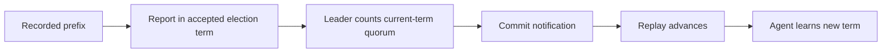

# Focused election checks

These seven models replace one large search with separate, bounded checks of
election handoffs, ballots, position ranking, nomination, stale-leader escape,
and replay dependencies. The original five describe `cluster-election-fix` at
`0861a99a81`, compared with the preceding implementation at `6d60124e15`.
The follow-up found **another acknowledged-write-loss defect** and added a Java
correction: advance recording metadata before catch-up reports positions in
the accepted term. See [FOLLOW-UP.md](FOLLOW-UP.md) for the reproductions,
correction, and the new models' precise scope.

Run the entire matrix with Java and a local TLC jar:

```sh
python3 docs/formal/election/run.py --jar /path/to/tla2tools.jar
```

`--list` describes the cases. Supply names to select cases, for example
`handoff-base-0 handoff-old-guard`. Defaults are one worker, a 1 GiB heap, and a
120-second limit **per case**. A timeout, parser failure, unexpected invariant,
or nonempty queue on a claimed success fails the run. The timeout is an
operational limit, not a model bound or a successful verification result.

The runner creates a new results directory for each invocation, retaining all
TLC output, counterexample traces, exact generated `.cfg` files, frozen model
inputs, hashes, commands, exit codes, and timings. It also pins the Java commit,
tracked changes, and relevant source hashes at the beginning and end. This is
correspondence evidence, not an automatic proof of correspondence. See [RESULTS.md](RESULTS.md)
for measured results. Results and scratch files are excluded from git.

## Why the earlier search is expensive

The local copy of `reduced-20260915-clean` still extends the full
`AeronElection.tla`: approximately 20 protocol variables, including a log per
node, a matrix of each node's cached peer positions, votes, accepted and
candidate terms, six replay-related fields, and a set of pending messages.
Every combination of message contents, recipient, delivery order, election
phase, log, and replay progress contributes states. Even `MaxTerm = 1` leaves
that product. A pending-message constraint removes some congested behaviors
but still leaves many subsets of the message alphabet.

The earlier VIEW normalizes some unused fields and removes delivery history;
the baseline symmetry only swaps the two followers. Those are useful
reductions of the same large protocol, but do not separate unrelated proof
obligations. More elapsed time with a growing BFS frontier is not evidence of
proximity to completion.

The files inspected locally are under
`~/cruft/design/tla/reduced-20260915-clean`. The user identified the active runs
as `ube:/home/ericb/tlc-checkpoints/aeron-sequencer-docs/internal/design/tla/reduced-20260915-clean`.
SSH authentication failed during this work, so the active runs, their latest
progress, and remote file equality were **not** verified or changed. The local
full-model SHA-256 is
`e0c3ab17b63bc30b689677057c198bdaf244a9781b58298859d451ae0ee6954b`;
the wrapper hash is
`77207eb7d71b511ed41553f7f2be9a501d5f5b0f9f4d3b1774292176d5991fd5`.

## Models and code correspondence

| Model | What is checked | Corresponding implementation |
|---|---|---|
| [Ballots.tla](Ballots.tla) | Competing candidates, persistent voting, delayed requests, and crash recovery | `Election.nominate` / `onRequestVote` / `init`, `NodeStateFile`, startup recovery |
| [Consecutive.tla](Consecutive.tla) | Historical acknowledgement survives two elected terms, delayed messages, metadata/replay boundaries, and one crash | Ballot log comparison; catch-up/live join; term-filtered commitment; truncation |
| [Handoff.tla](Handoff.tla) | Acknowledged entry identities remain on a quorum and are never truncated, across a delayed winner and old leader | `Election.onNewLeadershipTerm`, truncation, follower recording, `ConsensusModuleAgent.onCanvassPosition` / `onAppendPosition` / `updateLeaderPosition` |
| [Quorum.tla](Quorum.tla) | Ranked positions have a current-term, active majority; result is maximal and bounded by the leader's recording | `ClusterMember.quorumPosition`, `ConsensusModuleAgent.quorumPositionBoundedByLeaderLog` |
| [Nomination.tla](Nomination.tla) | A cached self term does not predict votes that the actual log comparison would reject | `Election.resetMembers`, `ClusterMember.willVoteFor` / `isQuorumCandidate` / `isUnanimousCandidate` |
| [StaleRecovery.tla](StaleRecovery.tla) | A stale incumbent eventually enters an election when a surviving voter has promised a newer term | `Election.canvass` / `onRequestVote`; closed-leader `ConsensusModuleAgent.onRequestVote` |
| [Replay.tla](Replay.tla) | A stable quorum commits and applies a fresh write; loss of the leader releases a waiting follower to CANVASS | `Election.leaderLogReplication` / `followerReplay`, `ConsensusModuleAgent.catchupPoll`, election quorum call sites |

Each defect has a negative control: disable **only** its correction and require
the corresponding invariant or temporal property to fail. Additional cases
deliberately negate successful acknowledgement, stale-message rejection, and
fair recovery to obtain witnesses. An expected counterexample is labeled as
such, not counted as a safety pass.

### Handoff: preserve the race, remove the unrelated election histories

The starting cut is immediately after member 1 wins a newer term with member
2's vote, before its leadership announcement. Member 0 still leads the old
term. This is the cut used by `AcknowledgedWriteDurabilityTest` and the older
`TruncationWitness`; an old leader with two extra entries also recreates the
older `StaleWriteWitness` mechanism.

There are three families, with 0, 1, or 2 old entries at the winning candidate.
The voter may have any shorter prefix; its vote is valid because the
candidate's log is at least as recent. The old leader may have a longer tail.
The common committed prefix before these entries is omitted. Initially
acknowledged entries are on every member and included in the elected prefix.
These cuts are scenario assumptions, not states inferred by a new ballot
protocol. An independent refinement/reachability proof for every cut is not
provided.

After the cut, TLC explores **all enabled interleavings** of old/new writes,
follower restarts, old and new leadership messages, truncation, recording,
position publication, position delivery, election completion, and client
acknowledgement. There is no script counter. The winner's base is immutable;
accepting its leadership and recording its entries are separate actions.
Acknowledgements are historical, even if the acknowledging leader later steps
down. Entries distinguish `old-a`, `old-b`, the new term event, and `new-write`.

Instead of a combinatorial message bag, `published[node][term]` records the
highest position that source has published in that term. Delivery may choose
**any lower or equal position at any later time**, including after restart or
truncation. Published history is never consumed. This intentionally includes
duplicates and out-of-order stale reports; it does not overwrite old messages
with the latest one. Lower positions need not actually have been sent, so this
is an overapproximation for these position-only safety checks. Report caches
still overwrite their previous term and position, just as Java does.

Leadership announcements abstract their transport separately: the old term
can be heard repeatedly while the voter canvasses; the elected newer term can
be heard after the election cut. Archive/log compatibility is represented by
the immutable prefix and truncation boundary. It is not a complete model of
recording-log metadata or all fields in `NewLeadershipTerm`.

All cached reports may remain active; this increases opportunities for unsafe
commitment. The ranking model separately exercises inactive members. The
handoff assumes the fixed leader self stamp and abstracts successful replay
before election completion; the replay model checks those dependencies.

This model does **not** cover arbitrary future elections, winner crashes,
membership changes, snapshots, disk durability, or every possible log shape.
Three values of `Base` are different cuts, not three successive elections.
There is no claim that these cuts are an exhaustive quotient of the earlier
full protocol. Their value is exhaustive scheduling of the specific competing
leader mechanisms, with two independent defect controls.

This original model equates metadata term with presence of a recorded term
event and assumes a persisted newer vote at the checked stale recipient.
Those simplifications must not be generalized to arbitrary crashes or leader
acceptance. `Consecutive` separates those states; the independent review
explains the boundary in [INDEPENDENT-REVIEW.md](INDEPENDENT-REVIEW.md).

### Ranking and nomination: exhaustive local contracts

`Quorum` models the descending-array insertion used in Java, then checks it
against an independently expressed set-cardinality contract. All input
combinations include ties, inactive members, stale/current terms, and an
independent bound from the leader's recording. It checks 1 and 3 members with
positions 0–2, and 5 members with positions 0–1. The latter represents positions
below versus at/above a threshold. Only term equality matters here, so one
nonmatching term represents old, future, and unset values. This is a check of
the accounting function, not evidence that callers supplied truthful reports;
`Handoff` supplies the causal reporting scenario.

`Nomination` enumerates 3- and 5-member views, known and unknown peers, log
terms 0–2, positions 0–2, and a self accepted term that may exceed its log term.
It checks both quorum and unanimous assessments against the request-vote log
comparison. It says nothing about whether a peer's cached position is current,
or whether a candidate will actually win a ballot. The stale-leader companion
is allowed to nominate without a known quorum; this contract concerns the
ordinary quorum/unanimity predicates, not that separate escape condition.

### Progress: state the healthy suffix and check temporal properties

`StaleRecovery` models the dead winner's two survivors. It keeps canvass,
leadership announcement, and one-shot vote-request delivery separate, allows
the ballot to time out before request delivery, and measures the stale-leader
deadline from entry into CANVASS. The deadline can expire before or after the
stale announcement. It checks closed and unfinished incumbents independently.
Weak fairness applies to individual timer, send, receive, and nomination
actions. A reliable delivery suffix is assumed. The property is deliberately
**opening an election at the incumbent**, not eventual service under arbitrary
competing ballots. The consumed first request does not also grant a vote.
Subsequent ballots and their higher terms are outside this model.

The first request must be successfully published before its modeled ballot
timeout; Java publication backpressure can violate that premise. The appointed
leader gate is omitted. These are additional assumptions of this one-shot
progress cut, not consequences of delivery fairness.

`Replay` has separate recorded, notified, applied, accepted, and agent-term
state. The accepted election term is normalized to 1; the agent remains in 0
until replay/join. Replay start captures a stop position, and completion is a
separate action, so a newer commit notification can arrive during a partial
replay. Partial completion returns to CANVASS while retaining the notification.
Each report and commit link has one outstanding message: sending, delivery,
commitment, recording, and application remain separate transitions.



The fixed report can be sent before the agent learns the term. The old
catch-up report uses the agent term and leaves that dependency cycle stuck.
The retained-notification mutation instead alternates CANVASS and replay
without reporting the recorded prefix.

Healthy replay/catch-up checks assume a stable elected leader and quorum,
eventually serviced operations, and no deadline expiry during recovery. The
one-message links model backpressure and finite delay in that suffix; this is
not arbitrary lossy, reordered transport. Weak fairness is on operations,
never on the desired result. A fresh client write at position 4 must actually
commit and be applied; election closure alone is insufficient. Separate
single-node, zero-notification, retained-notification, partial-replay, and
already-available-prefix cases are checked.

Leader-loss cases intentionally have no incoming progress and do allow the
deadline to expire. They check return to CANVASS with zero and nonzero retained
notifications. Clearing `notified` does not undo already applied data, which is
why the position invariant allows `applied > notified` in CANVASS.

## Interpreting the evidence

These are bounded diagnostic models with explicit scenario boundaries, not a
proof of the Java implementation or of the full consensus protocol. The
models share assumptions; their individual passes do not constitute a
mechanical composition proof. In particular, the new handoff cut assumes a
valid winning ballot and persistent candidate terms, and the progress models
assume a healthy suffix or a specific leader-loss boundary.

The checks avoid `CONSTRAINT`, `ACTION_CONSTRAINT`, VIEW, and symmetry. Safety
does not assume fairness. Temporal properties are checked directly, including
fair successful executions to guard against vacuous specifications. The
[Toolbox documentation](https://tla.msr-inria.inria.fr/tlatoolbox/doc/model/model-values.html)
also cautions against symmetry reduction for liveness checks.

Use these as a fast regression suite and reviewable explanation of the fixes.
Keep the Java regressions and original models for broader exploration. The
follow-up adds actual ballots, consecutive handoffs, and crash cuts, but still
does not prove arbitrary elections or compose every model into one protocol
proof. Its discovery of another real defect demonstrates why that distinction
matters.
